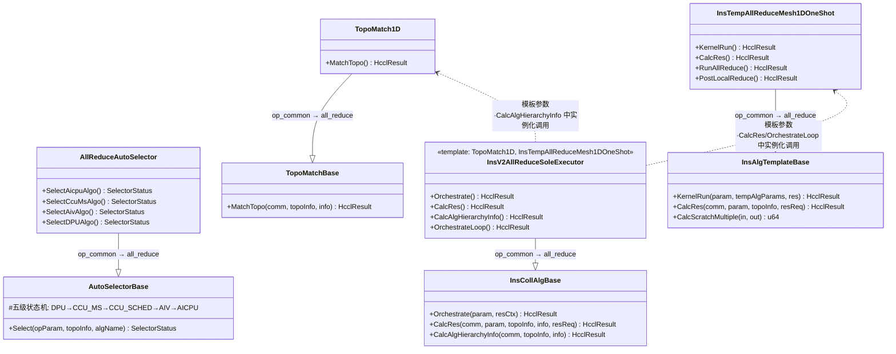
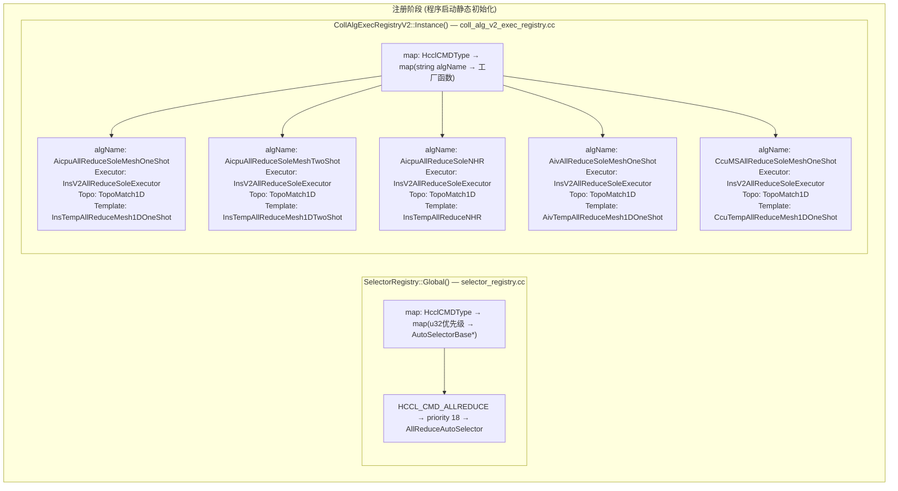
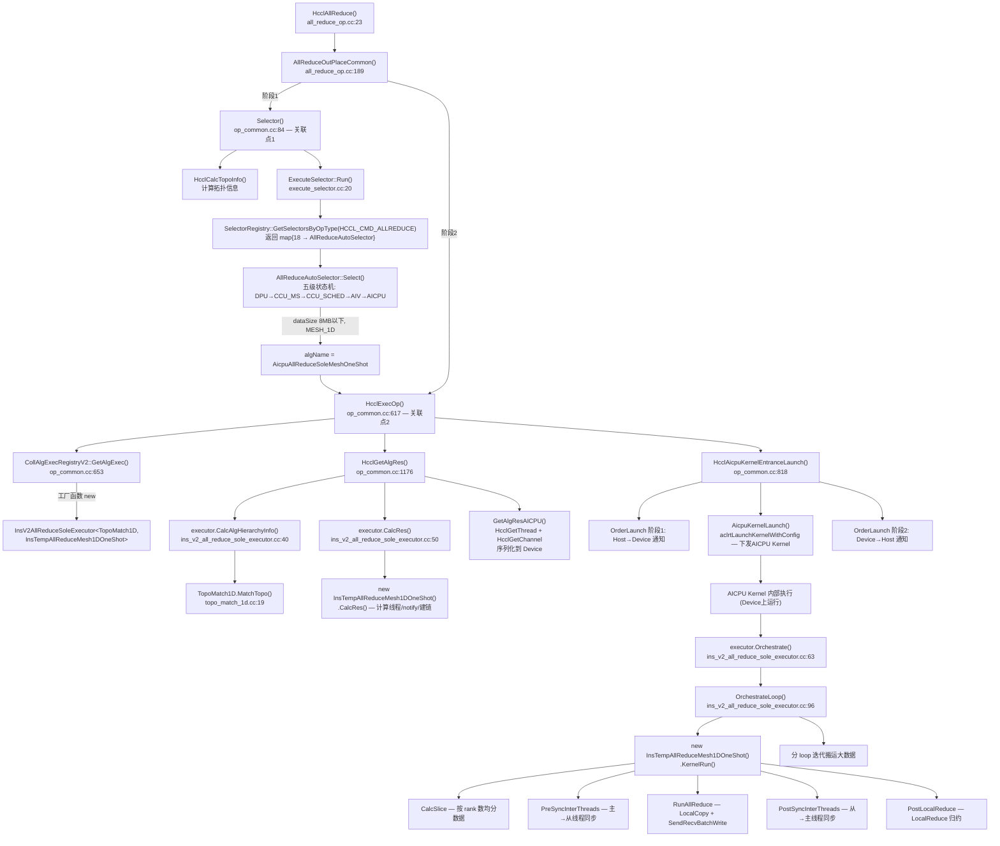
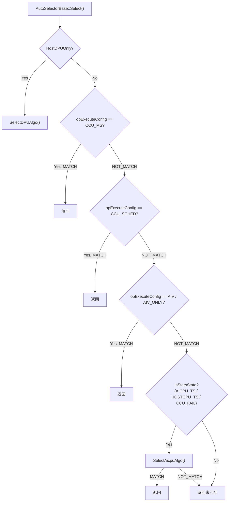
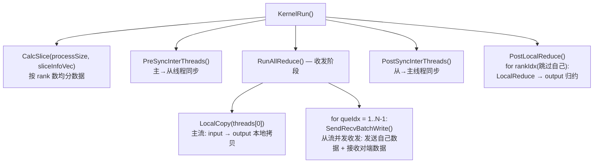
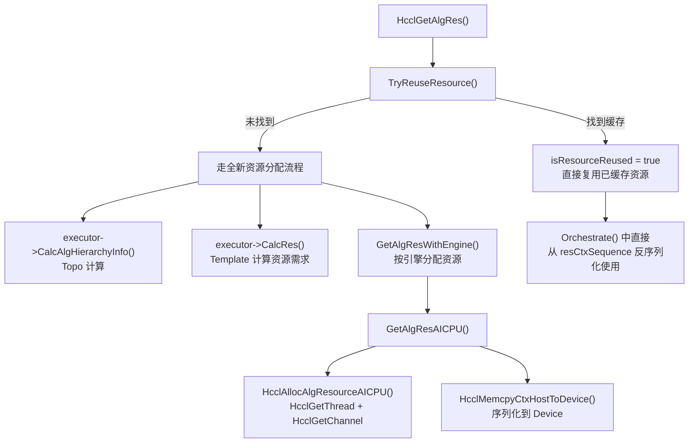

# HCCL AllReduce 算子执行流程详解

> 基于 HCCL 仓 `src/ops/all_reduce/` 与 `src/ops/op_common/` 源码分析，聚焦 `REGISTER_EXEC_V2` 注册机制、四件套关联与完整执行链路。

---

## 1. 概述

HCCL 每个集合通信算子按 **executor / selector / template / topo** 四件套组织。`op_common` 提供基类与注册表，各算子目录（如 `all_reduce/`）提供子类实现与注册调用。本文以如下注册条目为例贯穿全流程：

```cpp
REGISTER_EXEC_V2(
    HcclCMDType::HCCL_CMD_ALLREDUCE,    // 算子类型
    AicpuAllReduceSoleMeshOneShot,       // 算法名（同时也是 map key）
    InsV2AllReduceSoleExecutor,          // Executor 模板类
    TopoMatch1D,                         // Topo 匹配类
    InsTempAllReduceMesh1DOneShot);      // Template 算法模板类
```

此行位于 `all_reduce/executor/ins_v2_all_reduce_sole_executor.cc:271`。

### 1.1 整体执行流程概览

从 API 入口到实际通信执行，AllReduce 经历**参数初始化 → 拓扑计算 → 算法选择 → 资源计算 → 编排执行**五个阶段：

```
HcclAllReduce()                          [all_reduce_op.cc]
  └─ AllReduceOutPlaceCommon()
       ├─ FillAllReduceOpParam()          填充 OpParam（opType=ALLREDUCE）
       ├─ Selector()                     [op_common.cc] 算法选择
       │    ├─ HcclCalcTopoInfo()        计算拓扑信息
       │    └─ ExecuteSelector::Run()    [execute_selector.cc] 遍历 selector 选算法
       │         └─ AllReduceAutoSelector::Select()  五级状态机 → 返回 algName
       └─ HcclExecOp()                   [op_common.cc] 算法执行
            ├─ CollAlgExecRegistryV2::GetAlgExec(opType, algName)  从注册表取 executor
            ├─ executor->CalcAlgHierarchyInfo()  → TopoMatch1D::MatchTopo()
            ├─ executor->CalcRes()              → Template::CalcRes()
            ├─ HcclGetAlgRes()                  计算/复用通信资源
            └─ executor->Orchestrate()          编排执行
                 └─ OrchestrateLoop()
                      └─ Template::KernelRun()  实际通信（AICPU/CCU/AIV）
```

---

## 2. 核心组件关系总览

### 2.1 类继承关系图



### 2.2 继承关系一览

| 组件 | op_common 基类 | all_reduce 子类 | 文件位置 |
|------|---------------|----------------|---------|
| **Selector** | `AutoSelectorBase` | `AllReduceAutoSelector` | `all_reduce/selector/all_reduce_auto_selector.h:18` |
| **Executor** | `InsCollAlgBase` | `InsV2AllReduceSoleExecutor<TopoMatch1D, InsTempAllReduceMesh1DOneShot>` | `all_reduce/executor/ins_v2_all_reduce_sole_executor.h:20` |
| **Template** | `InsAlgTemplateBase` → `CommonAlgTemplateBase` | `InsTempAllReduceMesh1DOneShot` | `all_reduce/template/aicpu/ins_temp_all_reduce_mesh_1D_one_shot.h:20` |
| **Topo** | `TopoMatchBase` | `TopoMatch1D` | `op_common/topo/topo_match_1d.h:22` |

> **关键设计**：Executor 是**模板类**（C++ template），接收 TopoMatch 和 Template 作为模板参数。在编译期通过 `REGISTER_EXEC_V2` 宏完成实例化并注册到全局 map。Selector 则是运行期通过虚函数分发。

---

## 3. 注册机制详解

### 3.1 三大注册表与 Map 管理

HCCL 使用三个全局单例注册表，均在程序启动时（静态变量初始化阶段）通过宏完成注册：

| 注册表 | 单例入口 | 内部 map 结构 | 注册宏 | Key 含义 | Value 含义 |
|--------|---------|-------------|--------|---------|-----------|
| `SelectorRegistry` | `SelectorRegistry::Global()` | `map<HcclCMDType, map<u32, AutoSelectorBase*>>` | `REGISTER_SELECTOR_BY_OPTYPE(optype, priority, selectorCls)` | 外层: 算子类型; 内层: 优先级 | `AutoSelectorBase*` (selector 实例指针) |
| `CollAlgExecRegistryV2` | `CollAlgExecRegistryV2::Instance()` | `map<HcclCMDType, map<string, CollExecCreatorV2>>` | `REGISTER_EXEC_V2(type, name, execCls, topoCls, tempCls)` | 外层: 算子类型; 内层: 算法名 | `CollExecCreatorV2` (`std::function<InsCollAlgBase*()>`) |
| `InsAlgTemplateRegistry` | `InsAlgTemplateRegistry::Instance()` | `map<string, InsAlgTemplateCreator>` | `REGISTER_TEMPLATE_V2(name, tempCls)` | 模板名 | `InsAlgTemplateCreator` (`std::function`) |

> 三个注册表均通过 `std::mutex` 保证线程安全。

### 3.2 REGISTER_EXEC_V2 宏展开过程

以目标注册条目为例，宏展开过程如下：

```
原始宏调用：
REGISTER_EXEC_V2(
    HcclCMDType::HCCL_CMD_ALLREDUCE, AicpuAllReduceSoleMeshOneShot,
    InsV2AllReduceSoleExecutor, TopoMatch1D, InsTempAllReduceMesh1DOneShot);

▼ 宏展开（见 coll_alg_v2_exec_registry.h:63-71）

第1步：REGISTER_EXEC_V2 展开为 REGISTER_EXECUTOR_HELPER_1(__COUNTER__, ...)

第2步：REGISTER_EXECUTOR_HELPER_1 展开为 REGISTER_EXECUTOR_HELPER(__COUNTER__, ...)

第3步：REGISTER_EXECUTOR_HELPER 最终展开为：

static HcclResult g_func_AicpuAllReduceSoleMeshOneShot_N =
    CollAlgExecRegistryV2::Instance().Register(
        HcclCMDType::HCCL_CMD_ALLREDUCE,        // type
        std::string("AicpuAllReduceSoleMeshOneShot"),  // tag (字符串化 #name)
        DefaultExecCreatorV2<InsV2AllReduceSoleExecutor<TopoMatch1D, InsTempAllReduceMesh1DOneShot>>()
    );
```

其中 `DefaultExecCreatorV2` 是一个模板工厂函数：

```cpp
template <typename P>
static InsCollAlgBase* DefaultExecCreatorV2()
{
    static_assert(std::is_base_of<InsCollAlgBase, P>::value, "...");
    return new (std::nothrow) P();   // new InsV2AllReduceSoleExecutor<TopoMatch1D, InsTempAllReduceMesh1DOneShot>()
}
```

> **核心要点**：宏在**编译期**完成模板实例化——`InsV2AllReduceSoleExecutor` 被实例化为携带 `TopoMatch1D` 和 `InsTempAllReduceMesh1DOneShot` 两个模板参数的具体类。在**程序启动时**（静态变量初始化），该实例的工厂函数被注册到全局 map 中。

### 3.3 注册后 Executor Map 的内容

对于 AllReduce 的 `InsV2AllReduceSoleExecutor` 注册，map 中该 opType 下注册了多个算法名：

```
CollAlgExecRegistryV2::execCreators_[HCCL_CMD_ALLREDUCE]:
├── "AicpuAllReduceSoleMeshOneShot"     → InsV2AllReduceSoleExecutor<TopoMatch1D, InsTempAllReduceMesh1DOneShot>
├── "AicpuAllReduceSoleMeshTwoShot"     → InsV2AllReduceSoleExecutor<TopoMatch1D, InsTempAllReduceMesh1DTwoShot>
├── "AicpuAllReduceSoleNHR"             → InsV2AllReduceSoleExecutor<TopoMatch1D, InsTempAllReduceNHR>
├── "AicpuAllReduceSoleMeshChunkTwoShot"→ InsV2AllReduceSoleExecutor<TopoMatch1D, InsTempAllReduceMesh1DTwoShotMeshChunk>
├── "AicpuAllReduceSoleNHRAicpuReduce"  → InsV2AllReduceSoleExecutor<TopoMatch1D, InsTempAllReduceAicpuReduceNHR>
├── "AivAllReduceSoleMeshOneShot"       → InsV2AllReduceSoleExecutor<TopoMatch1D, AivTempAllReduceMesh1DOneShot>
├── "AivAllReduceSoleMeshTwoShot"       → InsV2AllReduceSoleExecutor<TopoMatch1D, AivTempAllReduceMesh1DTwoShot>
├── "CcuMSAllReduceSoleMesh"            → InsV2AllReduceSoleExecutor<TopoMatch1D, CcuTempAllReduceMesh1D>
├── "CcuMSAllReduceSoleMeshOneShot"     → InsV2AllReduceSoleExecutor<TopoMatch1D, CcuTempAllReduceMesh1DOneShot>
├── "CcuSchedAllReduceSoleNHR"          → InsV2AllReduceSoleExecutor<TopoMatch1D, CcuTempAllReduceNHRMem2Mem1D>
├── "CcuSchedAllReduceSoleMesh"         → InsV2AllReduceSoleExecutor<TopoMatch1D, CcuTempAllReduceMeshMem2Mem1D>
├── ... (更多)
```

> **同一个 Executor 模板类**（`InsV2AllReduceSoleExecutor`）通过不同的模板参数组合，注册为多个 map entry。算法名（string key）是唯一的关联标识。

### 3.4 Selector 注册

AllReduce 的 Selector 注册在文件末尾：

```cpp
// all_reduce/selector/all_reduce_auto_selector.cc:724
REGISTER_SELECTOR_BY_OPTYPE(HcclCMDType::HCCL_CMD_ALLREDUCE, 18, AllReduceAutoSelector);
```

展开后：

```cpp
static HcclResult g_func_18_AllReduceAutoSelector_N =
    SelectorRegistry::Global()->RegisterByOpType(
        HcclCMDType::HCCL_CMD_ALLREDUCE,   // opType
        18,                                 // priority (越小越先执行)
        new AllReduceAutoSelector());       // selector 实例
```

注册后 Selector map 结构：

```
SelectorRegistry::opTypeImpls_[HCCL_CMD_ALLREDUCE]:
└── priority 18 → AllReduceAutoSelector*
```

### 3.5 注册阶段 Map 管理图示



> 同一个 Executor 模板类（`InsV2AllReduceSoleExecutor`）通过不同的 Topo + Template 模板参数组合，注册为多个 algName entry。**Selector 按优先级遍历选择，Executor 按 algName 从 map 查找。**

---

## 4. AllReduce 与 op_common 的关联调用

### 4.1 调用入口

AllReduce 算子入口 `HcclAllReduce()` → `AllReduceOutPlace()` → `AllReduceOutPlaceCommon()`，在 `AllReduceOutPlaceCommon()` 中调用 op_common 的两个核心函数：

```
all_reduce_op.cc:229  →  Selector(comm, param, topoInfo, algName)      // op_common 函数
all_reduce_op.cc:231  →  HcclExecOp(comm, param, topoInfo, algName, resPack)  // op_common 函数
```

这两个函数定义在 `op_common/op_common.cc` 中，是 AllReduce 与 op_common 的主要关联点。

### 4.2 职责划分

| 层次 | 目录 | 提供内容 |
|------|------|---------|
| **算子层** | `all_reduce/` | 具体 Selector（`AllReduceAutoSelector`）、具体 Executor（`InsV2AllReduceSoleExecutor` 等）、具体 Template（`InsTempAllReduceMesh1DOneShot` 等） |
| **通用层** | `op_common/` | 基类（`InsCollAlgBase`/`AutoSelectorBase`/`InsAlgTemplateBase`/`TopoMatchBase`）、三个注册表、入口函数（`Selector()`/`HcclExecOp()`/`ExecuteSelector`）、通用 TopoMatch（`TopoMatch1D` 等） |

### 4.3 完整调用链路

```
HcclAllReduce()                                    [all_reduce_op.cc:23]
  │
  ├─ AllReduceInitAndCheck()                        [all_reduce_op.cc:107]
  │   └─ InitEnvConfig(), CheckAllReduceInputPara(), HcclGetRankSize() ...
  │   └─ param.opType = HcclCMDType::HCCL_CMD_ALLREDUCE
  │
  ├─ AllReduceOutPlace()                           [all_reduce_op.cc:270]
  │   └─ AllReduceOutPlaceCommon()                  [all_reduce_op.cc:189]
  │       │
  │       ├─ FillAllReduceOpParam()                 [all_reduce_op.cc:159]
  │       │   └─ 填充 OpParam: inputPtr/outputPtr/opType/reduceType ...
  │       │
  │       ├─ HcclGetOpExpansionMode()               [op_common — 获取通信域展开模式]
  │       │
  │       ├─ 单卡场景 → SingleRankProc() 返回
  │       │
  │       ├─ Selector() ◄═══════════════════════ 【关联点1: op_common.cc:84】
  │       │   │
  │       │   ├─ HcclCalcTopoInfo()                 [op_common.cc:1097]
  │       │   │   └─ InitRankInfo() → 序列化 TopoInfoWithNetLayerDetails
  │       │   │
  │       │   ├─ ExecuteSelector::Run()             [op_common/selector/execute_selector.cc:20]
  │       │   │   │
  │       │   │   ├─ SelectorRegistry::Global()
  │       │   │   │    ->GetSelectorsByOpType(HCCL_CMD_ALLREDUCE)
  │       │   │   │  返回: {18 → AllReduceAutoSelector*}
  │       │   │   │
  │       │   │   └─ AllReduceAutoSelector::Select()   [auto_selector_base.cc:18]
  │       │   │       │  (五级状态机: DPU→CCU_MS→CCU_SCHED→AIV→AICPU)
  │       │   │       │
  │       │   │       ├─ SelectCcuMsAlgo()             [all_reduce_auto_selector.cc:38]
  │       │   │       ├─ SelectCcuScheduleAlgo()       [all_reduce_auto_selector.cc:166]
  │       │   │       ├─ SelectAivAlgo()               [all_reduce_auto_selector.cc:584]
  │       │   │       └─ SelectAicpuAlgo()             [all_reduce_auto_selector.cc:401]
  │       │   │           └─ SelectMeshAlgoAicpu()     [all_reduce_auto_selector.cc:510]
  │       │   │               └─ 数据量<=8MB → selectAlgName = "AicpuAllReduceSoleMeshOneShot"
  │       │   │                  └─ 返回 SelectorStatus::MATCH
  │       │   │
  │       │   ├─ SetCommEngine(param)                 [设置 param.engine]
  │       │   ├─ SetOpParamAlgTag(param, algName)
  │       │   └─ SetExecTimeout(param)
  │       │
  │       │   ★ algName = "AicpuAllReduceSoleMeshOneShot"
  │       │
  │       ├─ HcclExecOp() ◄═══════════════════════ 【关联点2: op_common.cc:617】
  │           │
  │           ├─ CollAlgExecRegistryV2::Instance()
  │           │    .GetAlgExec(HCCL_CMD_ALLREDUCE, "AicpuAllReduceSoleMeshOneShot")
  │           │  ★ 从 map 中查找 → 调用工厂函数 → new InsV2AllReduceSoleExecutor<TopoMatch1D, InsTempAllReduceMesh1DOneShot>()
  │           │  返回: unique_ptr<InsCollAlgBase> executor
  │           │
  │           ├─ HcclGetAlgRes()                      [op_common.cc:1176]
  │           │   │  (资源计算与分配)
  │           │   ├─ TryReuseResource()               [尝试复用已缓存资源]
  │           │   │
  │           │   ├─ executor->CalcAlgHierarchyInfo() [executor_v2_base → ins_v2_all_reduce_sole_executor.cc:40]
  │           │   │   └─ TopoMatch1D::MatchTopo()     [topo_match_1d.cc:19]
  │           │   │       └─ 填充 algHierarchyInfo: infos[0][0] = {0,1,2,...,rankSize-1}
  │           │   │
  │           │   ├─ executor->CalcRes()              [ins_v2_all_reduce_sole_executor.cc:50]
  │           │   │   └─ new InsTempAllReduceMesh1DOneShot(param, rank, subCommRanks)
  │           │   │   └─ algTemplate->CalcRes()       [ins_temp_all_reduce_mesh_1D_one_shot.cc:23]
  │           │   │       └─ 计算线程数/notify数/建链请求
  │           │   │
  │           │   └─ GetAlgResWithEngine()            [op_common.cc:1309]
  │           │       └─ GetAlgResAICPU()             [op_common.cc:1443]
  │           │           ├─ HcclAllocAlgResourceAICPU() → HcclGetThread() + HcclGetChannel()
  │           │           └─ 序列化 → HcclMemcpyCtxHostToDevice()
  │           │
  │           ├─ HcclAicpuKernelEntranceLaunch()     [op_common.cc:818]
  │           │   │  (AICPU 引擎的 kernel 下发)
  │           │   ├─ OrderLaunch 第一阶段             [order_launch.cc]
  │           │   ├─ AicpuKernelLaunch()              [op_common.cc:948]
  │           │   │   └─ aclrtLaunchKernelWithConfig()  ← 下发 AICPU Kernel
  │           │   └─ OrderLaunch 第二阶段
  │           │
  │           │   ★ AICPU Kernel 内部执行：
  │           │   executor->Orchestrate()             [ins_v2_all_reduce_sole_executor.cc:63]
  │           │   └─ OrchestrateLoop()                [ins_v2_all_reduce_sole_executor.cc:96]
  │           │       ├─ new InsTempAllReduceMesh1DOneShot(param, rank, subCommRanks)
  │           │       ├─ algTemplate->KernelRun()     [ins_temp_all_reduce_mesh_1D_one_shot.cc:67]
  │           │       │   ├─ CalcSlice()              [数据切片]
  │           │       │   ├─ PreSyncInterThreads()    [线程同步]
  │           │       │   ├─ RunAllReduce()           [ins_temp_all_reduce_mesh_1D_one_shot.cc:103]
  │           │       │   │   ├─ LocalCopy()          [主流: 本地拷贝]
  │           │       │   │   └─ SendRecvBatchWrite() [从流: 向其他rank收发数据]
  │           │       │   ├─ PostSyncInterThreads()   [线程同步]
  │           │       │   └─ PostLocalReduce()        [本地归约]
  │           │       │       └─ LocalReduce()        [对收到的数据做归约]
  │           │       └─ 循环处理数据块（分loop搬运大数据）
  │           │
  │           └─ HcclProfilingReportOp()
  │
  └─ return HCCL_SUCCESS
```

---

## 5. Executor / Selector / Template / Topo 关联机制

### 5.1 关联方式：模板参数编译期绑定

V2 架构中，**Executor 是模板类**，通过模板参数在编译期绑定 TopoMatch 和 Template：

```cpp
// 定义（all_reduce/executor/ins_v2_all_reduce_sole_executor.h）
template <typename AlgTopoMatch, typename InsAlgTemplate>
class InsV2AllReduceSoleExecutor : public InsCollAlgBase { ... };

// 注册时实例化具体类型（all_reduce/executor/ins_v2_all_reduce_sole_executor.cc:271）
REGISTER_EXEC_V2(
    HcclCMDType::HCCL_CMD_ALLREDUCE,
    AicpuAllReduceSoleMeshOneShot,                    // algName（字符串 key）
    InsV2AllReduceSoleExecutor,                       // Executor 模板
    TopoMatch1D,                                      // TopoMatch 类型
    InsTempAllReduceMesh1DOneShot);                   // Template 类型
```

即注册的是一个**完全实例化的具体类** `InsV2AllReduceSoleExecutor<TopoMatch1D, InsTempAllReduceMesh1DOneShot>`，key 为 `(opType, algName)`。

### 5.2 运行时调用关系

Executor 在运行时创建并调用 TopoMatch 和 Template：

| 阶段 | Executor 方法 | 内部操作 |
|------|-------------|---------|
| 拓扑匹配 | `CalcAlgHierarchyInfo()` | `AlgTopoMatch topoMatch; topoMatch.MatchTopo(comm, topoInfo, algHierarchyInfo);` |
| 资源计算 | `CalcRes()` | `auto algTemplate = make_shared<InsAlgTemplate>(...); algTemplate->CalcRes(...);` |
| 编排执行 | `Orchestrate()` → `OrchestrateLoop()` | `auto algTemplate = make_shared<InsAlgTemplate>(...); algTemplate->KernelRun(...);` |

**关键代码**（sole_executor.cc）：

```cpp
// CalcAlgHierarchyInfo：用模板参数 AlgTopoMatch 做拓扑匹配
template <typename AlgTopoMatch, typename InsAlgTemplate>
HcclResult InsV2AllReduceSoleExecutor<...>::CalcAlgHierarchyInfo(...)
{
    AlgTopoMatch topoMatch;                              // 编译期确定的 TopoMatch 类型
    CHK_RET(topoMatch.MatchTopo(comm, topoInfo, algHierarchyInfo));
    return HCCL_SUCCESS;
}

// OrchestrateLoop：用模板参数 InsAlgTemplate 做实际通信
template <typename AlgTopoMatch, typename InsAlgTemplate>
HcclResult InsV2AllReduceSoleExecutor<...>::OrchestrateLoop(...)
{
    auto algTemplate = std::make_shared<InsAlgTemplate>(  // 编译期确定的 Template 类型
        param, resCtx.topoInfo.userRank, resCtx.algHierarchyInfo.infos[0]);
    for (u64 loop = 0; loop < loopTimes; loop++) {
        CHK_RET(algTemplate->KernelRun(param, tempAlgParams, templateAlgRes));
    }
}
```

### 5.3 Selector 与 Executor 的关联：通过 algName 字符串

Selector 不直接持有 Executor，而是返回一个**算法名字符串**（如 `"AicpuAllReduceSoleMeshOneShot"`），Executor 注册表用 `(opType, algName)` 作为 key 查找对应实例：

```
Selector::Select()  →  algName = "AicpuAllReduceSoleMeshOneShot"
                            │
                            ▼
HcclExecOp()  →  CollAlgExecRegistryV2::GetAlgExec(HCCL_CMD_ALLREDUCE, algName)
                            │
                            ▼
              InsV2AllReduceSoleExecutor<TopoMatch1D, InsTempAllReduceMesh1DOneShot>*
```

### 5.4 运行阶段调用链图示



### 5.5 关联方式总结

| 关联 | 方式 | 发生时机 | 代码体现 |
|------|------|---------|---------|
| **Selector ↔ 算子类型** | 注册时绑定 `HcclCMDType` → `AutoSelectorBase*` | 程序启动 | `REGISTER_SELECTOR_BY_OPTYPE(HCCL_CMD_ALLREDUCE, 18, AllReduceAutoSelector)` |
| **Selector → algName** | 运行期 Select() 返回算法名字符串 | 算子执行时 | `selectAlgName = "AicpuAllReduceSoleMeshOneShot"` |
| **Executor ↔ (算子类型, algName)** | 注册时绑定 `(HcclCMDType, string)` → 工厂函数 | 程序启动 | `REGISTER_EXEC_V2(HCCL_CMD_ALLREDUCE, "AicpuAllReduceSoleMeshOneShot", ...)` |
| **Executor ↔ Topo** | **C++ 模板参数**（编译期绑定） | 编译期 | `InsV2AllReduceSoleExecutor<TopoMatch1D, ...>` |
| **Executor ↔ Template** | **C++ 模板参数**（编译期绑定） | 编译期 | `InsV2AllReduceSoleExecutor<..., InsTempAllReduceMesh1DOneShot>` |
| **Executor → Topo（调用）** | 运行期在 `CalcAlgHierarchyInfo()` 中实例化并调用 | 资源计算阶段 | `topo_match_1d.cc:19` `TopoMatch1D::MatchTopo()` |
| **Executor → Template（调用）** | 运行期在 `CalcRes()` 和 `OrchestrateLoop()` 中实例化并调用 | 资源计算与执行阶段 | `ins_temp_all_reduce_mesh_1D_one_shot.cc:67` `KernelRun()` |

> **核心设计模式**：
> - Selector 采用**运行期多态**（虚函数 + map 注册），因为算法选择依赖运行期参数（数据量、拓扑、引擎模式）。
> - Executor 采用**编译期多态**（C++ 模板），将 Topo 和 Template 作为模板参数注入，避免运行期虚函数开销，同时保证类型安全。
> - Template 在 Executor 内部通过 `std::make_shared<InsAlgTemplate>(...)` 动态实例化，但类型在编译期已确定。

---

## 6. Selector 五级状态机

`AutoSelectorBase::Select()` 实现了五级状态机，按优先级依次尝试各引擎：



对于 `AllReduceAutoSelector::SelectAicpuAlgo()`，当拓扑为单层 MESH_1D 且数据量 ≤ 8MB（`AR_AICPU_1D_SMALL_DATA_SIZE`）时，选择算法名 `"AicpuAllReduceSoleMeshOneShot"`。

`ExecuteSelector::Run()` 的遍历逻辑（execute_selector.cc）：

```cpp
// 非 MC2 路径：按 opType 取所有 selector，按 priority 升序遍历，第一个 MATCH 的胜出
auto selectors = SelectorRegistry::Global()->GetSelectorsByOpType(opParam.opType);
for (auto iter : selectors) {  // map 按 key(priority) 自动升序
    if (iter.second->Select(opParam, topoInfo, selectAlgName) == MATCH) {
        return HCCL_SUCCESS;
    }
}
```

---

## 7. 完整执行时序（以 AicpuAllReduceSoleMeshOneShot 为例）

```
用户调用 HcclAllReduce(sendBuf, recvBuf, count, ...)
  │
  ├─[1] AllReduceInitAndCheck()     参数校验、获取 rankSize/userRank
  ├─[2] FillAllReduceOpParam()      填充 OpParam，opType=HCCL_CMD_ALLREDUCE
  │
  ├─[3] Selector()                  算法选择
  │    ├─ HcclCalcTopoInfo()        从 HCOMM 获取拓扑，填充 TopoInfoWithNetLayerDetails
  │    └─ ExecuteSelector::Run()
  │         ├─ SelectorRegistry::GetSelectorsByOpType(ALLREDUCE)
  │         │    └─ 返回 {18: AllReduceAutoSelector*}（按 priority 升序）
  │         └─ AllReduceAutoSelector::Select(opParam, topoInfo, algName)
  │              └─ 五级状态机：DPU→CCU_MS→CCU_SCHED→AIV→AICPU
  │                   假设选中 AICPU → algName = "AicpuAllReduceSoleMeshOneShot"
  │
  └─[4] HcclExecOp(comm, param, topoInfo, algName, resPack)
       ├─ CollAlgExecRegistryV2::GetAlgExec(ALLREDUCE, "AicpuAllReduceSoleMeshOneShot")
       │    └─ execCreators_[ALLREDUCE]["AicpuAllReduceSoleMeshOneShot"]()
       │         → new InsV2AllReduceSoleExecutor<TopoMatch1D, InsTempAllReduceMesh1DOneShot>()
       │
       ├─ executor->CalcAlgHierarchyInfo(comm, topoInfo, algHierarchyInfo)
       │    └─ TopoMatch1D::MatchTopo()  计算层级拓扑信息
       │
       ├─ executor->CalcRes(comm, param, topoInfo, algHierarchyInfo, resourceRequest)
       │    └─ make_shared<InsTempAllReduceMesh1DOneShot>(...)
       │         → template->CalcRes()  计算所需 Channel/Thread/内存
       │
       ├─ HcclGetAlgRes()             从 HCOMM 申请/复用通信资源
       │
       └─ executor->Orchestrate(param, resCtx)
            └─ OrchestrateLoop()
                 ├─ make_shared<InsTempAllReduceMesh1DOneShot>(...)
                 ├─ 计算 loopTimes（数据量 / 单次最大传输量）
                 └─ for each loop:
                      └─ template->KernelRun(param, tempAlgParams, templateAlgRes)
                           → 下发 AICPU Kernel + TS Task，完成实际数据搬运
```

---

## 8. Template 执行逻辑（Mesh1D OneShot）

`InsTempAllReduceMesh1DOneShot::KernelRun()` 执行 AllReduce 的核心通信逻辑：



> **OneShot 算法特点**：所有 rank 一次性发送完整数据到所有对端，对端收到后在本地做归约。适合小数据量（≤8MB）场景。

---

## 9. 资源复用机制

`HcclExecOp()` 中通过 `HcclGetAlgRes()` 管理资源：



---

## 10. 关键设计要点

| 设计点 | 说明 |
|--------|------|
| **编译期绑定 + 运行期查找** | Executor/TopoMatch/Template 通过模板参数编译期绑定，Selector 通过 algName 字符串运行期查找 Executor |
| **三级注册表独立** | Selector（按 priority 排序）、Executor（按 opType+algName）、Template（按 algName）各自独立管理，解耦 |
| **静态初始化自动注册** | 所有 `REGISTER_*` 宏定义全局静态变量，程序启动时自动调用 `Register()` 写入 map，无需手动注册 |
| **Selector 优先级遍历** | `map<u32, selector>` 按 priority 升序，第一个返回 MATCH 的胜出，支持回退（NOT_MATCH 继续下一个） |
| **Executor 模板复用** | 同一个 `InsV2AllReduceSoleExecutor` 模板通过不同 Template 参数注册为不同 algName，避免代码重复 |
| **TopoMatch 通用化** | `TopoMatch1D` 等放在 `op_common/topo/`，被所有算子的 Executor 共用，不绑定具体算子 |
| **控制面/数据面分离** | Selector/TopoMatch 属控制面（算法选择、拓扑查询），Template/KernelRun 属数据面（数据搬运），两层独立演进 |

---

## 11. 文件索引

| 文件 | 作用 |
|------|------|
| `all_reduce/all_reduce_op.cc` | AllReduce 算子入口，调用 op_common 的 Selector() 和 HcclExecOp() |
| `all_reduce/selector/all_reduce_auto_selector.cc` | AllReduce 算法选择器，五级状态机实现，最后一行注册 |
| `all_reduce/executor/ins_v2_all_reduce_sole_executor.cc` | AllReduce Sole Executor 模板类实现 + REGISTER_EXEC_V2 注册 |
| `all_reduce/template/aicpu/ins_temp_all_reduce_mesh_1D_one_shot.cc` | Mesh1D OneShot 算法模板，KernelRun 实现 |
| `op_common/op_common.cc` | Selector()、HcclExecOp()、HcclGetAlgRes() 等核心函数 |
| `op_common/selector/execute_selector.cc` | ExecuteSelector::Run()，从 SelectorRegistry 查找并调用 |
| `op_common/selector/selector_registry.h` | SelectorRegistry 单例 + REGISTER_SELECTOR_BY_OPTYPE 宏 |
| `op_common/selector/auto_selector_base.h/cc` | AutoSelectorBase 基类 + Select() 五级状态机 |
| `op_common/executor/registry/coll_alg_v2_exec_registry.h` | CollAlgExecRegistryV2 单例 + REGISTER_EXEC_V2 宏 |
| `op_common/executor/executor_v2_base.h` | InsCollAlgBase 基类（Executor 接口） |
| `op_common/template/alg_v2_template_base.h` | InsAlgTemplateBase 基类（Template 接口） |
| `op_common/template/registry/alg_v2_template_register.h` | InsAlgTemplateRegistry 单例 + REGISTER_TEMPLATE_V2 宏 |
| `op_common/topo/topo_match_base.h` | TopoMatchBase 基类（Topo 接口） |
| `op_common/topo/topo_match_1d.cc` | TopoMatch1D 实现，计算 AlgHierarchyInfo |

---

## 12. 总结

**一句话总结**：Selector 在运行期从 `SelectorRegistry` 中按 opType 查找到 `AllReduceAutoSelector`，选出算法名 `"AicpuAllReduceSoleMeshOneShot"`；`HcclExecOp()` 用该算法名从 `CollAlgExecRegistryV2` 的 map 中取出对应的工厂函数，`new` 出一个在编译期就绑定好 `TopoMatch1D` 和 `InsTempAllReduceMesh1DOneShot` 的 `InsV2AllReduceSoleExecutor` 实例；Executor 先调 Topo 算层级、调 Template 算资源，再在 AICPU Kernel 内调 Template 的 `KernelRun()` 完成实际数据搬运。
