# HCCL 整体代码架构

> 基于 HCCL 仓 `AGENTS.md` 与 `docs/zh/architecture/architecture-brief.md` 整理，仅用于个人学习。

---

## 1. 概述

HCCL（Huawei Collective Communication Library）是 CANN 的核心集合通信库，提供 AllReduce、Broadcast、AllGather、ReduceScatter、AlltoAll 等集合通信原语与 Send/Recv 点对点通信，支持单算子与图模式。

**软件组成**：

```
HCCL 软件栈 = HCCL 集合通信算子库（cann/hccl，本仓）
            + HCOMM 通信基础库（cann/hcomm，独立仓）
```

两仓通过 `dlsym` 动态加载解耦，可独立编译、独立版本演进。HCCL 对上支持 AI 框架，对下通过 HCOMM 使能昇腾 NPU。

---

## 2. HCCL 集合通信简介

### 2.1 为什么需要集合通信

大模型训练与推理 = 多卡协同，**通信是扩展瓶颈**。

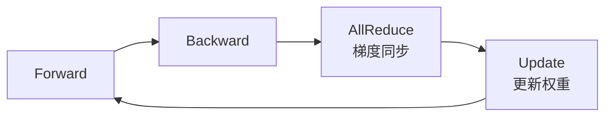

- **训练侧**：数据并行下每张 NPU 处理不同样本，迭代后需 AllReduce 同步梯度；模型/专家并行还依赖 AllGather、ReduceScatter、AlltoAll 协同
- **推理侧**：大模型推理同样需要张量并行/专家并行协同，通信时延直接影响首字时延与吞吐
- **集合通信**：让所有节点并行、高效、有序地交换数据，大幅减少同步开销
- HCCL = **昇腾 NPU 集群的高性能集合通信库**，让多块 NPU 高效协同工作

### 2.2 HCCL 核心能力一览

| 维度 | 能力 |
|------|------|
| **集合通信原语** | AllReduce、Broadcast、AllGather、ReduceScatter、AlltoAllv、Send、Receive、…… |
| **通信算法** | Ring、Mesh、RHD(Halving-Doubling)、Star + 自研算法 |
| **通信协议** | UBC、UBG、UBoE、RoCE(v2)、HCCS、UB_MEM |
| **执行模式** | 单算子模式 + 图模式 |
| **扩展能力** | 通信算子自定义开发 |
| **应用场景** | 大模型训练（数据/模型/专家并行）与推理（TP/PP/EP）的集合通信 |

HCCL 在 CANN 软件栈中的位置——介于 AI 框架与硬件驱动之间，承上启下：

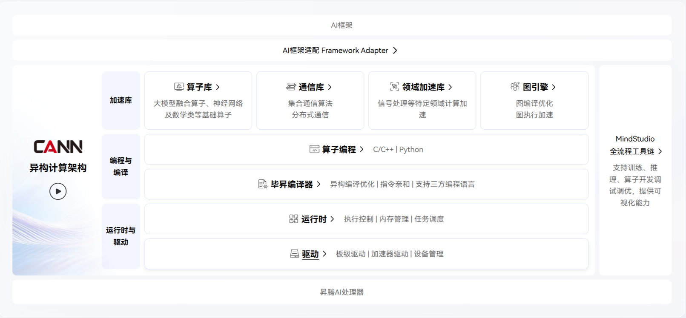

---

## 3. 集合通信模型

### 3.1 概念及关系介绍

集合通信涉及三个核心概念：

| 术语 | 一句话解释 | 主要对应硬件 |
|------|-----------|---------|
| **集合通信域** | 集合通信执行的上下文，管理参与通信的实体和资源 | 多个 NPU 组成 |
| **Rank** | 集合通信域中的成员，拥有唯一 Rank ID（从0开始） | 一个 NPU |
| **RankGraph** | Rank 间的通信关系图，描述"谁和谁怎么连" | 网络拓扑 |

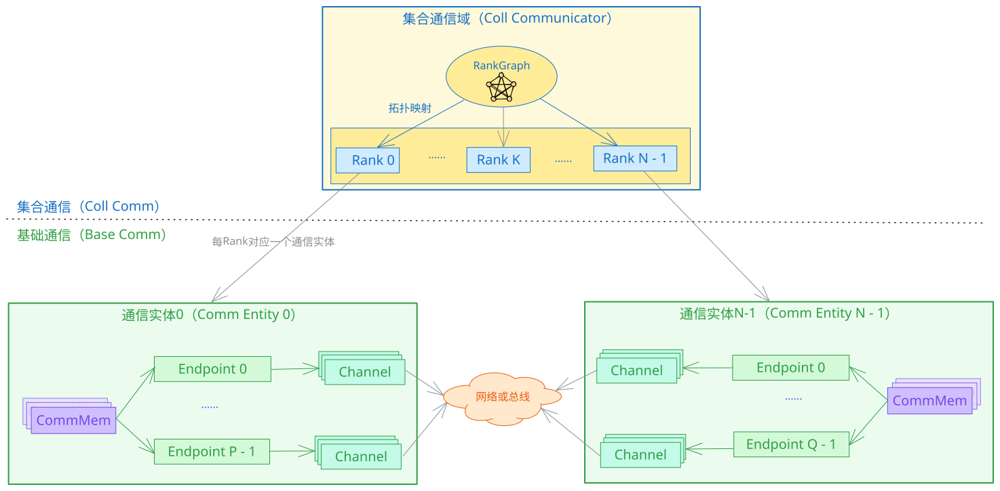

### 3.2 RankGraph 拓扑模型简介

RankGraph 使用图（Graph）对通信域内不同 Rank 间的连接关系进行建模，并引入拓扑层级抽象以适配大规模集群的分级结构。

| 概念 | 一句话解释 | 好理解的类比 |
|------|-----------|------------|
| **Node** | 图中的节点，分为通信实体和 Fabric（交换/路由抽象） | 通信实体 = 带网口的NPU；Fabric = 交换机组 |
| **Endpoint** | Node 的通信设备（逻辑概念），一个 Node 可有多个 Endpoint；一个 Endpoint 映射一个物理端口（可为 Bonding 口，硬件控制，软件不感知），一个物理端口可被多个 Endpoint 共享 | NPU上的网卡口，一个NPU可有多个网口；Bonding 口对软件透明 |
| **Edge** | Node 间的连接关系，两端是 Endpoint（对应 NCCL 的 Link） | 网线，两端插在不同NPU的网口上 |
| **Link** | 从 Edge 中提取的两个通信实体间可建链信息（含两端 Endpoint + 协议），对应 NCCL 的 Path | 两个NPU之间可建链的路径描述 |
| **netLayer** | 拓扑层级，通信质量逐层增加而递减；Server 内为 Layer0（如HCCS 直连），Server 间为 Layer1（如RoCE 经交换机） | Server 内 8 卡 HCCS 直连最快（Layer0），跨 Server 经交换机较慢（Layer1） |
| **Fabric** | 对网络交换/路由组的抽象，与它相连的通信实体两两互通。同一个网络层次不存在相连的两个Fabric。 | 一台交换机让所有插在上面的NPU互相通信 |
| **TopoInstance** | 每层内的拓扑实例 | 同机房内 8 个NPU卡组成一个 1DMesh 实例 |

> **层级要点**：集群天然分层（Layer），每层内有拓扑实例（TopoInstance），通信质量逐层增加而递减。拓扑类型包括 Fullmesh、1DMesh、CLOS、Ring 等。
> **递进关系**：Edge 描述"谁和谁连" → Link 描述"怎么建链" → Channel 描述"怎么通信"。Channel 基于 Link 实例化，是真正可用的数据通道。

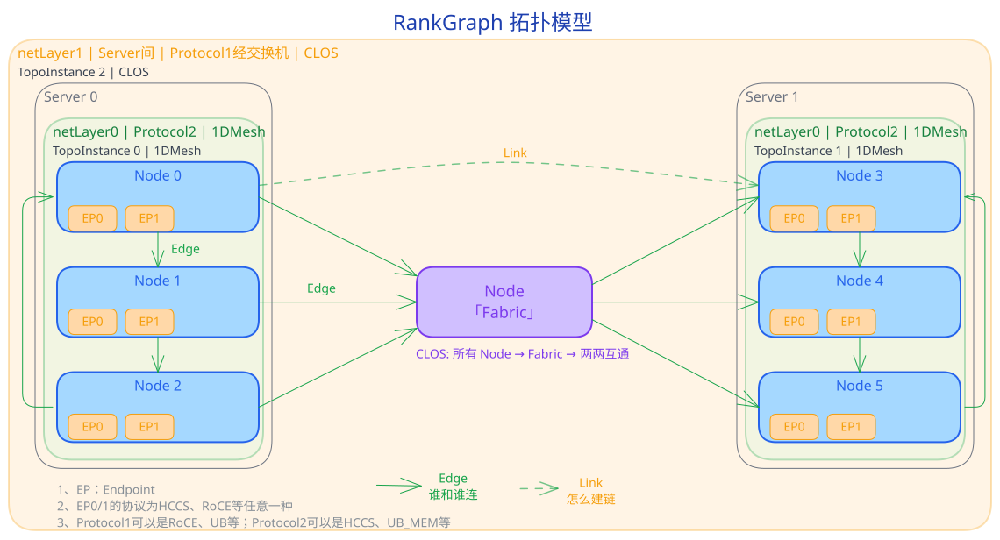

### 3.3 基础通信简介

集合通信的基础是四个**原语概念**——构成所有通信操作的基本元素：

| 概念 | 一句话解释 | 主要对应硬件 |
|------|-----------|---------|
| **通信设备(Endpoint)** | 网络通信的逻辑接口，包含协议与地址 | NPU 网口 / Host NIC |
| **通信通道(Channel)** | 两端通信设备间的数据通道（含同步 Notify） | RoCE QP / UB Jetty 连接 |
| **通信内存(CommMem)** | 注册到通信域、可被通信设备(Endpoint)访问的内存段 | NPU HBM / Host 内存 |
| **通信引擎(CommEngine)** | 执行通信任务的模块，含 Thread 与线程调度器，驱动通信硬件搬移数据 | AICPU_TS、CCU、AIV |

> **组合关系**: Channel = 两端通信设备 + 通信协议 + N Notifys

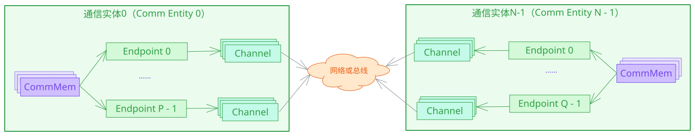

#### 3.3.1 内存语义原语 vs 网络语义原语

| | 网络语义原语 | 内存语义原语 |
|--|---------|---------|
| **核心对象** | Channel（通信通道） | 通信设备 + 映射内存 |
| **操作方式** | Write / Read / Notify | 本地拷贝（像操作本地内存） |
| **通信模型** | 单边操作、双边操作（需两端配合） | 单边操作（只需一端发起） |
| **适用协议** | RoCE、UB | UB_MEM、HCCS |

- 网络语义

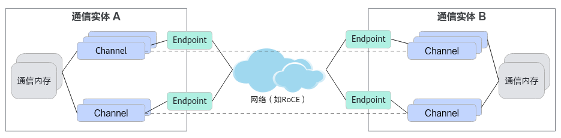

- 内存语义 

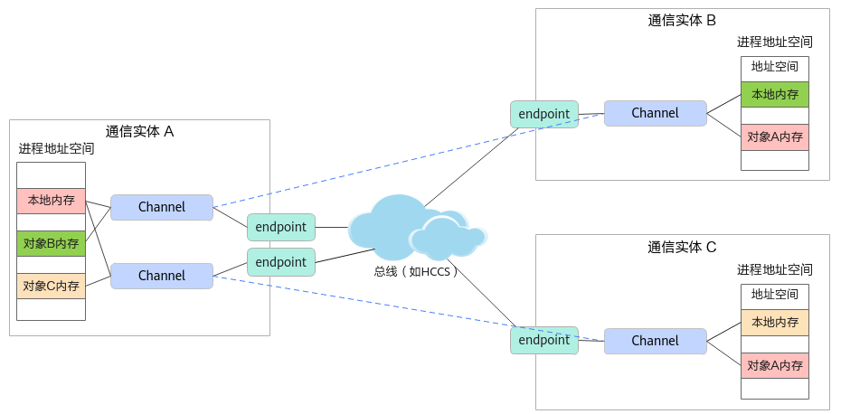

> 选择哪种语义取决于底层协议与场景需求。

### 3.4 通信引擎介绍

通信引擎是通信实体中**执行通信任务的核心模块**。它向上接收**通信资源**（Endpoint/Channel/CommMem）与**通信任务编排**下发的任务，向下通过**线程执行调度器**驱动**通信硬件**完成数据搬移。

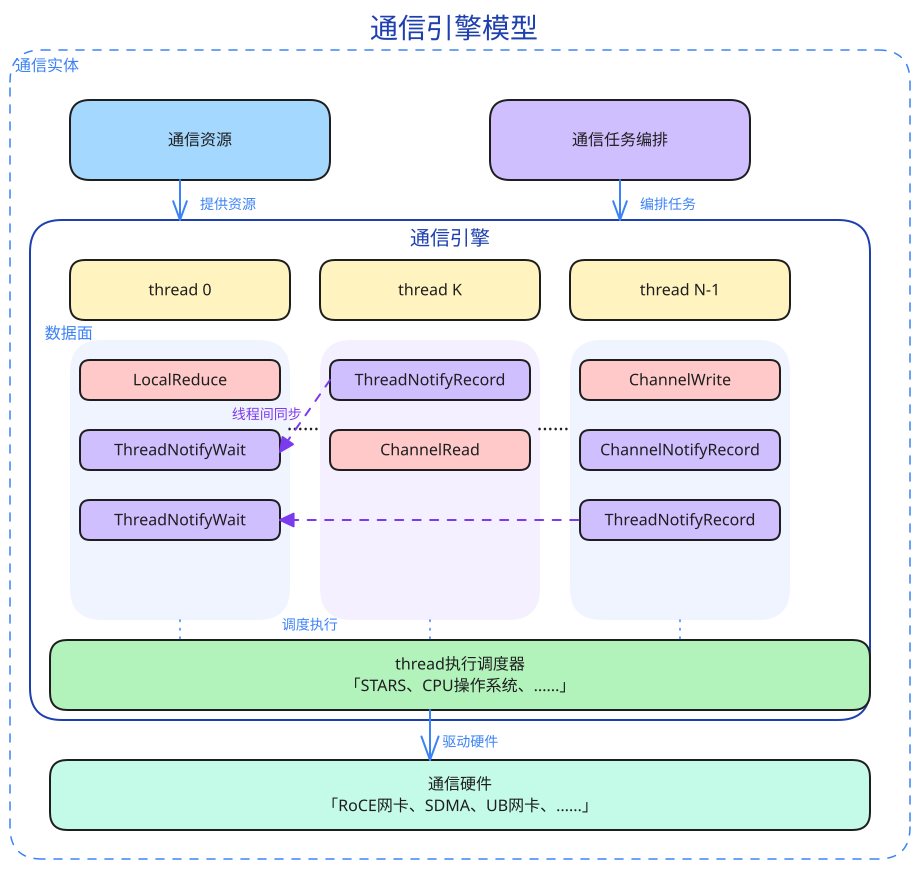

- **Thread（线程）**：通信任务的执行上下文，承载一串数据面算子（LocalReduce、ChannelRead/Write、Notify 等）；一个引擎可含多个 Thread 并发执行
- **线程执行调度器**：将 Thread 上的算子调度到硬件执行，如 TS（Task Scheduler）/ STARS / 操作系统
- **通信硬件**：实际搬移数据的硬件，如 RoCE 网卡、SDMA、UB 网卡
- **线程间同步**：不同 Thread 通过 ThreadNotify/ChannelNotify 协调执行顺序（详见 3.5）

> **一句话**：通信引擎 = Thread（执行上下文）+ 线程调度器（调度执行）；AICPU_TS 引擎即由 **AICPU 运行通信 Kernel、TS 调度 Task** 协同完成。

按 Thread 抽象与调度方式不同，通信引擎常见有 AICPU_TS、CPU_TS、AIV、CCU 等：

> AICPU：在AICPU上运行通信Kernel，调度也归AICPU

| 通信引擎 | Thread 抽象 | 介绍 | 特点 | 适用场景 |
|------|------------|------|-------|---------|
| **AICPU_TS** | NPU Stream | AICPU 运行通信 Kernel 并下发通信 Task 描述符，TS 调度到硬件执行 | 不占计算核，Task 描述符下发 | 大数据量通信 |
| **CPU_TS** | NPU Stream | Host CPU 运行通信逻辑，TS 调度下发 | 不占计算核，下发开销大 | Atlas A2 专用 |
| **AIV** | AICore Block | Vector Core 直接执行通信算子 | 低延迟，占 Vector 核 | 小数据低延迟 |
| **CCU** | Mission | 硬化通信单元，微码执行 | 硬化调度，微码执行 | 专用硬件通信 |

> 同一集合通信域默认只用一种引擎；算子开发者通过算法选择器自动选择引擎。

#### 3.4.1 AICPU_TS通信引擎

Task 描述符下发模式：

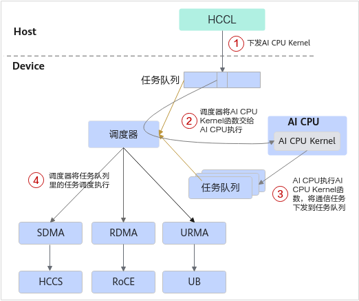

1. Host 提交 AICPU Kernel 至任务队列
2. TS 调度器将 AICPU Kernel 分发至 AICPU 执行
3. AICPU 提交通信 Task 描述符至 TS 队列
4. TS 调度器将通信 Task 分发至执行器

> **要点**: AICPU 通过 Task 描述符下发通信任务，**不占计算核**，适合大数据高带宽场景。

#### 3.4.2 CCU通信引擎

专用加速单元执行模式。CCU（Collective Communication Unit，集合通信加速单元）是位于 IO Die 的专用集合通信协处理器，Thread 抽象为 Mission。

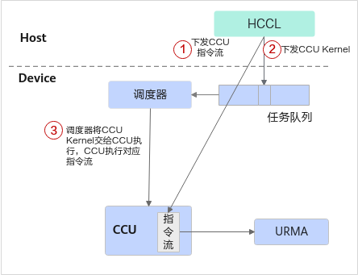

1. Host 将 CCU 指令序列（由 CCU 可识别的指令组成）下发至 CCU 指令空间，同时提交 CCU Kernel 任务至任务队列
2. CCU Kernel 被调度器调度后发送至 CCU 执行
3. CCU 执行对应指令流，并利用 URMA（Unified Remote Memory Access，统一远端内存访问）完成数据搬运

> **要点**: CCU 是专用集合通信加速单元，执行预置的 CCU 指令流（经 URMA 搬运数据）；**高带宽、低时延**且少占计算核与访存带宽，但受片上资源限制、支持的通信域数量有限（Ascend 950PR/950DT）。

#### 3.4.3 AIV通信引擎

Vector Core 执行模式：

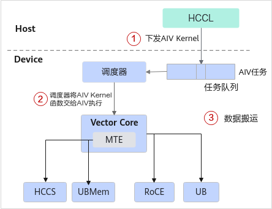

1. Host 提交 AIV Kernel 至任务队列
2. TS 调度器将 AIV Kernel 分发至 Vector Core
3. Vector Core 利用不同协议完成数据搬运

> **要点**: AIV 低延迟但**占 Vector 计算核**，适合小数据低延迟场景。

### 3.5 同步机制介绍

通信中的同步有两种场景：

| 同步方式 | 场景 | 说明 | 接口原型 |
|---------|------|------|-----|
| **ThreadNotify** | 同一通信实体内 | Thread 向同通信实体内另一个 Thread 发送/等待同步信号 | `ThreadNotifyRecord` / `ThreadNotifyWait` |
| **ChannelNotify** | 不同通信实体间 | Thread 通过 Channel上的notify及Channel数据通道向远端通信实体的Thread发送/等待同步信号 | `ChannelNotifyRecord` / `ChannelNotifyWait` |

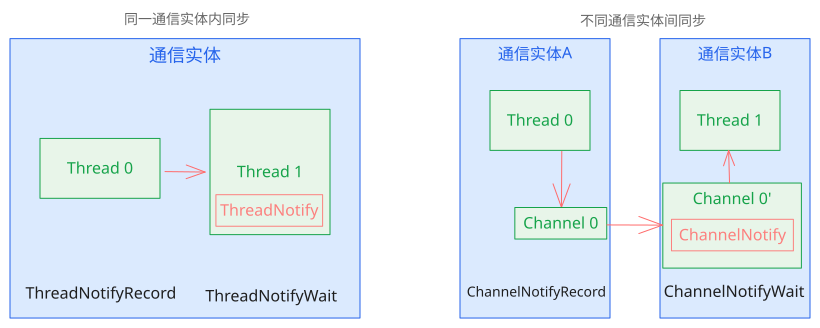

---

## 4. 软件分层架构

| 软件层次 | 职责 | 代码仓 | 关键模块 |
|---------|------|--------|---------|
| **L1 HCCL 集合通信算子** | 算子入口 → 算法选择 → 算法执行 | `cann/hccl` | `src/ops/` |
| **L2 HCOMM 集合通信域管理（HCCM）** | 通信域 + 拓扑管理 + 资源管理 | `cann/hcomm` | `coll_communicator_mgr/` |
| **L3 HCOMM 基础通信** | 资源管理 + 通信原语执行 | `cann/hcomm` | `base_comm/` |

**依赖方向**（自上而下，不可反向）：

```
coll_comm_ops (HCCL)  →  coll_communicator_mgr (HCCM)  →  base_comm (HCOMM)
```

---

## 5. HCCL 仓目录结构

```text
hccl/
├── src/                          # HCCL 算子源码
│   ├── ops/                      # 集合通信算子实现
│   │   ├── all_reduce/           # AllReduce
│   │   ├── all_gather/           # AllGather
│   │   ├── all_gather_v/         # AllGatherV
│   │   ├── all_to_all_v/         # AlltoAll / AlltoAllV / AlltoAllVC
│   │   ├── batch_send_recv/      # BatchSendRecv
│   │   ├── broadcast/            # Broadcast
│   │   ├── reduce/               # Reduce
│   │   ├── reduce_scatter/       # ReduceScatter
│   │   ├── reduce_scatter_v/     # ReduceScatterV
│   │   ├── scatter/              # Scatter
│   │   ├── send/                 # Send
│   │   ├── recv/                 # Recv
│   │   └── op_common/            # ⭐ 算子通用组件（四大件）
│   │       ├── executor/         # 算法执行器
│   │       ├── selector/         # 算法选择器
│   │       ├── template/         # 算法模板（aicpu / aiv / ccu）
│   │       └── topo/             # RankGraph 拓扑信息适配
│   └── common/                   # 通用逻辑
│       ├── adapter_acl/          # ACL 适配
│       ├── alg_env_config/       # 算法环境变量配置
│       ├── log/                  # 日志
│       ├── param_check/          # 参数校验
│       ├── sal/                  # 系统抽象层
│       ├── hcomm_dlsym/          # ⭐ HCOMM 动态加载符号表
│       ├── op_graph/             # 图模式
│       ├── utils/                # 工具函数
│       └── hccl_mc2/             # MC2 自定义算子框架
├── include/                      # 对外头文件
│   ├── hccl.h                    # 算子 API（AllReduce 等）
│   └── hccl_mc2.h                # MC2 自定义算子框架（KfcOpArgs / OpResCtx）
├── experimental/                 # 社区试验性代码（结构与 src 一致，不编入商用）
├── test/                         # UT / ST
├── docs/                         # 文档
└── build.sh                      # 一键编译脚本
```

---

## 6. 算子通用组件（op_common）

每个算子都按 `executor / selector / template / topo` 四件套组织：

| 组件 | 职责 | 关键类/文件 |
|------|------|------------|
| **executor** | 算法执行器，编排 template 的执行顺序（串行/并发/流水线） | `ExecuteSelector`、`SequenceExecutor`、`ConcurrentExecutor`、`OmniPipeExecutor`、`SoleExecutor` |
| **selector** | 算法选择器，根据数据量、拓扑、引擎模式等条件选择具体算法 | `AutoSelectorBase`、`AllReduceAutoSelector`（五级状态机：DPU→CCU_MS→CCU_SCHED→AIV→AICPU） |
| **template** | 算法模板，封装具体通信引擎的执行逻辑 | AICPU 模板（Mesh1D OneShot/TwoShot、NHR 等）、AIV 模板、CCU 模板 |
| **topo** | RankGraph 拓扑信息适配，为 selector/executor 提供拓扑查询 | 拓扑层级（Layer0/1）、TopoInstance（Fullmesh/1DMesh/CLOS/Ring） |

**调用链路**：

```
算子入口（hccl.h）
  → ExecuteSelector::Run()        // 入口分流（isMc2 / 非MC2）
    → AutoSelectorBase::Select()  // 五级状态机选算法
      → Executor::Execute()       // 编排执行
        → Template::Run()         // 具体引擎模板执行
```

---

## 7. 对外 API 分层

| 层次 | 头文件 | 面向 | 职责 |
|------|--------|------|------|
| L1 | `include/hccl.h` | AI 框架适配层 | AllReduce / Broadcast / AllGather / ReduceScatter / AlltoAll / Send / Recv 等标准算子入口 |
| MC2 | `include/hccl_mc2.h` | 自定义通信算子开发者 | KfcOpArgs / OpResCtx 等自定义算子框架接口 |

`include/` 变更需向后兼容。

---

## 8. 架构约束（硬性）

| 约束 | 说明 |
|------|------|
| **分层依赖方向** | 上层依赖下层，下层不能反向依赖上层。HCCL 不得被 HCOMM 反向依赖 |
| **控制面/数据面分离** | 资源管理、拓扑查询（控制面）与数据搬运/同步（数据面）接口独立演进，算子层不得耦合 HCOMM 控制面内部实现 |
| **HCCL 与 HCOMM 解耦** | HCCL 通过 `dlsym` 动态加载 HCOMM 接口，不得 `#include` HCOMM 私有头，不得引入编译期硬依赖。跨仓调用统一走 `src/common/hcomm_dlsym/` |
| **新算子落标准结构** | 官方新算子落 `src/ops/<op>/`；社区试验性算子落 `experimental/ops/<op>/`。均按 executor/selector/template 组织，禁止散落其他目录 |
| **legacy 不持续演进** | HCOMM 的 `legacy/` 仅用于历史版本兼容（A2/A3/A5旧流程），新能力一律落标准目录 |

---

## 9. 通信引擎（速查）

> 详细介绍见上文 [3.4 通信引擎介绍](#34-通信引擎介绍)，本节为快速对比表。

通信引擎是执行通信任务的核心模块 = Thread（执行上下文）+ 线程调度器（调度执行）。

| 引擎 | Thread 抽象 | 特点 | 适用场景 |
|------|------------|------|---------|
| **AICPU_TS** | NPU Stream | AICPU 运行通信 Kernel + TS 调度 Task 描述符，不占计算核 | 大数据量通信 |
| **CCU** | Mission | 硬化通信单元，微码执行，经 URMA 搬运数据，高带宽低时延，少占计算核 | 专用硬件通信（Ascend 950PR/950DT） |
| **AIV** | AICore Block | Vector Core 直接执行通信算子，低延迟但占 Vector 核 | 小数据低延迟 |
| **CPU_TS** | NPU Stream | Host CPU 运行通信逻辑，TS 调度下发，下发开销大 | Atlas A2 专用 |

> 同一集合通信域默认只用一种引擎；算子开发者通过 selector 自动选择引擎。

---

## 参考资料

- [CANN HCCL（GitCode 镜像）](https://gitcode.com/cann/hccl)
- [CANN HCCL（Gitee 官方）](https://gitee.com/ascend/cann-hccl)
- [CANN 编码规范](https://gitcode.com/cann/community/tree/master/contributor/coding-standards)
