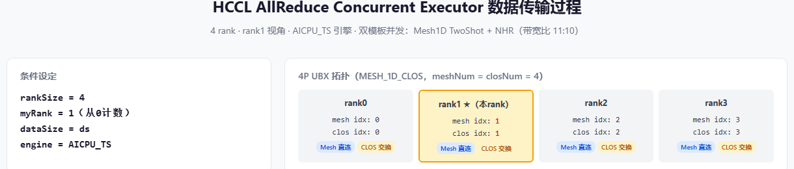
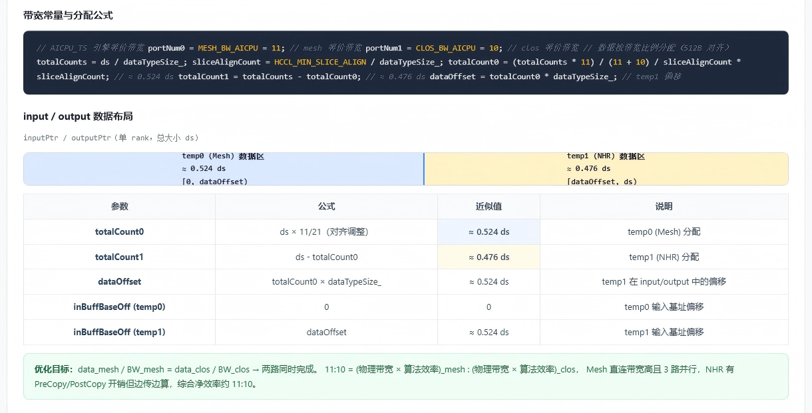
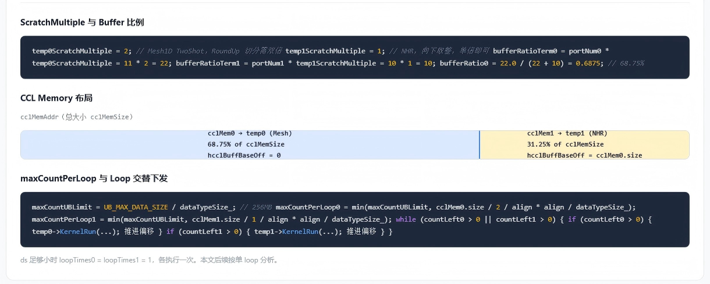
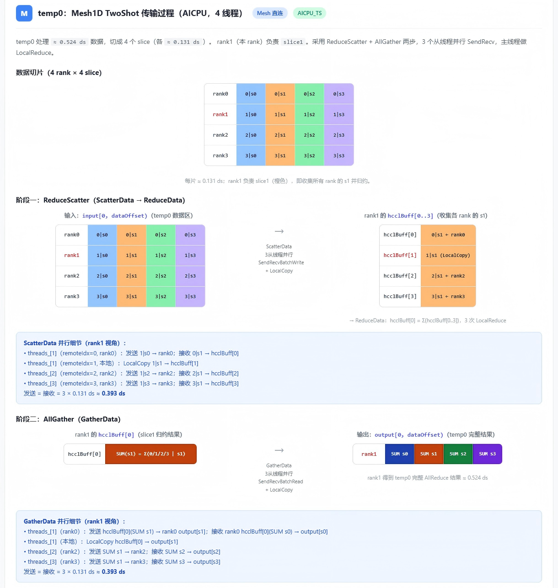
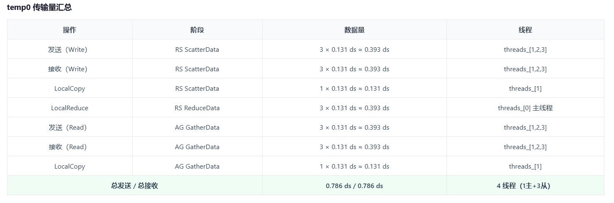
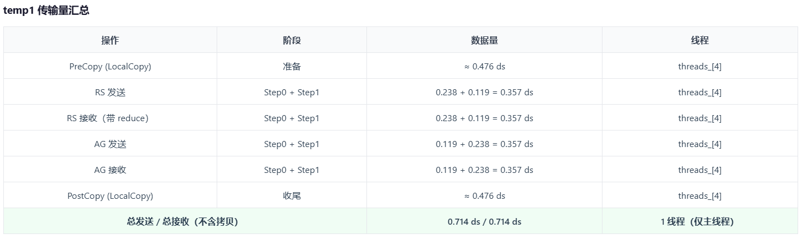
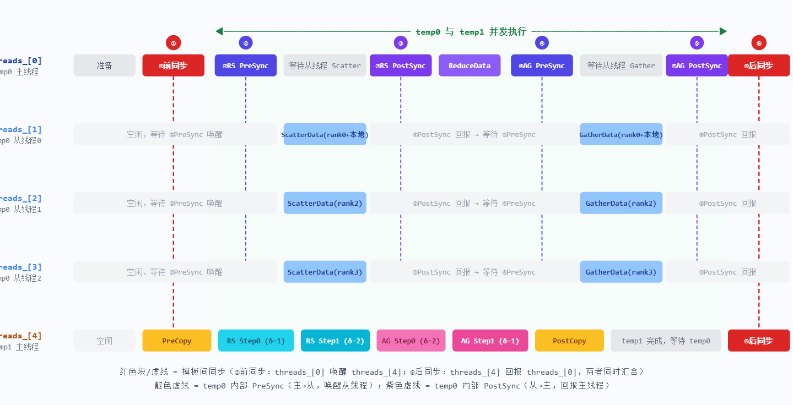

# HCCL AllReduce Concurrent Executor 归纳整理

> **基于**：`ins_v2_all_reduce_concurrent_executor.cc` line 519-522 注册 + 双模板完整源码 + 数据传输过程可视化  
> **假定条件**：4 rank（本 rank 为 rank1）· AICPU_TS 引擎 · 单 rank 输入数据大小 = ds

---

## 0. 文档导航

| 章节 | 核心内容 |
| --- | --- |
| [1. 概述与核心设计](#1-概述与核心设计) | Concurrent Executor 的定位、双模板并发架构 |
| [2. 注册与拓扑](#2-注册信息与拓扑结构) | line 519-522 注册宏、4P UBX 拓扑 |
| [3. 数据切分](#3-数据切分与带宽分配) | 按 11:10 带宽比例在 mesh/clos 间分配 ds |
| [4. CCL Buffer 切分](#4-ccl-buffer-切分与使用) | 按 22:10 比例划分 ccl buffer 给两模板 |
| [5. 资源计算](#5-资源计算calres) | 5 线程 / 8 Notify / Channel 分配 |
| [6. Mesh 模板传输](#6-temp0-mesh1d-twoshot-传输过程) | ReduceScatter + AllGather 两步，3 从线程并行 |
| [7. NHR 模板传输](#7-temp1-nhr-传输过程) | 递归减半/倍增，单线程串行，边传边算 |
| [8. 并发时序与同步](#8-并发执行时序与同步机制) | 6 个同步点、双模板同时运行的甘特图 |
| [9. 函数调用链](#9-完整函数调用链) | 从 Orchestrate 到模板 KernelRun 全链路 |
| [10. 汇总表](#10-数据量与通信量汇总) | 全量数据、通信量、资源一览 |
| [11. 带宽比例分析](#11-带宽比例-1110-的深度分析) | 物理带宽 × 算法效率的综合等效吞吐 |
| [12. 三种 Executor 对比](#12-concurrent-vs-sequence-vs-omnipipe) | 并发/串行/流水线的架构差异 |
| [13. 关键设计要点](#13-关键设计要点) | 设计决策与优化目标 |
| [14. 代码索引](#14-关键代码位置索引) | 各功能对应的文件与行号 |

---

## 1. 概述与核心设计

### 1.1 Concurrent Executor 的定位

Concurrent Executor 是 HCCL AllReduce 在 UBX 机型（MESH_1D_CLOS 拓扑）下的**双模板并发执行器**。它的核心思想是：

> 将输入数据按带宽比例切分给两个算法模板，**同时并发执行**，各自完成 AllReduce 后将结果拼接回 output。

### 1.2 与其他 Executor 的本质区别

| 执行器 | 模板数 | 执行方式 | 总时间 | 适用场景 |
| --- | --- | --- | --- | --- |
| **Sequence** | 4 | 四模板**串行** | = 各步之和 | 通用 fallback |
| **OmniPipe** | 6 | 三级**流水线** | ≈ 最长级 + 填充/排空 | 大规模（256P） |
| **Concurrent** | 2 | 双模板**完全并发** | ≈ max(temp0, temp1) | UBX 4P，mesh+clos 双路径 |

### 1.3 双模板架构

```
input (ds)
  │
  ├── [0, dataOffset) ≈ 0.524 ds ──→ temp0: Mesh1D TwoShot（框内 mesh 直连）
  │                                      └── 4 线程（1主+3从），ReduceScatter + AllGather
  │
  └── [dataOffset, ds) ≈ 0.476 ds ──→ temp1: NHR（CLOS 框间交换）
                                         └── 1 线程，递归减半+倍增，边传边算
  │
  └── 两模板同时运行 → 完成后拼接 → output (ds)
```

**优化目标**：`data_mesh / BW_mesh = data_clos / BW_clos` → 两路同时完成，避免一条路径空闲等待。

---

## 2. 注册信息与拓扑结构

### 2.1 注册（line 519-522）

```cpp
// ins_v2_all_reduce_concurrent_executor.cc:519-522
REGISTER_EXECUTOR_BY_TWO_TEMPS(
    HcclCMDType::HCCL_CMD_ALLREDUCE, InsAllReduceConcurrent, InsV2AllReduceConcurrentExecutor, TopoMatchUBX,
    InsTempAllReduceMesh1DTwoShot, InsTempAllReduceNHR);
```

| 参数 | 值 | 说明 |
| --- | --- | --- |
| selectAlgName | `InsAllReduceConcurrent` | 算法选择名称 |
| Executor 类 | `InsV2AllReduceConcurrentExecutor` | 并发执行器 |
| 拓扑匹配 | `TopoMatchUBX` | UBX 机型（MESH_1D_CLOS） |
| temp0 | `InsTempAllReduceMesh1DTwoShot` | Mesh1D 两步算法（框内 mesh 路径） |
| temp1 | `InsTempAllReduceNHR` | NHR 递归算法（CLOS 框间路径） |

### 2.2 4P UBX 拓扑



```
TopoMatchUBX 匹配 MESH_1D_CLOS 拓扑，4P 场景下 meshNum == closNum == 4

rank0: mesh idx=0, clos idx=0  →  Mesh 直连 506 / CLOS 交换 507
rank1: mesh idx=1, clos idx=1  →  Mesh 直连 512 / CLOS 交换 513  ★（本 rank）
rank2: mesh idx=2, clos idx=2  →  Mesh 直连 518 / CLOS 交换 519
rank3: mesh idx=3, clos idx=3  →  Mesh 直连 524 / CLOS 交换 525
```

- 每个 rank 同时拥有 **Mesh 直连**和 **CLOS 交换**两条可达路径
- 两条路径都使用 `COMM_PROTOCOL_UBC_CTP` 协议
- temp0 和 temp1 的 `templateRankSize_` 均为 4，`myRankIdx_` 均为 1

---

## 3. 数据切分与带宽分配

### 3.1 带宽常量（AICPU_TS）

```cpp
portNum0 = MESH_BW_AICPU = 11;   // mesh 等价带宽
portNum1 = CLOS_BW_AICPU = 10;   // clos 等价带宽
```

### 3.2 数据分配公式（512B 对齐）

```cpp
totalCounts = ds / dataTypeSize_;
sliceAlignCount = HCCL_MIN_SLICE_ALIGN / dataTypeSize_;  // 512B 对齐
totalCount0 = (totalCounts * 11) / (11 + 10) / sliceAlignCount * sliceAlignCount;  // ≈ 0.524 ds
totalCount1 = totalCounts - totalCount0;  // ≈ 0.476 ds
dataOffset = totalCount0 * dataTypeSize_;  // temp1 偏移
```



### 3.3 input/output 数据布局

| 区域 | 偏移 | 大小 | 归属 |
| --- | --- | --- | --- |
| temp0 (Mesh) 数据区 | `[0, dataOffset)` | **≈ 0.524 ds** | inBuffBaseOff=0, outBuffBaseOff=0 |
| temp1 (NHR) 数据区 | `[dataOffset, ds)` | **≈ 0.476 ds** | inBuffBaseOff=dataOffset, outBuffBaseOff=dataOffset |

> **优化目标**：`data_mesh / BW_mesh = data_clos / BW_clos` → 两路同时完成。11:10 = (物理带宽 × 算法效率)_mesh : (物理带宽 × 算法效率)_clos。

---

## 4. CCL Buffer 切分与使用

### 4.1 ScratchMultiple

```cpp
temp0ScratchMultiple = 2;  // Mesh1D TwoShot，RoundUp 切分需双倍
temp1ScratchMultiple = 1;  // NHR，向下取整，单倍即可
```

### 4.2 Buffer 比例（带宽 × ScratchMultiple）

```cpp
bufferRatioTerm0 = portNum0 * temp0ScratchMultiple = 11 * 2 = 22;
bufferRatioTerm1 = portNum1 * temp1ScratchMultiple = 10 * 1 = 10;
bufferRatio0 = 22.0 / (22 + 10) = 0.6875;  // 68.75%
```



### 4.3 CCL Memory 布局

| 区域 | 大小 | 归属 | hcclBuffBaseOff |
| --- | --- | --- | --- |
| cclMem0 | **68.75%** of cclMemSize | temp0 (Mesh) | 0 |
| cclMem1 | **31.25%** of cclMemSize | temp1 (NHR) | cclMem0.size |

> Buffer 分配比数据分配更偏向 Mesh（68.75% vs 52.4%），因为 Mesh1D TwoShot 的 ScratchMultiple=2。

### 4.4 maxCountPerLoop 与 Loop 交替下发

```cpp
maxCountUBLimit = UB_MAX_DATA_SIZE / dataTypeSize_;  // 256MB
maxCountPerLoop0 = min(maxCountUBLimit, cclMem0.size / 2 / align * align / dataTypeSize_);
maxCountPerLoop1 = min(maxCountUBLimit, cclMem1.size / 1 / align * align / dataTypeSize_);

while (countLeft0 > 0 || countLeft1 > 0) {
    if (countLeft0 > 0) { temp0->KernelRun(...); 推进偏移 }
    if (countLeft1 > 0) { temp1->KernelRun(...); 推进偏移 }
}
```

> ds 足够小时 `loopTimes0 = loopTimes1 = 1`，各执行一次。

---

## 5. 资源计算（CalcRes）

### 5.1 各模板资源

| 资源 | temp0 (Mesh) | temp1 (NHR) |
| --- | --- | --- |
| slaveThreadNum | 3 | 0 |
| 总线程数 | 4（1主+3从） | 1（仅主） |
| notifyNumOnMainThread | 3 | 0 |
| notifyNumPerThread | [1,1,1] | [] |
| Channel 数 | 3（到 rank0/2/3） | NHR MultiJetty 计算 |

### 5.2 Executor 汇总资源

```cpp
slaveThreadNum = 3 + 0 + 1 = 4;           // +1: temp1 主线程也算从线程
notifyNumOnMainThread = 3 + 1 = 4;        // +1: 模板间同步
notifyNumPerThread = [1,1,1] + [1] + [] = [1,1,1,1];
```

| 资源 | 值 | 说明 |
| --- | --- | --- |
| 总线程数 | **5** | threads_[0..4] |
| 主线程 notify | **4** | notify[0,1,2] 内部 + notify[3] 模板间 |
| 从线程 notify | **[1,1,1,1]** | 3个 temp0 从线程 + 1个 temp1 主线程 |

### 5.3 线程分配

| 线程 | 归属 | 角色 | 职责 |
| --- | --- | --- | --- |
| threads_[0] | temp0 (Mesh) | 主线程（Executor 主线程） | PreSync/PostSync 调度 + ReduceData 本地归约 |
| threads_[1] | temp0 (Mesh) | 从线程 0 | Scatter/Gather：rank0 + 本地 LocalCopy |
| threads_[2] | temp0 (Mesh) | 从线程 1 | Scatter/Gather：rank2 |
| threads_[3] | temp0 (Mesh) | 从线程 2 | Scatter/Gather：rank3 |
| threads_[4] | temp1 (NHR) | 主线程（Executor 视角为"从线程"） | 单线程串行：PreCopy → RS → AG → PostCopy |

### 5.4 Channel 分配

```cpp
const auto& channels = resCtx.channels[0];  // 所有 channel 合并在一层
// 前半给 temp0，后半给 temp1
for (i = 0; i < channelCount; ++i) {
    targetChannels = (i < channelCount / 2) ? tempAlgResource0.channels : tempAlgResource1.channels;
    targetChannels[channel.remoteRank].push_back(channel);
}
```

---

## 6. temp0: Mesh1D TwoShot 传输过程



> 数据传输量



temp0 处理 **≈ 0.524 ds** 数据，切成 4 个 slice（各 **≈ 0.131 ds**）。rank1 负责 slice1。采用 **ReduceScatter + AllGather** 两步，3 个从线程并行 SendRecv，主线程做 LocalReduce。

### 6.1 数据切片（4 rank × 4 slice）

```
每片 ≈ 0.131 ds；rank1 负责 slice1（橙色），即收集所有 rank 的 s1 并归约。

       s0(蓝)   s1(橙)   s2(绿)   s3(紫)
rank0: 0|s0     0|s1     0|s2     0|s3
rank1: 1|s0     1|s1 ★   1|s2     1|s3
rank2: 2|s0     2|s1     2|s2     2|s3
rank3: 3|s0     3|s1     3|s2     3|s3
```

### 6.2 阶段一：ReduceScatter（ScatterData → ReduceData）

**输入**：`input[0, dataOffset)`（temp0 数据区）

**ScatterData**：3 从线程并行 SendRecvBatchWrite + LocalCopy

| 线程 | remoteIdx | 操作 | 发送 | 接收 |
| --- | --- | --- | --- | --- |
| threads_[1] | 0 (rank0) | SendRecvBatchWrite | 1\|s0 → rank0 | 0\|s1 → hcclBuff[0] |
| threads_[1] | 1 (本地) | LocalCopy | — | 1\|s1 → hcclBuff[1] |
| threads_[2] | 2 (rank2) | SendRecvBatchWrite | 1\|s2 → rank2 | 2\|s1 → hcclBuff[2] |
| threads_[3] | 3 (rank3) | SendRecvBatchWrite | 1\|s3 → rank3 | 3\|s1 → hcclBuff[3] |

rank1 的 hcclBuff[0..3] 收集各 rank 的 s1：
- hcclBuff[0]: 0\|s1 ← rank0
- hcclBuff[1]: 1\|s1 (LocalCopy)
- hcclBuff[2]: 2\|s1 ← rank2
- hcclBuff[3]: 3\|s1 ← rank3

**ReduceData**（主线程 threads_[0]）：`hcclBuff[0] = Σ(hcclBuff[0..3])`，3 次 LocalReduce

### 6.3 阶段二：AllGather（GatherData）

**输入**：rank1 的 hcclBuff[0]（slice1 归约结果 SUM(s1)）

**GatherData**：3 从线程并行 SendRecvBatchRead + LocalCopy

| 线程 | remoteIdx | 操作 | 发送 | 接收 |
| --- | --- | --- | --- | --- |
| threads_[1] | 0 (rank0) | SendRecvBatchRead | SUM s1 → rank0 | SUM s0 → output[s0] |
| threads_[1] | 1 (本地) | LocalCopy | — | SUM s1 → output[s1] |
| threads_[2] | 2 (rank2) | SendRecvBatchRead | SUM s1 → rank2 | SUM s2 → output[s2] |
| threads_[3] | 3 (rank3) | SendRecvBatchRead | SUM s1 → rank3 | SUM s3 → output[s3] |

**输出**：`output[0, dataOffset)`（temp0 完整结果，4 个 slice 都是 SUM）

### 6.4 temp0 传输量汇总

| 操作 | 阶段 | 数据量 | 线程 |
| --- | --- | --- | --- |
| 发送（Write） | RS ScatterData | 3 × 0.131 ds ≈ **0.393 ds** | threads_[1,2,3] |
| 接收（Write） | RS ScatterData | 3 × 0.131 ds ≈ **0.393 ds** | threads_[1,2,3] |
| LocalCopy | RS ScatterData | 1 × 0.131 ds ≈ **0.131 ds** | threads_[1] |
| LocalReduce | RS ReduceData | 3 × 0.131 ds ≈ **0.393 ds** | threads_[0] 主线程 |
| 发送（Read） | AG GatherData | 3 × 0.131 ds ≈ **0.393 ds** | threads_[1,2,3] |
| 接收（Read） | AG GatherData | 3 × 0.131 ds ≈ **0.393 ds** | threads_[1,2,3] |
| LocalCopy | AG GatherData | 1 × 0.131 ds ≈ **0.131 ds** | threads_[1] |
| **总发送/总接收** | | **0.786 ds / 0.786 ds** | 4 线程（1主+3从） |

---

## 7. temp1: NHR 传输过程


> 数据传输量



temp1 处理 **≈ 0.476 ds** 数据，切成 4 个 slice（各 **≈ 0.119 ds**，向下取整，tail 可能略大）。rank1 负责 slice1。采用 **N-Halving and Doubling** 算法，`nSteps = log₂(4) = 2`。仅主线程 threads_[4] 参与（`channelsPerRank_ = 1`）。

### 7.1 PreCopy：input → hcclBuff

```
LocalCopy: input[dataOffset, ds) ≈ 0.476 ds → hcclBuff (cclMem1) ≈ 0.476 ds
线程: threads_[4]
```

### 7.2 阶段一：NHR ReduceScatter（递归减半，2 步）

**起始状态**：各 rank 持完整 4 slice

#### Step 0（deltaRank=1）

```
sendToIdx = (1 + 4 - 1) % 4 = 0    → 发给 rank0
recvFromIdx = (1 + 1) % 4 = 2      → 从 rank2 收
txSliceIdxs = [0, 2]    → 发送 slice 0 和 slice 2
rxSliceIdxs = [1, 3]    → 接收 slice 1 和 slice 3（带 reduce）

发送: 2 × 0.119 ds ≈ 0.238 ds → rank0
接收: 2 × 0.119 ds ≈ 0.238 ds ← rank2（带 reduce）
```

#### Step 1（deltaRank=2）

```
sendToIdx = (1 + 4 - 2) % 4 = 3    → 发给 rank3
recvFromIdx = (1 + 2) % 4 = 3      → 从 rank3 收
txSliceIdxs = [3]    → 发送 slice 3
rxSliceIdxs = [1]    → 接收 slice 1（带 reduce）

发送: 1 × 0.119 ds ≈ 0.119 ds → rank3
接收: 1 × 0.119 ds ≈ 0.119 ds ← rank3（带 reduce）
```

**RS 完成状态**：各 rank 持 1 个归约 slice
- rank0: Σs0 | rank1: Σs1 | rank2: Σs2 | rank3: Σs3

RS 发送 = RS 接收 = **0.357 ds**（接收带 reduce，无需额外 LocalReduce）

### 7.3 阶段二：NHR AllGather（递归倍增，2 步）

**起始状态**：各 rank 持 1 个归约 slice（RS 结果）

#### Step 0（deltaRank=2）

```
rank1 ↔ rank3，交换 s1,s3
发送: 0.119 ds → rank3
接收: 0.119 ds ← rank3
```

#### Step 1（deltaRank=1）

```
rank1 → rank2, rank1 ← rank0，交换 s0,s2
发送: 2 × 0.119 ds ≈ 0.238 ds → rank2
接收: 2 × 0.119 ds ≈ 0.238 ds ← rank0
```

**AG 完成状态**：各 rank 持全部 4 slice（都是 SUM）

AG 发送 = AG 接收 = **0.357 ds**

### 7.4 PostCopy：hcclBuff → output

```
LocalCopy: hcclBuff (cclMem1) 完整结果 ≈ 0.476 ds → output[dataOffset, ds) ≈ 0.476 ds
线程: threads_[4]
```

### 7.5 temp1 传输量汇总

| 操作 | 阶段 | 数据量 | 线程 |
| --- | --- | --- | --- |
| PreCopy (LocalCopy) | 准备 | **≈ 0.476 ds** | threads_[4] |
| RS 发送 | Step0 + Step1 | 0.238 + 0.119 = **0.357 ds** | threads_[4] |
| RS 接收（带 reduce） | Step0 + Step1 | 0.238 + 0.119 = **0.357 ds** | threads_[4] |
| AG 发送 | Step0 + Step1 | 0.119 + 0.238 = **0.357 ds** | threads_[4] |
| AG 接收 | Step0 + Step1 | 0.119 + 0.238 = **0.357 ds** | threads_[4] |
| PostCopy (LocalCopy) | 收尾 | **≈ 0.476 ds** | threads_[4] |
| **总发送/总接收（不含拷贝）** | | **0.714 ds / 0.714 ds** | 1 线程（仅主线程） |

---

## 8. 并发执行时序与同步机制

### 8.1 并发时序甘特图




> 以下为并发时序的文字化甘特图（HTML 原图因截图高度限制未提取，可参考 `ConcurrentExecutor_数据传输过程.html` 中的 SVG 甘特图）

```
时间轴 →
threads_[0]  ▏准备▕①▏②▕  等待Scatter  ▕③▕ReduceData▕④▕  等待Gather  ▕⑤▕⑥▕
threads_[1]  ▏      等待②       ▕ ScatterData ▕③▕   等待④   ▕ GatherData ▕⑤▕
threads_[2]  ▏      等待②       ▕ ScatterData ▕③▕   等待④   ▕ GatherData ▕⑤▕
threads_[3]  ▏      等待②       ▕ ScatterData ▕③▕   等待④   ▕ GatherData ▕⑤▕
threads_[4]  ▏  等待①  ▕PreCopy▕RS Step0▕RS Step1▕AG Step0▕AG Step1▕PostCopy▕  等待⑤  ▕⑥▕
              ↑                          ↑                          ↑
              ①模板间前同步            ②~⑤ temp0 内部同步        ⑥模板间尾同步
              (threads_[0]→[4])       (4个同步点)                (threads_[4]→[0])

并发区域: ②RS PreSync ~ ⑤AG PostSync 区间双模板同时运行
```

**5 条泳道**：
- threads_[0]：temp0 主线程（Executor 主线程）
- threads_[1]：temp0 从线程 0
- threads_[2]：temp0 从线程 1
- threads_[3]：temp0 从线程 2
- threads_[4]：temp1 主线程

**6 个同步点**：

| # | 同步 | 方向 | 触发时机 |
| --- | --- | --- | --- |
| ① | 模板间前同步 | threads_[0] → [4] | Loop 开始前，唤醒 temp1 |
| ② | temp0 RS PreSync | threads_[0] → [1,2,3] | ScatterData 前 |
| ③ | temp0 RS PostSync | threads_[1,2,3] → [0] | ScatterData 后，ReduceData 前 |
| ④ | temp0 AG PreSync | threads_[0] → [1,2,3] | GatherData 前 |
| ⑤ | temp0 AG PostSync | threads_[1,2,3] → [0] | GatherData 后 |
| ⑥ | 模板间尾同步 | threads_[4] → [0] | Loop 全部完成后 |

**并发区域**：②RS PreSync ~ ⑤AG PostSync 区间双模板并发运行。

### 8.2 各线程时间线

```
threads_[0]: 准备 → ①前同步 → ②RS PreSync → 等待从线程Scatter → ③RS PostSync → ReduceData → ④AG PreSync → 等待从线程Gather → ⑤AG PostSync → ⑥后同步
threads_[1]: 空闲等待② → ScatterData → ③PostSync回报 → 等待④ → GatherData → ⑤PostSync回报
threads_[2]: 空闲等待② → ScatterData → ③PostSync回报 → 等待④ → GatherData → ⑤PostSync回报
threads_[3]: 空闲等待② → ScatterData → ③PostSync回报 → 等待④ → GatherData → ⑤PostSync回报
threads_[4]: 空闲 → PreCopy → RS Step0(δ=1) → RS Step1(δ=2) → AG Step0(δ=2) → AG Step1(δ=1) → PostCopy → 完成等待temp0 → ⑥后同步
```

### 8.3 Notify 资源分配

| 线程 | Notify 索引 | 用途 | 同步方向 |
| --- | --- | --- | --- |
| threads_[0] | 0 | temp0 从线程0 完成回报 | 从→主 |
| threads_[0] | 1 | temp0 从线程1 完成回报 | 从→主 |
| threads_[0] | 2 | temp0 从线程2 完成回报 | 从→主 |
| threads_[0] | 3 | temp1 主线程完成回报（模板间尾同步） | 从→主 |
| threads_[1] | 0 | 主线程唤醒（RS/AG PreSync） | 主→从 |
| threads_[2] | 0 | 主线程唤醒（RS/AG PreSync） | 主→从 |
| threads_[3] | 0 | 主线程唤醒（RS/AG PreSync） | 主→从 |
| threads_[4] | 0 | 主线程唤醒（模板间前同步） | 主→从 |

### 8.4 模板间同步代码

```cpp
// executor.cc:361-368
ThreadHandle mainThread = tempAlgResource0.threads[0];      // threads_[0]
std::vector<ThreadHandle> syncThreads{tempAlgResource1.threads[0]};  // threads_[4]
std::vector<u32> notifyIdxesMainToSub{0};  // [0]
std::vector<u32> notifyIdxesSubToMain{3};  // [3]

// 模板间前同步: threads_[0] 通知 threads_[4] 开始执行
CHK_RET(PreSyncInterThreads(mainThread, syncThreads, notifyIdxesMainToSub));

// ... 交替下发 temp0 和 temp1 的 KernelRun ...

// 模板间尾同步: threads_[4] 通知 threads_[0] 全部完成
CHK_RET(PostSyncInterThreads(mainThread, syncThreads, notifyIdxesSubToMain));
```

### 8.5 temp1 内部无同步

`channelsPerRank_ = 1` 时 `threadNum_ = 1, slaveThreadNum = 0`，NHR 的 PreCopy/RS/AG/PostCopy 全部在 threads_[4] 上串行执行，无需内部 notify 同步。

---

## 9. 完整函数调用链

```
ExecuteSelector::Run()
  └── selectAlgName = "InsAllReduceConcurrent"
      └── InsV2AllReduceConcurrentExecutor::Orchestrate()           [executor.cc:168]
           └── OrchestrateLoop()                                     [executor.cc:198]
                │
                ├── 构造 temp0 (Mesh1D TwoShot) 和 temp1 (NHR)
                ├── 带宽分配: portNum0=11, portNum1=10
                │   └── totalCount0 ≈ 0.524ds, totalCount1 ≈ 0.476ds
                ├── CCL Buffer 划分: cclMem0=68.75%, cclMem1=31.25%
                ├── Channel 分配: 前半→temp0, 后半→temp1
                ├── Thread 分配: threads_[0..3]→temp0, threads_[4]→temp1
                ├── 模板间前同步: PreSyncInterThreads(threads_[0] → threads_[4])
                │
                ├── while (countLeft0 > 0 || countLeft1 > 0):
                │   │
                │   ├── temp0->KernelRun()                          [two_shot.cc:81]
                │   │    ├── SplitData()                             [two_shot.cc:140]
                │   │    │    └── 4 片, 每片 ≈ 0.131 ds
                │   │    ├── RunReduceScatter()                     [two_shot.cc:174]
                │   │    │    ├── PreSync(threads_[0]→[1,2,3])
                │   │    │    ├── ScatterData()                     [two_shot.cc:202]
                │   │    │    │    ├── remoteIdx=0: SendRecvBatchWrite → rank0  (threads_[1])
                │   │    │    │    ├── remoteIdx=1: LocalCopy                    (threads_[1])
                │   │    │    │    ├── remoteIdx=2: SendRecvBatchWrite → rank2  (threads_[2])
                │   │    │    │    └── remoteIdx=3: SendRecvBatchWrite → rank3  (threads_[3])
                │   │    │    ├── PostSync(threads_[1,2,3]→[0])
                │   │    │    └── ReduceData()                      [two_shot.cc:282]
                │   │    │         └── 3 次 LocalReduce → hcclBuff[0]  (threads_[0])
                │   │    └── RunAllGather()                        [two_shot.cc:310]
                │   │         ├── PreSync(threads_[0]→[1,2,3])
                │   │         ├── GatherData()                     [two_shot.cc:325]
                │   │         │    ├── remoteIdx=0: SendRecvBatchRead → rank0  (threads_[1])
                │   │         │    ├── remoteIdx=1: LocalCopy                    (threads_[1])
                │   │         │    ├── remoteIdx=2: SendRecvBatchRead → rank2  (threads_[2])
                │   │         │    └── remoteIdx=3: SendRecvBatchRead → rank3  (threads_[3])
                │   │         └── PostSync(threads_[1,2,3]→[0])
                │   │
                │   └── temp1->KernelRun()                          [nhr.cc:115]
                │        ├── PreCopy()                              [nhr.cc:189]
                │        │    └── LocalCopy: input→hcclBuff  (threads_[4])
                │        ├── PreSync (threadNum_=1 时跳过)
                │        ├── for channelIdx = 0:
                │        │    ├── RunReduceScatter()                [nhr.cc:207]
                │        │    │    ├── Step 0: SendRecvBatchWriteReduce → rank0, ←rank2  (2 slices)
                │        │    │    └── Step 1: SendRecvBatchWriteReduce → rank3, ←rank3  (1 slice)
                │        │    └── RunAllGather()                    [nhr.cc:280]
                │        │         ├── Step 0: SendRecvBatchWrite → rank3, ←rank3  (1 slice)
                │        │         └── Step 1: SendRecvBatchWrite → rank2, ←rank0  (2 slices)
                │        ├── PostSync (threadNum_=1 时跳过)
                │        └── PostCopy()                             [nhr.cc:348]
                │             └── LocalCopy: hcclBuff→output  (threads_[4])
                │
                └── 模板间尾同步: PostSyncInterThreads(threads_[4] → threads_[0])
```

---

## 10. 数据量与通信量汇总

### 10.1 数据量分配

| 参数 | 值 | 公式 |
| --- | --- | --- |
| 总输入 | ds | 单 rank 输入 |
| temp0 (Mesh) 数据 | **≈ 0.524 ds** | ds × 11/21 |
| temp1 (NHR) 数据 | **≈ 0.476 ds** | ds × 10/21 |
| temp0 每片大小 | ≈ 0.131 ds | 0.524 ds / 4 |
| temp1 每片大小 | ≈ 0.119 ds | 0.476 ds / 4 |

### 10.2 各模板传输量对比

| 阶段 | temp0 (Mesh) | temp1 (NHR) | 合计 |
| --- | --- | --- | --- |
| PreCopy | — | 0.476 ds | 0.476 ds |
| RS 发送 | 0.393 ds | 0.357 ds | 0.750 ds |
| RS 接收 | 0.393 ds | 0.357 ds（带reduce） | 0.750 ds |
| LocalReduce | 0.393 ds（3次） | —（边收边reduce） | 0.393 ds |
| AG 发送 | 0.393 ds | 0.357 ds | 0.750 ds |
| AG 接收 | 0.393 ds | 0.357 ds | 0.750 ds |
| LocalCopy | 0.262 ds（2次） | — | 0.262 ds |
| PostCopy | — | 0.476 ds | 0.476 ds |
| **总发送** | **0.786 ds** | **0.714 ds** | **1.500 ds** |
| **总接收** | **0.786 ds** | **0.714 ds** | **1.500 ds** |

> **守恒验证**：AllReduce 4P，每 rank RS 发送 = (N-1)/N × ds = 3/4 ds，AG 发送 = 3/4 ds，总发送 = 1.5 ds ✓（temp0 0.786 ds + temp1 0.714 ds = 1.5 ds，精确守恒）

### 10.3 CCL Buffer 使用

| 参数 | 值 | 公式 |
| --- | --- | --- |
| cclMem0 (Mesh) | **68.75%** of cclMemSize | 22/(22+10) |
| cclMem1 (NHR) | **31.25%** of cclMemSize | 10/(22+10) |
| temp0 ScratchMultiple | 2 | RoundUp 切分需双倍 |
| temp1 ScratchMultiple | 1 | 向下取整，单倍即可 |

### 10.4 NHR 步骤详解（rank1, 4 ranks）

**ReduceScatter（递归减半）**：

| Step | deltaRank | 发给 | 收自 | 发送 slice | 接收 slice | 发送量 | 接收量 |
| --- | --- | --- | --- | --- | --- | --- | --- |
| 0 | 1 | rank0 | rank2 | [0, 2] | [1, 3]（带reduce） | 0.238 ds | 0.238 ds |
| 1 | 2 | rank3 | rank3 | [3] | [1]（带reduce） | 0.119 ds | 0.119 ds |

**AllGather（递归倍增）**：

| Step | deltaRank | 发给 | 收自 | 发送 slice | 接收 slice | 发送量 | 接收量 |
| --- | --- | --- | --- | --- | --- | --- | --- |
| 0 | 2 | rank3 | rank3 | [1] | [3] | 0.119 ds | 0.119 ds |
| 1 | 1 | rank2 | rank0 | [1, 3] | [0, 2] | 0.238 ds | 0.238 ds |

### 10.5 关键常量

| 常量 | 值 | 说明 |
| --- | --- | --- |
| MESH_BW_AICPU | 11 | AICPU mesh 等价带宽 |
| CLOS_BW_AICPU | 10 | AICPU clos 等价带宽 |
| HCCL_MIN_SLICE_ALIGN | 512 | 切片对齐粒度（字节） |
| UB_MAX_DATA_SIZE | 256MB | 单次传输上限 |

---

## 11. 带宽比例 11:10 的深度分析

### 11.1 本质：物理带宽 × 算法效率

```
11 : 10 = (物理带宽 × 算法效率)_mesh : (物理带宽 × 算法效率)_clos
```

### 11.2 三种模式的带宽比例对比

| 执行模式 | MESH_BW | CLOS_BW | 比例 | mesh 分得数据 | clos 分得数据 |
| --- | --- | --- | --- | --- | --- |
| CCU_SCHED | 11 | 10 | 1.1 : 1 | 52.4% | 47.6% |
| **CCU_MS** | **22** | **10** | **2.2 : 1** | **68.75%** | **31.25%** |
| **AICPU_TS** | **11** | **10** | **1.1 : 1** | **52.4%** | **47.6%** |

### 11.3 物理链路分析

在 UBX 4P 场景下，4 个 rank 之间同时存在两条可达路径：

```
路径1 — Mesh（框内直连 UBC）: rank0 ←UBC_CTP→ rank1（全互联，直连，1跳，低延迟）
路径2 — CLOS（框间交换 UBC）: rank0 → CLOS Switch → rank1（经交换，2跳，略高延迟）
```

| 因素 | Mesh（直连） | CLOS（交换） | 影响 |
| --- | --- | --- | --- |
| 物理路径 | 直连，1 跳 | 经交换节点，2 跳 | Mesh 延迟更低 |
| 链路协议 | UBC_CTP | UBC_CTP | 相同 |
| 带宽上限 | 单链路满带宽 | 共享交换带宽 | CLOS 可能受交换瓶颈 |
| 并行度 | 3 条直连链路可全并行 | 经交换节点，可能存在竞争 | Mesh 并行度更高 |

### 11.4 算法效率分析

| 维度 | Mesh1D TwoShot (Mesh) | NHR (CLOS) | 谁占优 |
| --- | --- | --- | --- |
| 通信并行度 | 3 路并行（高） | 1 路串行（低） | Mesh |
| 通信步数 | RS: 1轮 + AG: 1轮 = 2轮 | RS: 2步 + AG: 2步 = 4步 | NHR 步数多但每步小 |
| Reduce 方式 | 通信后单独 LocalReduce（3次） | 边通信边 reduce（0次额外） | NHR |
| 链路延迟 | 低（直连） | 略高（交换） | Mesh |
| 额外拷贝 | 无（直接 input→hcclBuff→output） | PreCopy + PostCopy（2次） | Mesh |

**综合**：Mesh 的并行优势和直连低延迟，略胜于 NHR 的边传边算优势，净效率比约为 **11 : 10**。

### 11.5 CCU_MS 模式下 Mesh 翻倍的原因

```cpp
MESH_BW_MS = 22 = 11 × 2   // Mesh 硬件双流并行
CLOS_BW_MS = 10            // 交换节点不支持多流，带宽不变
```

- Mesh 的直连链路支持硬件级多流（multi-stream），同一物理链路可并行传输 2 个数据流
- CLOS 经交换节点转发，交换芯片不支持多流复用
- 因此 CCU_MS 下 mesh:clos = **22:10**

### 11.6 数据切分 vs Buffer 切分的比例差异

| 切分对象 | 公式 | 结果 | 说明 |
| --- | --- | --- | --- |
| **数据** | `portNum0 : portNum1` = 11 : 10 | 52.4% : 47.6% | 按等效带宽分配 |
| **CCL Buffer** | `portNum0 × Scratch0 : portNum1 × Scratch1` = 22 : 10 | 68.75% : 31.25% | 按带宽×倍数分配 |

> Buffer 分配比数据分配更偏向 Mesh，因为 Mesh1D TwoShot 的 ScratchMultiple=2（非均衡切分需要双倍 buffer）。

---

## 12. Concurrent vs Sequence vs OmniPipe

| 维度 | Sequence Executor | OmniPipe Executor | Concurrent Executor |
| --- | --- | --- | --- |
| **模板数** | 4 | 6 | 2 |
| **执行方式** | 四模板串行 | 三级流水线 | 双模板完全并发 |
| **总时间** | = 各步之和 | ≈ 最长级 + 填充/排空 | ≈ max(temp0, temp1) |
| **适用规模** | 通用 fallback | 大规模（256P） | UBX 4P |
| **拓扑** | 任意 | 8×8×4 三级 | MESH_1D_CLOS 双路径 |
| **算法** | Mesh1D + NHR + Ring 等 | 6 模板分三级 | Mesh1D TwoShot + NHR |
| **同步复杂度** | 低（串行） | 高（流水线级间同步） | 中（6 个同步点） |
| **资源利用率** | 低（串行等待） | 中（填充/排空开销） | 高（双路同时跑满） |

### 12.1 Concurrent 的核心优势

1. **双路径同时利用**：Mesh 直连和 CLOS 交换两条路径同时传输，总带宽 ≈ 两者之和
2. **无流水线开销**：不同于 OmniPipe 的填充/排空，Concurrent 两模板同时开始同时结束
3. **算法适配拓扑**：Mesh 路径用 Mesh1D TwoShot（全互联并行），CLOS 路径用 NHR（递归减半/倍增）

---

## 13. 关键设计要点

### 13.1 数据切分的优化目标

```
目标: T_mesh = T_clos
其中 T = 数据量 / 等效带宽
→ data_mesh / BW_mesh = data_clos / BW_clos
→ 数据分配比例 = 带宽比例
```

### 13.2 ScratchMultiple 的设计

- **Mesh1D TwoShot = 2**：非均衡切分时（RoundUp 向上取整），单倍 buffer 不足以存放 4 个 rank 发来的数据，需要双倍
- **NHR = 1**：均衡切分（向下取整），单倍 buffer 即可存放完整数据

### 13.3 线程模型的设计

- temp0 用 4 线程（1主+3从）：利用 Mesh 全互联，3 路从线程并行 SendRecv
- temp1 用 1 线程：NHR 每步只与 1 个对端通信，单线程串行即可，无需多线程开销
- Executor 共 5 线程：threads_[0..3] 给 temp0，threads_[4] 给 temp1

### 13.4 同步机制的设计

- 6 个同步点：2 个模板间 + 4 个 temp0 内部
- temp1 内部无同步（单线程串行）
- 模板间前同步确保 temp1 准时启动，尾同步确保两模板都完成后再进入下一 loop

### 13.5 带宽比例的经验值

11:10 不是单纯的物理链路带宽比，而是**"物理带宽 × 算法效率"的综合等效吞吐比**。这一点可以从 ReduceScatter Concurrent Executor 使用不同的带宽常量得到验证：

| 执行模式 | RS 比例 | AR 比例 |
| --- | --- | --- |
| CCU_SCHED | 10:12（CLOS 反而多） | 11:10 |
| AICPU_TS | 21:20 ≈ 1.05:1 | 11:10 ≈ 1.1:1 |

> 不同算法（RS vs AR）在相同拓扑上的效率不同，因此带宽比例也不同。

---

## 14. 关键代码位置索引

### 14.1 Concurrent Executor 主文件

| 功能 | 文件 | 行号 |
| --- | --- | --- |
| 注册（InsAllReduceConcurrent） | ins_v2_all_reduce_concurrent_executor.cc | 519-522 |
| 带宽常量定义 | ins_v2_all_reduce_concurrent_executor.cc | 21-27 |
| OrchestrateLoop | ins_v2_all_reduce_concurrent_executor.cc | 198-418 |
| 带宽分配 | ins_v2_all_reduce_concurrent_executor.cc | 229-232 |
| 数据切分 | ins_v2_all_reduce_concurrent_executor.cc | 233-237 |
| CCL Buffer 划分 | ins_v2_all_reduce_concurrent_executor.cc | 250-257 |
| Channel/Thread 分配 | ins_v2_all_reduce_concurrent_executor.cc | 311-343 |
| maxCountPerLoop | ins_v2_all_reduce_concurrent_executor.cc | 346-358 |
| 模板间同步 | ins_v2_all_reduce_concurrent_executor.cc | 361-407 |
| Loop 交替下发 | ins_v2_all_reduce_concurrent_executor.cc | 376-404 |
| CalcRes | ins_v2_all_reduce_concurrent_executor.cc | 94-165 |

### 14.2 Mesh1D TwoShot 模板

| 功能 | 文件 | 行号 |
| --- | --- | --- |
| KernelRun | ins_temp_all_reduce_mesh_1D_two_shot.cc | 81-138 |
| SplitData | ins_temp_all_reduce_mesh_1D_two_shot.cc | 140-172 |
| ScatterData | ins_temp_all_reduce_mesh_1D_two_shot.cc | 202-280 |
| ReduceData | ins_temp_all_reduce_mesh_1D_two_shot.cc | 282-308 |
| GatherData | ins_temp_all_reduce_mesh_1D_two_shot.cc | 325-402 |
| PreSync/PostSync | ins_temp_all_reduce_mesh_1D_two_shot.cc | 404-422 |

### 14.3 NHR 模板

| 功能 | 文件 | 行号 |
| --- | --- | --- |
| KernelRun | ins_temp_all_reduce_nhr.cc | 115-187 |
| PreCopy | ins_temp_all_reduce_nhr.cc | 189-205 |
| RunReduceScatter | ins_temp_all_reduce_nhr.cc | 207-278 |
| RunAllGather | ins_temp_all_reduce_nhr.cc | 280-346 |
| PostCopy | ins_temp_all_reduce_nhr.cc | 348-364 |
| GetReduceScatterStepInfoList | ins_temp_all_reduce_nhr.cc | 367-407 |
| GetAllGatherStepInfoList | ins_temp_all_reduce_nhr.cc | 410-449 |
| GetNHRStepNum | ins_temp_all_reduce_nhr.cc | 451-459 |

---

*数据来源：HCCL MC2 源码（`ins_v2_all_reduce_concurrent_executor.cc` + `ins_temp_all_reduce_mesh_1D_two_shot.cc` + `ins_temp_all_reduce_nhr.cc`）  
可视化来源：`ConcurrentExecutor_数据传输过程.html`  
整理日期：2026-08-13*
