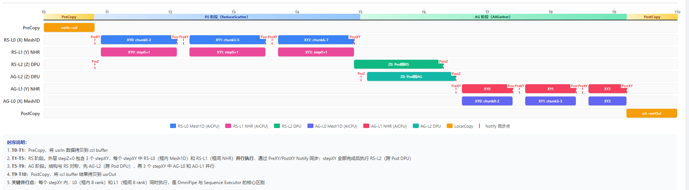
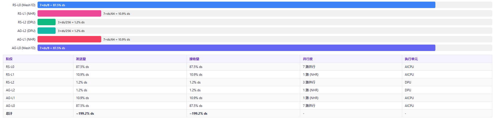

# HCCL AllReduce OmniPipe Executor 分析

*基于 `ins_v2_all_reduce_omnipipe_executor.cc` 全量源码 + `omnipipe_data_slice_calc.cc` 数据切片计算源码 + 6 个模板实现文件  
拓扑：8×8×4 = 256 rank · 单 rank 单 loop 输入数据大小 = ds*

---

## 0. 文档导航

| 章节 | 内容 |
| --- | --- |
| [1. 注册与拓扑](#1-executor-注册与三级拓扑) | 8×8×4 三级拓扑，6 个模板分配 |
| [2. 数据切分](#2-数据切分omnipipesplitdata) | 256 rank 数据均分，loop 拆分 |
| [3. 等价带宽](#3-等价带宽计算) | mesh/nhr/dpu 三级带宽模型 |
| [4. 流水线调度](#4-omnipipe-流水线调度核心) | 传统 vs OmniPipe，甘特时序图 |
| [5. 2D RS 算法](#5-2d-reducescatter-数据分布算法) | CalReducescatterDataSize2D 核心公式 |
| [6. 2D AG 算法](#6-2d-allgather-数据分布算法) | CalAllgatherDataSize2D 核心公式 |
| [7. 数据量变化](#7-各阶段数据量变化) | 从 PreCopy 到 PostCopy 全链路 |
| [8. 通信量计算](#8-各阶段通信量计算) | 逐级 send/recv 量推导 |
| [9. Scratch 与 Loop](#9-scratch-buffer-与-loop-计算) | ccl buffer 容量约束 |
| [10. 切片偏移](#10-切片偏移计算) | CalcRS/AGOmniPipeSliceInfo |
| [11. 线程与同步](#11-线程与-notify-同步机制) | 6 线程组 + Notify 同步点 |
| [12. 代码调用链](#12-完整代码调用链) | 从 OrchestrateLoop 到模板 KernelRun |
| [13. 对比 Sequence](#13-omnipipe-vs-sequence-executor) | 两种 Executor 横向对比 |
| [14. 汇总表](#14-汇总表) | 全量数据/通信量一览 |
| [15. 设计要点](#15-关键设计要点) | 6 大核心设计 |
| [16. 代码索引](#16-关键代码位置索引) | 文件 + 行号速查 |

---

## 1. Executor 注册与三级拓扑

### 1.1 注册信息（line 954-958）

```cpp
// ins_v2_all_reduce_omnipipe_executor.cc:954-958
REGISTER_EXEC_V2_MULTI(
    HcclCMDType::HCCL_CMD_ALLREDUCE,
    InsV2AllReduceOmniPipeMultilevel,        // Executor 名称
    InsV2AllReduceOmniPipeExecutor,          // Executor 类
    TopoMatchMultilevel,                     // 拓扑匹配器
    // RS 模板（Level0, Level1, Level2）
    InsTempReduceScatterOmniPipeMesh1D,      // RS-Level0: 框内 Mesh 1D (AICPU)
    InsTempReduceScatterOmniPipeNHR,         // RS-Level1: 框间 NHR (AICPU)
    InsTempReduceScatterOmniPipeMesh1dDpu,   // RS-Level2: 跨 Pod Mesh 1D (DPU)
    // AG 模板（Level0, Level1, Level2）
    InsTempAllGatherOmniPipeMesh1D,          // AG-Level0: 框内 Mesh 1D (AICPU)
    InsTempAllGatherOmniPipeNHR,             // AG-Level1: 框间 NHR (AICPU)
    InsTempAllGatherOmniPipeNHRDPU);         // AG-Level2: 跨 Pod NHR (DPU)
```

### 1.2 三级拓扑结构（8×8×4 = 256 rank）


### 1.3 模板分配表

| 层级 | RS 模板 | AG 模板 | 执行单元 | rankSize | 拓扑范围 | 并行度 |
| --- | --- | --- | --- | --- | --- | --- |
| **Level0 (X)** | OmniPipeMesh1D | OmniPipeMesh1D | AICPU | 8 | 框内 | 7 路并行 |
| **Level1 (Y)** | OmniPipeNHR | OmniPipeNHR | AICPU | 8 | 框间 | 1 路串行 (NHR) |
| **Level2 (Z)** | OmniPipeMesh1dDpu | OmniPipeNHRDPU | DPU | 4 | 跨 Pod | 3 路 / 1 路 |

### 1.4 rank 索引分解

```cpp
// ins_v2_all_reduce_omnipipe_executor.cc:659-662
uint32_t intraSuperpodDeviceNum = rankSizeLevel0_ * rankSizeLevel1_;  // 8×8 = 64
rankIdxLevel0_ = (myRank_ % intraSuperpodDeviceNum) % rankSizeLevel0_;  // r % 8
rankIdxLevel1_ = (myRank_ % intraSuperpodDeviceNum) / rankSizeLevel0_;  // (r/8) % 8
rankIdxLevel2_ = myRank_ / intraSuperpodDeviceNum;                      // r / 64
```

示例：rank = 100
- Level0: 100 % 8 = 4
- Level1: (100 / 8) % 8 = 12 % 8 = 4
- Level2: 100 / 64 = 1

---

## 2. 数据切分（OmniPipeSplitData）

### 2.1 全量数据切分

```cpp
// ins_v2_all_reduce_omnipipe_executor.cc:764
auto allRankSplitData = OmniPipeSplitData(rankSize_, dataCount_, dataTypeSize_);
```

```cpp
// omnipipe_data_slice_calc.cc:871-888
std::vector<u64> OmniPipeSplitData(u64 rankSize, u64 count, u64 dataTypeSize)
{
    u64 sliceCount = RoundUp(count, rankSize);  // 向上对齐到 rankSize 的整数倍
    // 将 count 个元素均分给 rankSize(=256) 个 rank，最后一个 rank 取余
    for (u64 sliceIdx = 0; sliceIdx < rankSize; ++sliceIdx) {
        // 每个 rank 分到 ≈ count/256 个元素
    }
}
```

**含义**：将单个 rank 的输入数据（`dataCount_` 个元素，总字节 = `ds × loopTimes`）均分为 256 份。每份对应一个 rank 在 ReduceScatter 后应持有的数据块。

- 单份数据量 ≈ `ds / 256`（字节）
- CCL buffer 布局：256 份连续排列，总大小 = `ds`（单 loop）

### 2.2 Loop 拆分

```cpp
// ins_v2_all_reduce_omnipipe_executor.cc:778-779
auto multiLoopAllRankSplitData
    = OmniPipeSplitRankDataLoop(allRankSplitData, maxCountPerLoop, loopTimes, dataTypeSize_);
```

```cpp
// omnipipe_data_slice_calc.cc:890-916
// 将每 rank 的总量进一步按 maxCountPerLoop 拆成 loopTimes 轮
std::vector<std::vector<u64>> OmniPipeSplitRankDataLoop(
    std::vector<u64> omniPipeSplitSliceInfoList, u64 maxDataCountPerLoop, u64 loopCount, u64 dataTypeSize)
{
    for (u64 i = 0; i < loopCount; i++) {
        for (u64 sliceIdx = 0; sliceIdx < sliceNum; ++sliceIdx) {
            // 每轮 loop 每 rank 取 maxDataCountPerLoop 个元素（最后一轮取余）
        }
    }
}
```

**结果**：`multiLoopAllRankSplitData[loop][rankId]` = 第 `loop` 轮中 `rankId` 对应的数据量（count）。

在单 loop 中：
- 每 rank 输入 = `ds` 字节 = 256 份 × `ds/256` 字节/份
- `multiLoopAllRankSplitData[loop][myRank_]` ≈ `ds / (256 × dataTypeSize_)` 个元素

---

## 3. 等价带宽计算

### 3.1 原始带宽值

```cpp
// omnipipe_data_slice_calc.h:27-35
constexpr double BW_OMNI_DEFAULT      = 50;   // L0/L1 默认带宽
constexpr double BW_OMNI_UBX_ROCE     = 25;   // L2 RoCE 带宽
constexpr double BW_OMNI_UBX_RS_CLOS  = 225;  // CLOS RS 带宽
constexpr double BW_OMNI_UBX_AG_CLOS  = 191;  // CLOS AG 带宽
```

### 3.2 OrchestrateLoop 中的带宽赋值

```cpp
// ins_v2_all_reduce_omnipipe_executor.cc:719-756
// RS 带宽
double bw_rs_l0 = BW_OMNI_DEFAULT;       // 50  (L0 Mesh, 无需除)
double bw_rs_l1 = BW_OMNI_DEFAULT;       // 50  (L1 NHR)
double bw_rs_l2 = BW_OMNI_UBX_ROCE;      // 25  (L2 RoCE)

// NHR 等价带宽 = 原始带宽 / (rankSize - 1)
eqBw4 = bw_rs_l1 / (rankSizeLevel1_ - 1);  // 50 / 7 ≈ 7.143
eqBw5 = bw_rs_l2 / (rankSizeLevel2_ - 1);  // 25 / 3 ≈ 8.333

// RS 等价带宽向量
std::vector<double> endpointAttrBwNew{eqBw3=50, eqBw4≈7.143, eqBw5≈8.333};
```

```cpp
// AG 带宽（同理）
double bw_ag_l0 = BW_OMNI_DEFAULT;       // 50
double bw_ag_l1 = BW_OMNI_DEFAULT;       // 50
double bw_ag_l2 = BW_OMNI_UBX_ROCE;      // 25
// AG 等价带宽
endpointAttrBwAG = {eqBw0=50, eqBw1≈7.143, eqBw2≈8.333};
```

### 3.3 等价带宽含义

| 轴 | 模板 | 原始带宽 | 等价带宽公式 | 等价带宽值 | 说明 |
| --- | --- | --- | --- | --- | --- |
| X (L0) | Mesh1D | 50 | bw（mesh 无需除） | **50** | 框内 mesh，多路并行 |
| Y (L1) | NHR | 50 | bw / (rankSize-1) | **50/7 ≈ 7.143** | NHR 串行，等价带宽除以邻居数 |
| Z (L2) | DPU | 25 | bw / (rankSize-1) | **25/3 ≈ 8.333** | DPU 串行，等价带宽除以邻居数 |

> **注**：若拓扑为 `MESH_1D_CLOS`（非 PCIe Mix），L1 带宽会替换为 `BW_OMNI_UBX_RS_CLOS=225`（RS）或 `BW_OMNI_UBX_AG_CLOS=191`（AG），等价带宽分别为 225/7≈32.14 和 191/7≈27.29。

### 3.4 2D 等价带宽（xyB）

```cpp
// omnipipe_data_slice_calc.cc:453-478
double CalcBandwidth2D(double xB, double yB, u64 xRankSize, u64 yRankSize, int maxStepNum)
{
    // 以 dataSizeEachRank=1 为基准，计算 2D AG 每步数据比例
    // 然后按慢轴总数据量 / 总时间 得到等效带宽
    int stepNum2d = CalAllgatherDataSizeRatio2D(xAGDataSize, yAGDataSize, xB, yB, xRankSize, yRankSize, ds=1, maxStepNum);
    double xds = sum(xAGDataSize[i]);
    return xB * 1 / xds;  // 等效带宽 = xB × 总数据 / 慢轴总数据
}
```

在 `CalcOmniPipeScratchInfo` 中（line 526-531）：
```cpp
if (yB >= xB) {
    xyB = CalcBandwidth2D(xB, yB, xRankSize, yRankSize, maxStepNum - 1);
} else {
    xyB = CalcBandwidth2D(yB, xB, yRankSize, xRankSize, maxStepNum - 1);
}
```

对于 8×8×4 默认带宽：yB(7.143) < xB(50)，所以调用 `CalcBandwidth2D(7.143, 50, 8, 8, maxStepNum-1)`，即 Y 为慢轴、X 为快轴。

---

## 4. OmniPipe 流水线调度核心

### 4.1 传统分层 vs OmniPipe


| 维度 | 传统分层 | OmniPipe |
| --- | --- | --- |
| 调度方式 | 严格串行 6 步 | L0+L1 并行，L2 外层循环 |
| 总延迟 | 6 步之和 | L2(2步) + max(L0,L1)×stepXY |
| 核心区别 | 每步等待上一步 | L0/L1 同一 stepXY 内同时执行 |

### 4.2 OrchestrateLoop 核心伪代码

```cpp
// RS 阶段：L0+L1 并行，L2 外层
for (stepZ = 0; stepZ < interPodStepNum; stepZ++) {
    PreSyncInterThreads(controlThread, L2_RS);  // Z 前同步
    for (stepXY = 0; stepXY < intraPodStepNum; stepXY++) {
        PreSyncInterThreads(controlThread, L0L1_RS);  // XY 前同步
        if (rankSizeLevel0 > 1) RS_Level0.KernelRun();  // 框内 Mesh1D
        if (rankSizeLevel1 > 1) RS_Level1.KernelRun();  // 框间 NHR
        PostSyncInterThreads(controlThread, L0L1_RS); // XY 后同步
    }
    RS_Level2.KernelRun();  // 跨 Pod DPU
    PostSyncInterThreads(controlThread, L2_RS);  // Z 后同步
}
// AG 阶段：同样结构
for (stepZ = 0; stepZ < interPodStepNum; stepZ++) { ... }
```

**关键创新**：Level0 和 Level1 在同一个 stepXY 内并行执行，通过 Notify 同步边界。

### 4.3 流水线时序图（单 loop · 细化版）



**时序说明**：
1. **T0-T1**：PreCopy，将 usrIn 数据拷贝到 ccl buffer
2. **T1-T5**：RS 阶段。外层 stepZ=0 包含 3 个 stepXY，每个 stepXY 中 RS-L0（框内 Mesh1D）和 RS-L1（框间 NHR）**并行执行**，通过 PreXY/PostXY Notify 同步；stepXY 全部完成后执行 RS-L2（跨 Pod DPU）
3. **T5-T9**：AG 阶段。结构与 RS 对称，先 AG-L2（跨 Pod DPU），再 3 个 stepXY 中 AG-L0 和 AG-L1 并行
4. **T9-T10**：PostCopy，将 ccl buffer 结果拷贝到 usrOut
5. **关键并行点**：每个 stepXY 内，L0（框内 8 rank）和 L1（框间 8 rank）同时执行，是 OmniPipe 与 Sequence Executor 的核心区别

---

## 5. 2D ReduceScatter 数据分布算法

### 5.1 核心函数 CalReducescatterDataSize2D

```cpp
// omnipipe_data_slice_calc.cc:331-448
u64 CalReducescatterDataSize2D(
    u64* xStepP2pDataSize,  // 输出：慢轴每步数据片大小
    u64* yStepP2pDataSize,  // 输出：快轴每步数据片大小
    double xB,              // 慢轴带宽
    double yB,              // 快轴带宽
    u64 xRankSize,          // 慢轴 rank 数
    u64 yRankSize,          // 快轴 rank 数
    u64 dataSizeEachRank,   // 单 rank 输入数据量
    u64 maxStep,            // 最大步数
    CommEngine engine)
```

### 5.2 算法步骤

```
步骤 1: 计算带宽比例和等比系数
  bandwidthRatio = yB / xB                        // 快慢轴带宽比
  omniPipeRatio  = (xRankSize - 1) / bandwidthRatio  // 斜对角等比

步骤 2: 计算通信步数
  若 omniPipeRatio == 1:  step = bandwidthRatio + 2
  否则:                    step = ceil(log(xRankSize - bandwidthRatio) / log(omniPipeRatio)) + 2
  若 step > maxStep:      step = maxStep, 需要放大系数 scale

步骤 3: 计算放大系数 scale（当 step 被 cap 到 maxStep 时）
  scale = bandwidthRatio / Σ(omniPipeRatio^t), t=0..maxStep-3

步骤 4: 逐步计算数据片大小
  第 0 步: xStep[0] = (xRankSize - bandwidthRatio) × dataSize / ((yRankSize-1)×bandwidthRatio + xRankSize-1)
           yStep[0] = xStep[0] × bandwidthRatio × (yRankSize-1) / (xRankSize-1)
  第 1~step-3 步:
           xStep[i] = yStep[i-1]  （慢轴转发上一步快轴收到的数据）
           yStep[i] = xStep[i] × bandwidthRatio / (xRankSize-1)
  最后 2 步（同轴收尾，拆为两步）:
           xStep[step-2], xStep[step-1] = 剩余数据按 1/(1+bandwidthRatio) 分配
           yStep[step-2], yStep[step-1] = 对应剩余数据
```

### 5.3 数据守恒关系

```
Σ xStepP2pDataSize[i] + Σ yStepP2pDataSize[i] = dataSizeEachRank
```

即：慢轴总数据 + 快轴总数据 = 单 rank 输入总量。这保证了 RS 完成后，每个 rank 恰好得到 `dataSizeEachRank / (xRankSize × yRankSize)` 的结果。

### 5.4 外层 2D（XY vs Z）

```cpp
// omnipipe_data_slice_calc.cc:542-548 (在 CalcOmniPipeScratchInfo 中)
if (zB > xyB) {
    // Z 带宽更高：XY 为慢轴，Z 为快轴
    outerStepNum = CalReducescatterDataSize2D(
        xyRSDataSize, zRSDataSize, xyB, zB, xRankSize*yRankSize, zRankSize, dataSize, maxStepNum, engine);
} else {
    // Z 带宽更低：Z 为慢轴，XY 为快轴
    outerStepNum = CalReducescatterDataSize2D(
        zRSDataSize, xyRSDataSize, zB, xyB, zRankSize, xRankSize*yRankSize, dataSize, maxStepNum, engine);
}
```

对于 8×8×4 默认带宽：
- xyB ≈ 由 `CalcBandwidth2D(7.143, 50, 8, 8, maxStep)` 计算（具体值依赖步数）
- zB ≈ 8.333
- 若 zB < xyB：Z 为慢轴，XY 为快轴 → 先做 Z 同轴，再做 XY 斜对角

### 5.5 内层 2D（X vs Y）

```cpp
// omnipipe_data_slice_calc.cc:552-562
if (yB >= xB) {
    // Y 快：X 慢轴，Y 快轴
    innerStepNum = CalReducescatterDataSize2D(
        xRSDataSize[i], yRSDataSize[i], xB, yB, xRankSize, yRankSize, xyRSDataSize[i], maxStepNum, engine);
} else {
    // X 快：Y 慢轴，X 快轴（交换）
    innerStepNum = CalReducescatterDataSize2D(
        yRSDataSize[i], xRSDataSize[i], yB, xB, yRankSize, xRankSize, xyRSDataSize[i], maxStepNum, engine);
}
```

对于默认带宽 yB(7.143) < xB(50)：Y 为慢轴，X 为快轴。

### 5.6 RS 步数说明

```cpp
// omnipipe_data_slice_calc.cc:48-57
int SetMaxStepNumOmni(OmniNeedSetStepNum needSetStepNum)
{
    int maxStepNum = MAX_STEP_NUM;  // 默认 5
    if (needSetStepNum == OMNIPIPE_UBX_16P)  maxStepNum = OMNIPIPE_UBX_16P_MAX_STEP_NUM;  // 5
    if (needSetStepNum == OMNIPIPE_UBX_32P)  maxStepNum = UBX_ROCE_MAX_STEP_NUM;           // 2
    return maxStepNum;
}
```

```cpp
// omnipipe_data_slice_calc.h:23-25
constexpr u64 MAX_STEP_NUM = 5;                      // 默认最大步数
constexpr u64 OMNIPIPE_UBX_16P_MAX_STEP_NUM = 5;     // 16P 最大步数
constexpr u64 UBX_ROCE_MAX_STEP_NUM = 2;             // 32P RoCE 最大步数
```

RS 额外 `+1`（line 494）：`maxStepNum = SetMaxStepNumOmni(...) + 1`，因为 RS 最后一步拆为两步。

| 拓扑模式 | needSetStepNum | RS maxStepNum | AG maxStepNum |
| --- | --- | --- | --- |
| DEFAULT (8×8×4 Multilevel) | OMNIPIPE_DEFAULT | 5+1=**6** | **5** |
| UBX_16P | OMNIPIPE_UBX_16P | 5+1=**6** | **5** |
| UBX_32P | OMNIPIPE_UBX_32P | 2+1=**3** | **2** |

---

## 6. 2D AllGather 数据分布算法

### 6.1 核心函数 CalAllgatherDataSize2D

```cpp
// omnipipe_data_slice_calc.cc:234-325
u64 CalAllgatherDataSize2D(
    u64* xStepP2pDataSize,  // 输出：慢轴每步数据片大小
    u64* yStepP2pDataSize,  // 输出：快轴每步数据片大小
    double xB, double yB,   // 慢/快轴带宽
    u64 xRankSize, u64 yRankSize,
    u64 dataSizeEachRank,   // 单 rank 数据量（AG 的起点）
    u64 maxStep, CommEngine engine)
```

### 6.2 AG 与 RS 的区别

| 维度 | RS | AG |
| --- | --- | --- |
| 数据流向 | 大→小（ds → ds/256） | 小→大（ds/256 → ds） |
| maxStepNum | `SetMaxStepNumOmni() + 1` | `SetMaxStepNumOmni()`（不 +1） |
| 最后一步处理 | 拆为两步 | 不拆 |
| 数据守恒 | Σx + Σy = dataSize | Σx + Σy = dataSize |

### 6.3 AG 数据分布步骤

```
步骤 1: 计算 bandwidthRatio = yB / xB, omniPipeRatio = (xRankSize-1)/bandwidthRatio
步骤 2: 计算步数 step（不 +2，直接 +1）
  若 omniPipeRatio == 1:  step = bandwidthRatio + 1
  否则:                    step = ceil(log(xRankSize - bandwidthRatio) / log(omniPipeRatio)) + 1
步骤 3: 逐步计算
  第 0 步: xStep[0] = scale × dataSize / bandwidthRatio (或 dataSize 当 step=2)
           yStep[0] = dataSize
  第 1~step-2 步:
           yStep[i] = xStep[i-1]
           xStep[i] = yStep[i] × (xRankSize-1) / bandwidthRatio
  最后一步:
           xStep[step-1] = (dataSize - sumY) × (xRankSize-1) / ((xRankSize-1) + (yRankSize-1)×bandwidthRatio)
           yStep[step-1] = (dataSize - sumY) - xStep[step-1]
```

### 6.4 AG 通信量

AG 的通信量与 RS 对称：

| 阶段 | 输入 | 输出 | send = recv |
| --- | --- | --- | --- |
| AG-L2 (NHRDPU, 4) | ds/256 | ds/64 | 3 × ds/256 |
| AG-L1 (NHR, 8) | ds/64 | ds/8 | 7 × ds/64 |
| AG-L0 (Mesh1D, 8) | ds/8 | ds | 7 × ds/8 |

OmniPipe 下 L0/L1 的 AG 通信量同样按带宽比例分配，总量守恒。

---

## 7. 各阶段数据量变化

### 7.1 数据流转总览


### 7.2 各阶段 cclBuffer 数据量（沙漏模型）

| 阶段 | 操作 | cclBuffer 数据量 | 占比 | 说明 |
| --- | --- | --- | --- | --- |
| **usrIn** | 输入 | ds | 100% | 完整数据 |
| **PreCopy** | usrIn → ccl | ds | 100% | 256 份拷入 ccl，每份 ds/256 |
| **RS-L0** (Mesh1D, 8 ranks) | 框内 RS | ds → **ds/8** | 12.5% | 8 份 scatter+reduce，每 rank 留 1 份 |
| **RS-L1** (NHR, 8 ranks) | 框间 RS | ds/8 → **ds/64** | 1.6% | 8 份 scatter+reduce |
| **RS-L2** (DPU, 4 ranks) | 跨 Pod RS | ds/64 → **ds/256** | 0.4% | 4 份 scatter+reduce |
| **AG-L2** (NHRDPU, 4 ranks) | 跨 Pod AG | ds/256 → **ds/64** | 1.6% | 4 倍 gather |
| **AG-L1** (NHR, 8 ranks) | 框间 AG | ds/64 → **ds/8** | 12.5% | 8 倍 gather |
| **AG-L0** (Mesh1D, 8 ranks) | 框内 AG | ds/8 → **ds** | 100% | 8 倍 gather |
| **PostCopy** | ccl → usrOut | ds | 100% | 256 份拷出 |
| **usrOut** | 输出 | ds | 100% | 完整数据 |

### 7.3 PreCopy 代码路径

```cpp
// ins_v2_all_reduce_omnipipe_executor.cc:817-824
tempParamLocalcopy.buffInfo.inBuffType = BufferType::INPUT;
tempParamLocalcopy.buffInfo.inBuffBaseOff = processedDataCount * dataTypeSize_;  // 按 loop 偏移
tempParamLocalcopy.buffInfo.outBuffBaseOff = 0;
tempParamLocalcopy.repeatNum = rankSize_;  // 256 份
CHK_RET(DoLocalCopy(tempParamLocalcopy, controlThread_, allRankSplitData, multiLoopAllRankSplitData[loop]));
```

```cpp
// omnipipe_data_slice_calc.cc:2086-2131 (CalLocalCopySlice)
// PreCopy: src=inputPtr, dst=hcclBuff
// 遍历 repeatNum=256 个 rank 的切片，每份大小 = curLoopAllRankSplitData[i] * dataTypeSize
for (auto i = 0; i < tempAlgParams.repeatNum; ++i) {
    DataSlice srcSlice = DataSlice(srcAddr, inBuffBaseOff + inputSliceStride[i],
        curLoopAllRankSplitData[i] * dataTypeSize, curLoopAllRankSplitData[i]);
    DataSlice dstSlice = DataSlice(dstAddr, outBuffBaseOff + outputSliceStride[i],
        curLoopAllRankSplitData[i] * dataTypeSize, curLoopAllRankSplitData[i]);
}
```

**PreCopy 总搬运量** = Σ(curLoopAllRankSplitData[i] × dataTypeSize) = ds（单 rank 单 loop）

### 7.4 PostCopy 代码路径

```cpp
// ins_v2_all_reduce_omnipipe_executor.cc:912-918
tempParamLocalcopy.buffInfo.inBuffType = BufferType::HCCL_BUFFER;  // 从 ccl 读
tempParamLocalcopy.buffInfo.inBuffBaseOff = 0;
tempParamLocalcopy.buffInfo.outBuffBaseOff = processedDataCount * dataTypeSize_;
tempParamLocalcopy.repeatNum = rankSize_;  // 256 份
CHK_RET(DoLocalCopy(tempParamLocalcopy, controlThread_, allRankSplitData, multiLoopAllRankSplitData[loop]));
```

**PostCopy 总搬运量** = ds（同 PreCopy）

---

## 8. 各阶段通信量计算

### 8.1 通信量基本原理

**ReduceScatter**（N 个 rank）：
- 每个 rank 持有 N 份数据（每份 = 总量/N）
- RS 后每个 rank 保留 1 份（其余 rank 对该份的 reduce 结果）
- **单 rank 发送量** = (N-1) 份 = (N-1)/N × 总量
- **单 rank 接收量** = (N-1) 份 = (N-1)/N × 总量

**AllGather**（N 个 rank）：
- 每个 rank 持有 1 份数据
- AG 后每个 rank 持有 N 份
- **单 rank 发送量** = (N-1) 份 = (N-1)/N × 最终总量
- **单 rank 接收量** = (N-1) 份 = (N-1)/N × 最终总量

### 8.2 标准分层通信量（等带宽分配）

> 以下为**标准分层**（非 OmniPipe 带宽感知分配）的通信量，即假设每层独立完整执行 RS/AG。

#### RS 阶段

| 阶段 | 模板 | rankSize | 输入数据量 | 输出数据量 | 单 rank 发送量 | 单 rank 接收量 |
| --- | --- | --- | --- | --- | --- | --- |
| RS-L0 | Mesh1D | 8 | ds | ds/8 | (8-1)×ds/8 = **7ds/8** | **7ds/8** |
| RS-L1 | NHR | 8 | ds/8 | ds/64 | (8-1)×ds/64 = **7ds/64** | **7ds/64** |
| RS-L2 | Mesh1dDpu | 4 | ds/64 | ds/256 | (4-1)×ds/256 = **3ds/256** | **3ds/256** |
| **RS 总计** | | | | ds/256 | **255ds/256 ≈ 99.6% ds** | **255ds/256** |

#### AG 阶段

| 阶段 | 模板 | rankSize | 输入数据量 | 输出数据量 | 单 rank 发送量 | 单 rank 接收量 |
| --- | --- | --- | --- | --- | --- | --- |
| AG-L2 | NHRDPU | 4 | ds/256 | ds/64 | (4-1)×ds/256 = **3ds/256** | **3ds/256** |
| AG-L1 | NHR | 8 | ds/64 | ds/8 | (8-1)×ds/64 = **7ds/64** | **7ds/64** |
| AG-L0 | Mesh1D | 8 | ds/8 | ds | (8-1)×ds/8 = **7ds/8** | **7ds/8** |
| **AG 总计** | | | | ds | **255ds/256 ≈ 99.6% ds** | **255ds/256** |

#### 全流程总通信量

| 类别 | 通信量 |
| --- | --- |
| PreCopy (LocalCopy) | ds |
| PostCopy (LocalCopy) | ds |
| RS 通信 (send) | 255ds/256 ≈ 99.6% ds |
| RS 通信 (recv) | 255ds/256 ≈ 99.6% ds |
| AG 通信 (send) | 255ds/256 ≈ 99.6% ds |
| AG 通信 (recv) | 255ds/256 ≈ 99.6% ds |
| **总数据传输** | **2 × ds + 4 × 255ds/256 ≈ 5.98 ds** |

### 8.3 各阶段通信量对比（单 rank）



### 8.4 OmniPipe 带宽感知分配

OmniPipe 的关键创新是 **L0 和 L1 并行执行**，数据在两轴间按带宽比例分配。总通信量不变，但 L0/L1 的分配比例改变。

#### 外层分配（XY 合并 vs Z）

```
外层 2D RS：将 ds 在 XY(64 ranks) 和 Z(4 ranks) 之间分配
  XY 总数据 + Z 总数据 = ds
  分配比例由 CalReducescatterDataSize2D(xyB, zB, ...) 决定

  Z 通信量（标准）= 3ds/256 ≈ 1.17% ds
  XY 通信量（标准）= 63ds/64 ≈ 98.44% ds
```

#### 内层分配（X vs Y）

```
内层 2D RS：将 xyRSDataSize[step] 在 X(8 ranks) 和 Y(8 ranks) 之间分配
  X 总数据 + Y 总数据 = xyRSDataSize[step]
  分配比例由 CalReducescatterDataSize2D(xB, yB, ...) 决定

  带宽比 bandwidthRatio = yB_fast / xB_slow = 50 / 7.143 ≈ 7
  → 快轴(X, Mesh)分配更多数据，慢轴(Y, NHR)分配更少
```

#### OmniPipe 下 L0/L1 通信量变化

| 维度 | 标准分配 | OmniPipe 分配趋势 |
| --- | --- | --- |
| L0 (X, Mesh) send | 7ds/8 = 87.5% ds | **增大**（带宽高，分配更多数据） |
| L1 (Y, NHR) send | 7ds/64 = 10.9% ds | **减小**（带宽低，分配更少数据） |
| L0+L1 send 合计 | 63ds/64 = 98.4% ds | **不变**（总量守恒） |
| L2 (Z, DPU) send | 3ds/256 = 1.2% ds | 由外层 2D 决定 |

> **注**：OmniPipe 下 L0/L1 的精确通信量取决于 `CalReducescatterDataSize2D` 的逐步计算结果，涉及带宽比、步数、对齐等多重因素，无法用简单公式表达。但总量守恒关系始终成立。

### 8.5 Mesh1D 模板通信量计算代码

```cpp
// ins_temp_reduce_scatter_omnipipe_mesh_1D.cc:205-275 (RunReduceScatter)
for (u32 queIdx = 0; queIdx < threadNum_; queIdx++) {     // threadNum_ = rankSize-1 = 7
    u32 nextRank = (myAlgRank + 1 + queIdx) % templateRankSize_;  // 7 个邻居
    for (u32 repeatIdx = 0; repeatIdx < inputOmniPipeSliceStride[myAlgRank].size(); repeatIdx++) {
        // 每片传输量 = stepSliceSize[nextRank][repeatIdx]
        DataSlice txSrcSlice = DataSlice(localCclBuffAddr, txSrcCurrent,
            tempAlgParam.stepSliceInfo.stepSliceSize[nextRank][repeatIdx],
            tempAlgParam.stepSliceInfo.stepCount[nextRank][repeatIdx]);
        // ... 构造 txDstSlice, rxSrcSlice, rxDstSlice ...
    }
    SendRecvWrite(sendRecvInfo, threads[queIdx]);  // 7 路并行
}
// 之后执行 PostReduce：从 cclBuffer 做 LocalReduce
```

**通信量公式**：
```
Mesh1D RS send = Σ_{neighbor=0}^{N-2} Σ_{repeat=0}^{R-1} stepSliceSize[neighbor][repeat]
               = (N-1) × piece_size  （标准情况）
               = 7 × ds/8  （L0, N=8）
```

### 8.6 NHR 模板通信量计算代码

```cpp
// ins_temp_reduce_scatter_omnipipe_nhr.cc:139-197 (RunNHR)
const u32 nSteps = GetNHRStepNum(templateRankSize_);  // ceil(log2(8)) = 3
for (u32 step = 0; step < nSteps; ++step) {
    AicpuNHRStepInfo stepInfo;
    GetStepInfo(step, nSteps, stepInfo);  // 按 XOR 距离配对
    for (u32 i = 0; i < stepInfo.nSlices; ++i) {
        // 传输量 = dataSplitVec_[txIdx][rpt][channelIdx]
        // 由 PrepareOmniPipeDataSplitForMultiChannel 按端口组切分
    }
    SendRecvWriteReduce(sendRecvInfo, threads[0], channelIdx);  // 1 路串行
}
```

**NHR 步数**：`GetNHRStepNum(N) = ceil(log2(N))`

| rankSize | NHR 步数 |
| --- | --- |
| 8 | 3 |
| 4 | 2 |

**通信量公式**：
```
NHR RS send = Σ_{step=0}^{ceil(log2(N))-1} Σ_{slice} dataSplitVec[txIdx][rpt][ch]
            = (N-1)/N × input_data  （标准情况）
            = 7/8 × ds/8 = 7ds/64  （L1, N=8, input=ds/8）
```

### 8.7 DPU 模板通信量计算代码

```cpp
// ins_temp_reduce_scatter_omnipipe_mesh_1d_dpu.cc:233-305 (DPUKernelRun)
for (u32 rankIdx = 0; rankIdx < rankIds.size(); rankIdx++) {
    u32 remoteRank = rankIds[rankIdx];
    if (remoteRank == myRank) continue;  // 跳过自己
    for (u32 repeatIdx = 0; repeatIdx < inputOmniPipeSliceStride[myAlgRank].size(); repeatIdx++) {
        // 传输量 = stepSliceSize[rankIdx][repeatIdx]
        DataSlice txSrcSlice = DataSlice(localCclBuffAddr, txSrcCurrent,
            tempAlgParam.stepSliceInfo.stepSliceSize[rankIdx][repeatIdx],
            tempAlgParam.stepSliceInfo.stepCount[rankIdx][repeatIdx]);
    }
    SendRecvWrite(sendRecvInfo);  // DPU 侧无 thread 参数
}
```

**通信量公式**：
```
DPU RS send = Σ_{neighbor} Σ_{repeat} stepSliceSize[neighbor][repeat]
            = (N-1) × piece_size  （标准情况）
            = 3 × ds/256  （L2, N=4）
```

---

## 9. Scratch Buffer 与 Loop 计算

### 9.1 Scratch 计算入口

```cpp
// ins_v2_all_reduce_omnipipe_executor.cc:759-773
OmniPipeScratchParam scratchParam;
CHK_RET(InitOmniPipeScratchParam(scratchParam, param, endpointAttrBwNew, tempMap));
scratchParam.maxTmpMemSize = resCtx.cclMem.size;  // ccl buffer 总大小
scratchParam.dataSize = CalcCountToDataSize(allRankSplitData, dataTypeSize_);  // 转 byte

std::vector<u64> loopInfo = CalcOmniPipeScratchInfo(scratchParam);
u64 maxCountPerLoop = loopInfo[0];  // 单 loop 最大 count
u64 loopTimes = loopInfo[1];        // loop 轮数
```

### 9.2 CalcOmniPipeScratchInfo 计算

```cpp
// omnipipe_data_slice_calc.cc:483-678
std::vector<u64> CalcOmniPipeScratchInfo(OmniPipeScratchParam& omniPipeScratchParam)
{
    // 1. 计算 2D 等价带宽 xyB
    // 2. 外层 2D RS 数据分布（XY vs Z）
    // 3. 内层 2D RS 数据分布（X vs Y）
    // 4. 计算各轴 scratch 大小
    // 5. 计算总 ccl buffer 需求
    // 6. 按 bufferRatio 缩放，计算 maxCountPerLoop 和 loopTimes
}
```

### 9.3 CCL Buffer 组成

```cpp
// omnipipe_data_slice_calc.cc:639-642
u64 allCclBufferSize = 0;
if (engine == COMM_ENGINE_AICPU_TS || engine == COMM_ENGINE_CPU) {
    allCclBufferSize = dataSize * xRankSize * yRankSize * zRankSize;  // AICPU: 全量数据
}
allCclBufferSize += scratchSize[0] + scratchSize[1] + scratchSize[2];  // + scratch
```

| 组成部分 | 公式 | 说明 |
| --- | --- | --- |
| 数据区 (AICPU) | `dataSize × 256` | 全量数据在 ccl 中 |
| X scratch | `CalScratchSize[0]` | L0 mesh 需要的额外空间 |
| Y scratch | `CalScratchSize[1]` | L1 NHR 需要的额外空间 |
| Z scratch | `CalScratchSize[2]` | L2 DPU 需要的额外空间 |

### 9.4 Scratch 大小计算

```cpp
// omnipipe_data_slice_calc.cc:683-722 (CalScratchSize)
// 仅 AICPU + Mesh 类型需要预留 scratch
for (int axis = 0; axis < levelAlgType.size(); axis++) {
    if (levelAlgType[axis] > 0  // mesh=1, nhr=0
        && (engine == COMM_ENGINE_AICPU_TS || engine == COMM_ENGINE_CPU)) {
        for (int i = 0; i < rsStepDataSize[axis].size(); i++) {
            scratchSize[axis] = max(rsStepDataSize[axis][i] × levelRankSize[axis]);
        }
    }
}
```

| 轴 | levelAlgType | 是否需要 scratch | scratch 大小 |
| --- | --- | --- | --- |
| X (L0) | 1 (Mesh) | 是 | `max_step_data × 8` |
| Y (L1) | 0 (NHR) | 否 | 0 |
| Z (L2) | 1 (Mesh1dDpu) | 是（AICPU 编排） | `max_step_data × 4` |

### 9.5 Loop 缩放逻辑

```cpp
// omnipipe_data_slice_calc.cc:648-665
if (bufferRatio < 1) {
    maxDataSizePerLoop = dataSize;  // buffer 够大，单 loop 完成
} else {
    maxDataSizePerLoop = dataSize / bufferRatio;  // 按比例缩小
    maxDataSizePerLoop = maxDataSizePerLoop / justifyLen * justifyLen;  // 对齐 512B
}

// 验证循环：如果仍然超限，继续缩小
while (allCclBufferSize > maxTmpMemSize) {
    maxDataSizePerLoop = maxDataSizePerLoop * LOOP_SCALING_FACTOR;  // ×0.9
    maxDataSizePerLoop = maxDataSizePerLoop / justifyLen * justifyLen;
    // 重新计算 scratch...
}
```

```cpp
// omnipipe_data_slice_calc.cc:15-16
constexpr double LOOP_SCALING_FACTOR = 0.9;
// omnipipe_data_slice_calc.h:21
constexpr u64 HCCL_MIN_SLICE_ALIGN_OMNIPIPE = 512;  // 对齐粒度
```

### 9.6 CCL Buffer 布局

```
┌─────────────────────────────────────────────────────────────┐
│                     CCL Buffer 布局                          │
├─────────────────────────────────────────────────────────────┤
│  数据区 (dataSize × 256)    ← AICPU 模式全量数据           │
├─────────────────────────────────────────────────────────────┤
│  X scratch (scratchSize[0]) ← L0 Mesh 额外空间              │
├─────────────────────────────────────────────────────────────┤
│  Y scratch (scratchSize[1]) ← L1 NHR 额外空间（通常=0）     │
├─────────────────────────────────────────────────────────────┤
│  Z scratch (scratchSize[2]) ← L2 DPU 额外空间               │
└─────────────────────────────────────────────────────────────┘

偏移基址：
  xCclBufferBaseOff = dataSize × 256              (line 1524-1527)
  yCclBufferBaseOff = xCclBufferBaseOff + scratchSize[0]  (line 1530)
  zCclBufferBaseOff = yCclBufferBaseOff + scratchSize[1]  (line 1531)
```

---

## 10. 切片偏移计算

### 10.1 RS Slice 计算（CalcRSOmniPipeSliceInfo）

```cpp
// omnipipe_data_slice_calc.cc:1466-2084
OmniPipeSliceInfo CalcRSOmniPipeSliceInfo(OmniPipeSliceParam& omniPipeSliceParam)
{
    // 1. 计算外层 2D RS（XY vs Z）→ zRSDataSize, xyRSDataSize
    // 2. 计算内层 2D RS（X vs Y）→ xRSDataSize, yRSDataSize
    // 3. 计算偏移 → zRSOffset, xyRSOffset, xRSOffset, yRSOffset
    // 4. 填充 dataSliceLevel0/1/2（StepSliceInfo 数组）
    //    每个 StepSliceInfo 包含：
    //      - stepSliceSize[rankIdx][repeatIdx]  每片字节大小
    //      - stepCount[rankIdx][repeatIdx]      每片元素个数
    //      - stepInputSliceStride[rankIdx]      输入步进偏移
    //      - stepOutputSliceStride[rankIdx]     输出步进偏移
    //      - inputOmniPipeSliceStride[rank][repeat]  OmniPipe 管道偏移
    //      - outputOmniPipeSliceStride[rank][repeat] OmniPipe 管道偏移
}
```

### 10.2 RS 步数结构

```
外层 stepZ 循环：interPodStepNum 步
  ├── 每步分配 zRSDataSize[stepZ]（Z 轴数据）和 xyRSDataSize[stepZ]（XY 轴数据）
  └── 内层 stepXY 循环：intraPodStepNum 步
       ├── 每步分配 xRSDataSize[stepZ][stepXY]（X 轴数据）和 yRSDataSize[stepZ][stepXY]（Y 轴数据）
       └── X (Mesh1D) 和 Y (NHR) 并行执行

代码路径：
  interPodStepNum = OmniPipeSliceInfoRS.dataSliceLevel2.size()          (line 827)
  intraPodStepNum = dataSliceLevel0.size() / dataSliceLevel2.size()     (line 828)
```

### 10.3 AG Slice 计算（CalcAGOmniPipeSliceInfo）

```cpp
// omnipipe_data_slice_calc.cc:920-1441
OmniPipeSliceInfo CalcAGOmniPipeSliceInfo(OmniPipeSliceParam& omniPipeSliceParam)
{
    // maxStepNum = SetMaxStepNumOmni()（不 +1，AG 不拆最后一步）
    // 计算外层 2D AG（XY vs Z）
    // 计算内层 2D AG（X vs Y）
    // 填充 dataSliceLevel0/1/2
}
```

### 10.4 StepSliceInfo 结构体

```cpp
// template_utils.h:177-211
struct StepSliceInfo {
    std::vector<std::vector<u64>> stepCount;              // 每 step 各 rank 的数据量（count）
    std::vector<std::vector<u64>> stepSliceSize;          // 每 step 各 rank 的数据量（byte）
    std::vector<u64> stepInputSliceStride;                // 输入步进：addr + stride[rankId] + pipeStride[j]
    std::vector<u64> stepOutputSliceStride;               // 输出步进
    std::vector<std::vector<u64>> inputOmniPipeSliceStride;   // 管道内输入偏移
    std::vector<std::vector<u64>> outputOmniPipeSliceStride;  // 管道内输出偏移
};
```

### 10.5 OmniPipeSliceInfo 结构体

```cpp
// omnipipe_data_slice_calc.h:48-60
struct OmniPipeSliceInfo {
    std::vector<StepSliceInfo> dataSliceLevel0;  // X 轴每步偏移
    std::vector<StepSliceInfo> dataSliceLevel1;  // Y 轴每步偏移
    std::vector<StepSliceInfo> dataSliceLevel2;  // Z 轴每步偏移
};
```

---

## 11. 线程与 Notify 同步机制

### 11.1 线程分配

```
controlThread_ (主线程，threads_[0])
├── RS-Level0 线程组 (levelThreadsRS_[0])
├── RS-Level1 线程组 (levelThreadsRS_[1])
├── RS-Level2 线程组 (levelThreadsRS_[2])
├── AG-Level0 线程组 (levelThreadsAG_[0])
├── AG-Level1 线程组 (levelThreadsAG_[1])
└── AG-Level2 线程组 (levelThreadsAG_[2])
```

### 11.2 Notify 同步点

| 同步类型 | 触发时机 | 方向 | 涉及线程 |
| --- | --- | --- | --- |
| PreSync-XY | 每个 stepXY 开始 | 主线程 → L0/L1 | 主线程 → L0/L1 RS/AG 主线程 |
| PostSync-XY | 每个 stepXY 结束 | L0/L1 → 主线程 | L0/L1 RS/AG 主线程 → 主线程 |
| PreSync-Z | 每个 stepZ 开始 | 主线程 → L2 | 主线程 → L2 RS/AG 主线程 |
| PostSync-Z | 每个 stepZ 结束 | L2 → 主线程 | L2 RS/AG 主线程 → 主线程 |

### 11.3 完整一次 loop 的同步时序

```
1. PreSync-XY (RS-L0/L1)
2. DoLocalCopy (PreCopy: usrIn → ccl)
3. PostSync-XY (RS-L0/L1)
4. for stepZ:
   a. PreSync-Z (RS-L2)
   b. for stepXY:
      - PreSync-XY (RS-L0/L1)
      - RS-L0 KernelRun
      - RS-L1 KernelRun
      - PostSync-XY (RS-L0/L1)
   c. RS-L2 KernelRun
   d. PostSync-Z (RS-L2)
5. for stepZ:
   a. PreSync-Z (AG-L2)
   b. for stepXY:
      - PreSync-XY (AG-L0/L1)
      - AG-L0 KernelRun
      - AG-L1 KernelRun
      - PostSync-XY (AG-L0/L1)
   c. AG-L2 KernelRun
   d. PostSync-Z (AG-L2)
6. PreSync-XY (AG-L0/L1)
7. DoLocalCopy (PostCopy: ccl → usrOut)
8. PostSync-XY (AG-L0/L1)
```

---

## 12. 完整代码调用链

### 12.1 OrchestrateLoop 主流程

```
Orchestrate() [line 155]
  └── OrchestrateLoop() [line 684]
       │
       ├── BuildSubCommAndTempMap() [line 692]
       │    └── 设置 rankSizeLevel0_=8, rankSizeLevel1_=8, rankSizeLevel2_=4
       │    └── 创建 6 个模板实例 (RS-L0/L1/L2, AG-L0/L1/L2)
       │
       ├── InitTemplateParams() [line 717]
       │    └── 为每个模板分配 threads, channels, cclMem
       │
       ├── 带宽计算 [line 719-756]
       │    └── endpointAttrBwNew (RS) = {50, 50/7, 25/3}
       │    └── endpointAttrBwAG   (AG) = {50, 50/7, 25/3}
       │
       ├── CalcOmniPipeScratchInfo() [line 769]
       │    └── 计算 maxCountPerLoop, loopTimes
       │
       ├── OmniPipeSplitData() [line 764]
       │    └── 将 dataCount 均分 256 份
       │
       ├── OmniPipeSplitRankDataLoop() [line 779]
       │    └── 按 loop 拆分
       │
       ├── CalcRSOmniPipeSliceInfo() [line 807]
       │    └── 计算 RS 三轴每步 stepSliceSize/offset
       │
       ├── CalcAGOmniPipeSliceInfo() [line 809]
       │    └── 计算 AG 三轴每步 stepSliceSize/offset
       │
       └── for loop = 0 to loopTimes-1: [line 795]
            │
            ├── PreCopy (usrIn → ccl) [line 817-824]
            │    └── DoLocalCopy() → CalLocalCopySlice()
            │
            ├── RS 双层循环 [line 831-867]
            │    for stepZ = 0 to interPodStepNum-1:
            │      ├── PreSync-Z → RS-L2 参数准备
            │      for stepXY = 0 to intraPodStepNum-1:
            │      │   ├── PreSync-XY
            │      │   ├── RS-L0 KernelRun (Mesh1D)    ← 并行
            │      │   ├── RS-L1 KernelRun (NHR)       ← 并行
            │      │   └── PostSync-XY
            │      ├── RS-L2 KernelRun (DPU)
            │      └── PostSync-Z
            │
            ├── AG 双层循环 [line 873-909]
            │    for stepZ = 0 to interPodStepNum-1:
            │      ├── PreSync-Z → AG-L2 参数准备
            │      for stepXY = 0 to intraPodStepNum-1:
            │      │   ├── PreSync-XY
            │      │   ├── AG-L0 KernelRun (Mesh1D)    ← 并行
            │      │   ├── AG-L1 KernelRun (NHR)       ← 并行
            │      │   └── PostSync-XY
            │      ├── AG-L2 KernelRun (NHRDPU)
            │      └── PostSync-Z
            │
            └── PostCopy (ccl → usrOut) [line 912-918]
                 └── DoLocalCopy() → CalLocalCopySlice()
```

### 12.2 RS-L0 KernelRun 调用链

```
tempMap[OMNIPIPE_RS_LEVEL0]->KernelRun() [line 847-848]
  └── InsTempReduceScatterOmniPipeMesh1D::KernelRun() [mesh_1D.cc:132-157]
       ├── PreSyncInterThreads()     ← 多线程同步
       ├── RunReduceScatter()        [mesh_1D.cc:205-275]
       │    ├── 遍历 7 个邻居 (queIdx=0..6)
       │    │    └── 遍历 repeatIdx
       │    │         └── 构造 DataSlice(stepSliceSize[nextRank][repeatIdx])
       │    │              └── SendRecvWrite()  ← 实际数据传输
       │    └── PostReduce()         [mesh_1D.cc:160-202]
       │         └── LocalReduce: 从 cclBuffer 归约到输出位置
       └── PostSyncInterThreads()
```

### 12.3 RS-L1 KernelRun 调用链

```
tempMap[OMNIPIPE_RS_LEVEL1]->KernelRun() [line 855-856]
  └── InsTempReduceScatterOmniPipeNHR::KernelRun() [nhr.cc:26-61]
       ├── PrepareOmniPipeDataSplitForMultiChannel()  ← 按端口组切分数据
       │    └── CalcDataSplitByPortGroup()  → dataSplitVec_, dataOffsetVec_
       ├── PreSyncInterThreads()
       ├── for channelIdx:
       │    └── RunNHR() [nhr.cc:139-197]
       │         ├── nSteps = GetNHRStepNum(8) = 3
       │         ├── for step = 0..2:
       │         │    ├── GetStepInfo() → stepInfo (XOR 配对)
       │         │    ├── GetNHRDataSize() [nhr.cc:99-137]
       │         │    │    └── 构造 DataSlice(dataSplitVec_[txIdx][rpt][ch])
       │         │    └── SendRecvWriteReduce()
       │         └── (3 步完成 7 邻居通信)
       └── PostSyncInterThreads()
```

### 12.4 RS-L2 KernelRun 调用链

```
tempMap[OMNIPIPE_RS_LEVEL2]->KernelRun() [line 862-863]
  └── InsTempReduceScatterOmniPipeMesh1dDpu::KernelRun() [mesh_1d_dpu.cc:111-186]
       ├── HcommBatchModeEnd()                    ← 切换 eager 模式
       ├── 序列化 DPURunInfo (tempAlgParams + channels + ranks)
       ├── HcommSendRequest()                     ← 发送到 DPU
       ├── HcommWaitResponse()                    ← 等待 DPU 完成
       ├── HcommBatchModeStart()                  ← 切回 batch 模式
       └── PostReduce()                           ← 本地归约
            └── DPU 侧: DPUKernelRun() [mesh_1d_dpu.cc:233-305]
                 ├── 遍历 3 个邻居
                 │    └── 遍历 repeatIdx
                 │         └── 构造 DataSlice(stepSliceSize[rankIdx][repeatIdx])
                 │              └── SendRecvWrite()  ← DPU 侧实际传输
                 └── (3 路并行)
```

### 12.5 GenTemplateAlgParamsByDimData

```cpp
// ins_v2_all_reduce_omnipipe_executor.cc:216-229
// 将 StepSliceInfo 填入 TemplateDataParams
HcclResult GenTemplateAlgParamsByDimData(TemplateDataParams& tempAlgParams, StepSliceInfo& stepSliceInfo)
{
    // RS 所有 step 都在 ccl buffer 中搬运
    tempAlgParams.buffInfo.inBuffType  = BufferType::HCCL_BUFFER;
    tempAlgParams.buffInfo.outBuffType = BufferType::HCCL_BUFFER;
    tempAlgParams.buffInfo.inBuffBaseOff    = stepSliceInfo.buffInfo.inBuffBaseOff;
    tempAlgParams.buffInfo.outBuffBaseOff   = stepSliceInfo.buffInfo.outBuffBaseOff;
    tempAlgParams.buffInfo.hcclBuffBaseOff  = stepSliceInfo.buffInfo.hcclBuffBaseOff;
    tempAlgParams.stepSliceInfo = stepSliceInfo;  // 关键：传递切片信息
}
```

调用点（RS-L0 为例）：
```cpp
// ins_v2_all_reduce_omnipipe_executor.cc:844-848
GenTemplateAlgParamsByDimData(
    tempAlgParamMap[OMNIPIPE_RS_LEVEL0],
    OmniPipeSliceInfoRS.dataSliceLevel0[stepZ * intraPodStepNum + stepXY]);
tempMap[OMNIPIPE_RS_LEVEL0]->KernelRun(param, tempAlgParamMap[OMNIPIPE_RS_LEVEL0], tempResMap[OMNIPIPE_RS_LEVEL0]);
```

---

## 13. OmniPipe vs Sequence Executor

| 维度 | Sequence Executor | OmniPipe Executor |
| --- | --- | --- |
| 拓扑层级 | 2 级（4×4 = 16 rank） | 3 级（8×8×4 = 256 rank） |
| 模板数 | 4 个 | 6 个 |
| 调度方式 | 严格串行 4 步 | L0+L1 并行，L2 外层 |
| 并行度 | 每步单模板 | L0/L1 同时执行 |
| 同步粒度 | 模板间 3 次边界 | 每 stepXY/stepZ 同步 |
| DPU 使用 | Step2/3 用 DPU | Level2 用 DPU |
| 适用规模 | 中小规模（≤16 rank） | 大规模（≥64 rank） |
| 总发送量 | ~187.5% ds (4×4) | ~199.2% ds (8×8×4) |
| 数据切分 | 简单均分 | 带宽感知 2D 分配 |
| 等价带宽 | 无 | xyB 2D 等价带宽计算 |

---

## 14. 汇总表

### 14.1 各阶段数据量与通信量（标准分层）

| 阶段 | 模板 | rankSize | 输入量 | 输出量 | 单 rank send | 单 rank recv | 并行度 | 执行单元 |
| --- | --- | --- | --- | --- | --- | --- | --- | --- |
| PreCopy | LocalCopy | - | ds (usrIn) | ds (ccl) | - | - | 1 路 | AICPU |
| RS-L0 | Mesh1D | 8 | ds | ds/8 | 7ds/8 = 87.5% ds | 7ds/8 | 7 路并行 | AICPU |
| RS-L1 | NHR | 8 | ds/8 | ds/64 | 7ds/64 = 10.9% ds | 7ds/64 | 1 路, 3 步 | AICPU |
| RS-L2 | Mesh1dDpu | 4 | ds/64 | ds/256 | 3ds/256 = 1.2% ds | 3ds/256 | 3 路并行 | DPU |
| AG-L2 | NHRDPU | 4 | ds/256 | ds/64 | 3ds/256 = 1.2% ds | 3ds/256 | 1 路, 2 步 | DPU |
| AG-L1 | NHR | 8 | ds/64 | ds/8 | 7ds/64 = 10.9% ds | 7ds/64 | 1 路, 3 步 | AICPU |
| AG-L0 | Mesh1D | 8 | ds/8 | ds | 7ds/8 = 87.5% ds | 7ds/8 | 7 路并行 | AICPU |
| PostCopy | LocalCopy | - | ds (ccl) | ds (usrOut) | - | - | 1 路 | AICPU |
| **总计** | | | | | **≈199.2% ds** | **≈199.2% ds** | | |

### 14.2 OmniPipe 带宽感知分配对比

| 维度 | 标准 send | OmniPipe send | 变化原因 |
| --- | --- | --- | --- |
| L0 (Mesh, X) | 7ds/8 = 87.5% ds | **增大** | xB=50 带宽高，分配更多 |
| L1 (NHR, Y) | 7ds/64 = 10.9% ds | **减小** | yB≈7.14 带宽低，分配更少 |
| L0+L1 合计 | 63ds/64 = 98.4% ds | **不变** | 总量守恒 |
| L2 (DPU, Z) | 3ds/256 = 1.2% ds | 由外层 2D 决定 | zB≈8.33 vs xyB |

### 14.3 各模板 CalcScratchMultiple

| 模板 | CalcScratchMultiple | 含义 |
| --- | --- | --- |
| RS-L0 OmniPipeMesh1D | 1 | mesh 类型标识 |
| RS-L1 OmniPipeNHR | 0 | nhr 类型标识（覆盖基类） |
| RS-L2 OmniPipeMesh1dDpu | 1 | mesh 类型标识 |
| AG-L0 OmniPipeMesh1D | OPBASE: rankSize, else 0 | scratch 倍数 |
| AG-L1 OmniPipeNHR | rankSize | scratch 倍数 |
| AG-L2 OmniPipeNHRDPU | rankSize | scratch 倍数 |

### 14.4 关键常量

| 常量 | 值 | 位置 | 说明 |
| --- | --- | --- | --- |
| MAX_STEP_NUM | 5 | omnipipe_data_slice_calc.h:23 | 默认最大步数 |
| UBX_ROCE_MAX_STEP_NUM | 2 | omnipipe_data_slice_calc.h:25 | 32P RoCE 最大步数 |
| HCCL_MIN_SLICE_ALIGN_OMNIPIPE | 512 | omnipipe_data_slice_calc.h:21 | AICPU 对齐粒度 |
| HCCL_MIN_SLICE_ALIGN_OMNIPIPE_CCU | 128 | omnipipe_data_slice_calc.h:22 | CCU 对齐粒度 |
| BANDWIDTH_RATIO_BOUND | 10 | omnipipe_data_slice_calc.cc:15 | 带宽比上限 |
| LOOP_SCALING_FACTOR | 0.9 | omnipipe_data_slice_calc.cc:16 | loop 缩放因子 |
| UB_MAX_DATA_SIZE | 256MB | alg_param.h:37 | UB 协议最大传输 |
| BW_OMNI_DEFAULT | 50 | omnipipe_data_slice_calc.h:27 | 默认带宽 |
| BW_OMNI_UBX_ROCE | 25 | omnipipe_data_slice_calc.h:32 | RoCE 带宽 |
| BW_OMNI_UBX_RS_CLOS | 225 | omnipipe_data_slice_calc.h:33 | CLOS RS 带宽 |
| BW_OMNI_UBX_AG_CLOS | 191 | omnipipe_data_slice_calc.h:34 | CLOS AG 带宽 |

### 14.5 NHR 步数

| rankSize | GetNHRStepNum | 说明 |
| --- | --- | --- |
| 8 | 3 | ceil(log2(8)) = 3 |
| 4 | 2 | ceil(log2(4)) = 2 |

### 14.6 数据传输量计算公式汇总

```
ReduceScatter (N ranks):
  单 rank send = (N-1) / N × input_data
  单 rank recv = (N-1) / N × input_data
  output_data  = input_data / N

AllGather (N ranks):
  单 rank send = (N-1) / N × output_data
  单 rank recv = (N-1) / N × output_data
  output_data  = input_data × N

分层 RS (8×8×4):
  L0: send = 7/8 × ds           = 7ds/8
  L1: send = 7/8 × ds/8         = 7ds/64
  L2: send = 3/4 × ds/64        = 3ds/256
  总 send = (7/8 + 7/64 + 3/256) ds = 255/256 ds

分层 AG (4×8×8):
  L2: send = 3/4 × ds/256       = 3ds/256
  L1: send = 7/8 × ds/64        = 7ds/64
  L0: send = 7/8 × ds/8         = 7ds/8
  总 send = (3/256 + 7/64 + 7/8) ds = 255/256 ds

OmniPipe 2D 分配:
  外层: ds → zRSDataSize[step] + xyRSDataSize[step] = ds (守恒)
  内层: xyRSDataSize[step] → xRSDataSize[step][inner] + yRSDataSize[step][inner] (守恒)
  分配比例由 CalReducescatterDataSize2D(xB, yB, ...) 按带宽比计算
```

---

## 15. 关键设计要点

1. **OmniPipe 流水线**：Level0 和 Level1 并行执行，掩盖框内/框间通信延迟，是与 Sequence Executor 的核心区别
2. **三级分层策略**：框内 Mesh1D（高带宽低延迟）+ 框间 NHR（通用拓扑适配）+ 跨 Pod DPU（RDMA 硬件卸载）
3. **统一 ccl buffer**：所有 RS/AG 阶段数据都在 ccl buffer 中流转（inBuffType=HCCL_BUFFER），减少内存拷贝
4. **Notify 精细同步**：按 stepXY/stepZ 粒度同步，支持流水线重叠，同步开销可控
5. **带宽感知切分**：根据各层带宽（BW_OMNI_DEFAULT / BW_OMNI_UBX_ROCE 等）计算等价带宽，通过 2D 数据分布算法优化数据切分比例，使快慢轴同时完成
6. **多 loop 处理**：按 ccl buffer 容量计算 maxCountPerLoop 和 loopTimes，支持大数据量分轮处理，loop 缩放因子 0.9 渐进收敛

---

## 16. 关键代码位置索引

| 功能 | 文件 | 行号 |
| --- | --- | --- |
| Executor 注册 | ins_v2_all_reduce_omnipipe_executor.cc | 954-958 |
| OrchestrateLoop 主循环 | ins_v2_all_reduce_omnipipe_executor.cc | 684-925 |
| 带宽计算 | ins_v2_all_reduce_omnipipe_executor.cc | 719-756 |
| Scratch 计算 | ins_v2_all_reduce_omnipipe_executor.cc | 759-773 |
| rank 索引分解 | ins_v2_all_reduce_omnipipe_executor.cc | 659-662 |
| PreCopy | ins_v2_all_reduce_omnipipe_executor.cc | 817-824 |
| PostCopy | ins_v2_all_reduce_omnipipe_executor.cc | 912-918 |
| GenTemplateAlgParamsByDimData | ins_v2_all_reduce_omnipipe_executor.cc | 216-229 |
| OmniPipeSplitData | omnipipe_data_slice_calc.cc | 871-888 |
| OmniPipeSplitRankDataLoop | omnipipe_data_slice_calc.cc | 890-916 |
| CalcOmniPipeScratchInfo | omnipipe_data_slice_calc.cc | 483-678 |
| CalReducescatterDataSize2D | omnipipe_data_slice_calc.cc | 331-448 |
| CalAllgatherDataSize2D | omnipipe_data_slice_calc.cc | 234-325 |
| CalcBandwidth2D | omnipipe_data_slice_calc.cc | 453-478 |
| CalScratchSize | omnipipe_data_slice_calc.cc | 683-722 |
| CalcRSOmniPipeSliceInfo | omnipipe_data_slice_calc.cc | 1466-2084 |
| CalcAGOmniPipeSliceInfo | omnipipe_data_slice_calc.cc | 920-1441 |
| CalLocalCopySlice | omnipipe_data_slice_calc.cc | 2086-2131 |
| SetMaxStepNumOmni | omnipipe_data_slice_calc.cc | 48-57 |
| RS-L0 Mesh1D KernelRun | ins_temp_reduce_scatter_omnipipe_mesh_1D.cc | 132-157 |
| RS-L0 Mesh1D RunReduceScatter | ins_temp_reduce_scatter_omnipipe_mesh_1D.cc | 205-275 |
| RS-L1 NHR KernelRun | ins_temp_reduce_scatter_omnipipe_nhr.cc | 26-61 |
| RS-L1 NHR RunNHR | ins_temp_reduce_scatter_omnipipe_nhr.cc | 139-197 |
| RS-L2 DPU KernelRun | ins_temp_reduce_scatter_omnipipe_mesh_1d_dpu.cc | 111-186 |
| RS-L2 DPU DPUKernelRun | ins_temp_reduce_scatter_omnipipe_mesh_1d_dpu.cc | 233-305 |
| AG-L0 Mesh1D KernelRun | ins_temp_all_gather_omnipipe_mesh_1D.cc | 25-54 |
| AG-L0 Mesh1D RunAllGatherMesh | ins_temp_all_gather_omnipipe_mesh_1D.cc | 57-233 |
| AG-L1 NHR KernelRun | ins_temp_all_gather_omnipipe_nhr.cc | 25-77 |
| AG-L1 NHR RunAllGatherNHR | ins_temp_all_gather_omnipipe_nhr.cc | 126-259 |
| AG-L2 NHRDPU KernelRun | ins_temp_all_gather_omnipipe_nhr_dpu.cc | 24-90 |
| AG-L2 NHRDPU RunNHR | ins_temp_all_gather_omnipipe_nhr_dpu.cc | 92-161 |
| StepSliceInfo 定义 | template_utils.h | 177-211 |
| OmniPipeSliceInfo 定义 | omnipipe_data_slice_calc.h | 48-60 |
| OmniPipeSliceParam 定义 | omnipipe_data_slice_calc.h | 72-142 |
| OmniPipeScratchParam 定义 | omnipipe_data_slice_calc.h | 145-203 |

---

*数据来源：HCCL MC2 源码（`ins_v2_all_reduce_omnipipe_executor.cc` + `omnipipe_data_slice_calc.cc` + 6 个模板实现文件）  
分析日期：2026-08-13*
