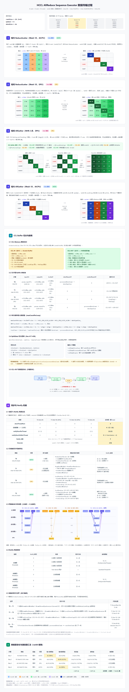

# HCCL AllReduce Sequence Executor 数据传输过程

*4 rank × 4 rank（16 rank）· rank6 视角 · 四模板串行：Intra RS → Inter RS(DPU) → Inter AG(NHR/DPU) → Intra AG*

> 完整可视化版本见 [Sequence_Executor_分析.html](./Sequence_Executor_分析.html)
>
> 

## 1. 条件设定与拓扑结构

### 1.1 条件设定

| 参数 | 值 |
| --- | --- |
| rankSize | 16 (4×4) |
| myRank | 6 |
| dataSize | ds |
| 拓扑 | 4 个 Server，每框 4 rank |

### 1.2 拓扑结构

```
┌──────────┐  ┌──────────┐  ┌──────────┐  ┌──────────┐
│ Server 0 │  │ Server 1★│  │ Server 2 │  │ Server 3 │
│  rank0   │  │  rank4   │  │  rank8   │  │  rank12  │
│  rank1   │  │  rank5   │  │  rank9   │  │  rank13  │
│  rank2   │  │  rank6 ★ │  │  rank10  │  │  rank14  │
│  rank3   │  │  rank7   │  │  rank11  │  │  rank15  │
└──────────┘  └──────────┘  └──────────┘  └──────────┘
```

- rank6 位于 Server 1，框内索引 rankIdxLevel0 = 6 % 4 = 2
- 框间索引 rankIdxLevel1 = 6 / 4 = 1

## 2. 四步数据流（rank6 视角）

### Step 1：框内 ReduceScatter（Mesh 1D，AICPU）

- **输入**：usrIn（完整数据 ds）
- **输出**：cclOut（rank6 负责 chunk2 = ds/4）
- **过程**：每个 rank 输入完整数据 ds，切成 4 个 chunk（各 ds/4）。框内 4 rank（rank4/5/6/7）做 Mesh ReduceScatter，rank6 负责 chunk2，收集 rank4/5/6/7 的 chunk2 并归约。
- **发送量 = 接收量** = 3 × ds/4 = **75% ds**
- **hcclBuff**：cclIn（前半 scratch）

### Step 2：框间 ReduceScatter（Mesh 1D，DPU）

- **输入**：cclOut（各 rank 的 chunk = ds/4）
- **输出**：cclOut 原地（rank6 得 sub1 = ds/16）
- **过程**：4 个 Server 的对应 rank（rank2/6/10/14）做框间 Mesh ReduceScatter，rank6 负责 sub1，收集 4 个 Server 的 sub1 并归约。
- **发送量 = 接收量** = 3 × ds/16 = **18.75% ds**
- **hcclBuff**：cclIn（复用 Step1 的 scratch）

### Step 3：框间 AllGather（NHR 2步，DPU）

- **输入**：cclOut（rank6 的 sub1 = ds/16）
- **输出**：cclOut（rank6 得完整 chunk2 = ds/4）
- **过程**：4 个 Server 的对应 rank 做 NHR AllGather，2 步完成（deltaRank=2→1），rank6 收集所有 sub 切片，重组为完整 chunk2。
- **发送量 = 接收量** = 3 × ds/16 = **18.75% ds**
- **复用**：Step2 的 displs

### Step 4：框内 AllGather（Mesh 1D，AICPU）

- **输入**：cclOut（各 rank 的 chunk = ds/4）
- **输出**：usrOut（完整数据 ds）
- **过程**：框内 4 rank（rank4/5/6/7）做 Mesh AllGather，rank6 收集所有 chunk，重组为完整数据。
- **发送量 = 接收量** = 3 × ds/4 = **75% ds**
- **复用**：Step1 的 displs

### 数据量变化沙漏

```
Step0 (usrIn)    Step1 (cclOut)   Step2 (cclOut)   Step3 (cclOut)   Step4 (usrOut)
   ds               ds/4             ds/16            ds/4              ds
   ████             ██               █                ██                ████
   100%             25%              6.25%            25%               100%
```

### 通信量汇总

| 步骤 | 模板 | 发送量 | 接收量 | 累计发送 |
| --- | --- | --- | --- | --- |
| Step1 | Intra RS (Mesh/AICPU) | 75% ds | 75% ds | 75% ds |
| Step2 | Inter RS (Mesh/DPU) | 18.75% ds | 18.75% ds | 93.75% ds |
| Step3 | Inter AG (NHR/DPU) | 18.75% ds | 18.75% ds | 112.5% ds |
| Step4 | Intra AG (Mesh/AICPU) | 75% ds | 75% ds | 187.5% ds |
| **总计** | | **187.5% ds** | **187.5% ds** | |

## 3. CCL Buffer 切分与使用

### 3.1 CCL Memory 整体划分

cclMem 分为两半：
- **cclIn**（前半）：scratch buffer，用于各步骤的 hcclBuff
- **cclOut**（后半）：中间结果存储，Step1 输出 → Step2/3 原地 → Step4 输入

```
┌─────────────────────────┬─────────────────────────┐
│         cclIn           │         cclOut          │
│     (scratch, hcclBuff) │    (中间结果存储)        │
└─────────────────────────┴─────────────────────────┘
```

### 3.2 各步骤 Buffer 映射表

| 步骤 | 模板 | 输入 | 输出 | hcclBuff |
| --- | --- | --- | --- | --- |
| Step1 | Intra RS | usrIn | cclOut | cclIn |
| Step2 | Inter RS | cclOut | cclOut（原地） | cclIn |
| Step3 | Inter AG | cclOut | cclOut（原地） | cclIn（复用） |
| Step4 | Intra AG | cclOut | usrOut | cclIn（复用） |

### 3.3 单次循环最大数据量（maxCountPerLoop）

`OrchestrateLoop` 中计算 maxCountPerLoop，确保每步数据不超过 cclBuff 容量。4 个模板串行执行，共享同一 cclIn 作为 hcclBuff。

### 3.4 SplitData 切分逻辑（line 417-458）

将数据按 rank 数切分，支持非均衡切分（末尾切片可能更小）。

### 3.5 CCL-OUT 数据量变化（沙漏形状）

见上方"数据量变化沙漏"图。数据量在 Step2 达到最小值（ds/16），然后逐步恢复到完整 ds。

## 4. 同步与 Notify 机制

### 4.1 线程与 Notify 资源总览

- 4 个模板串行执行，每个模板有独立的线程配置
- Intra 模板（Step1/4）：AICPU 执行，多线程
- Inter 模板（Step2/3）：DPU 执行，独立线程
- 模板间通过 Notify 同步边界

### 4.2 各模板同步机制对比

| 模板 | 执行单元 | 线程数 | 同步方式 |
| --- | --- | --- | --- |
| Intra RS (Mesh1D) | AICPU | 多线程 | Notify |
| Inter RS (Mesh1D) | DPU | DPU | Notify |
| Inter AG (NHR) | DPU | 单线程 | 无内部同步 |
| Intra AG (Mesh1D) | AICPU | 多线程 | Notify |

### 4.3 四模板串行时序图

```
主线程:  ┌─Step1─┐─同步─┌─Step2─┐─同步─┌─Step3─┐─同步─┌─Step4─┐
         │IntraRS│      │InterRS│      │InterAG│      │IntraAG│
从线程:  └───────┘      └───────┘      └───────┘      └───────┘
           AICPU           DPU            DPU           AICPU
```

### 4.4 Notify 用途映射

- 模板启动通知：主线程 → 从线程，启动对应模板
- 模板结束通知：从线程 → 主线程，通知模板完成
- 模板间同步边界：确保前一个模板完成后才启动下一个

### 4.5 模板间同步边界（串行编排）

4 个模板严格串行：Step1 完成 → Step2 启动 → Step2 完成 → Step3 启动 → Step3 完成 → Step4 启动 → Step4 完成。

## 5. 关键结论

1. **分层架构**：框内（Intra）用 Mesh 1D + AICPU，框间（Inter）用 Mesh 1D/NHR + DPU
2. **数据量沙漏**：D → D/4 → D/16 → D/4 → D，框间通信量远小于框内
3. **总发送量**：约 187.5% dataSize（框内 150% + 框间 37.5%）
4. **Buffer 复用**：cclIn 作为所有步骤的 hcclBuff，cclOut 存储中间结果
5. **串行编排**：4 模板严格串行，通过 Notify 同步边界

---

*数据来源：HCCL MC2 源码分析（ins_v2_all_reduce_sequence_executor.cc）*
