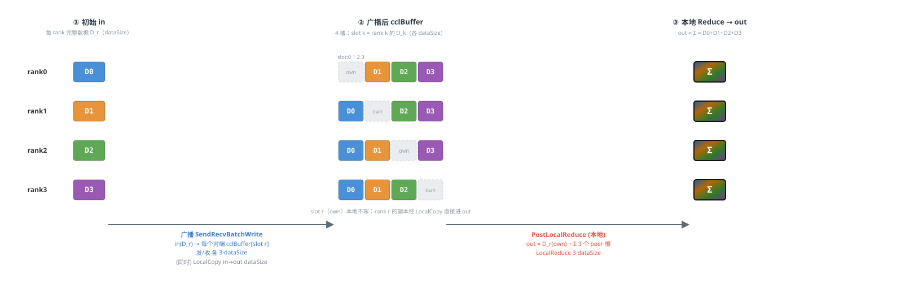
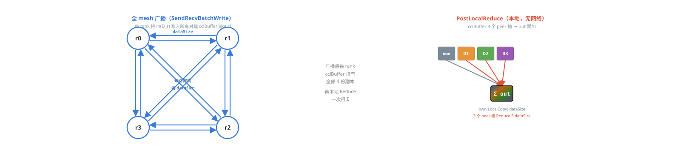

# HCCL AllReduce Mesh1D One-Shot 数据传输示意图（4 Rank）

*模板：`InsTempAllReduceMesh1DOneShot`
每 rank 输入数据量记为 **dataSize**（count 可被 4 整除，均衡切分）。in / cclBuffer / out 三块 buffer 间的数据流与数据量均已标注；不同数据块以不同颜色标识。*

## 模板一：Mesh1D One-Shot  ——  全量广播 + 本地全量 Reduce（单通信阶段）

**数据切分**：不按数据维切分。cclBuffer 被划成 **4 个等大槽位**（每槽 = 完整 dataSize，`CalcScratchMultiple = N = 4`），槽 k 专存 rank k 的完整副本。

**核心流程**：① 主线程 `LocalCopy(in → out)` 先把本 rank 的 D_r 落到 out；② 每个 rank 用 `SendRecvBatchWrite` 把自己的 `in(D_r)` 广播写入所有对端 cclBuffer 的 slot r，同时收下各对端的 D_k 到本地 slot k；③ `PostLocalReduce` 把本地 3 个 peer 槽位累加进 out。

**颜色规则**：按 **数据来源 rank** —— rank0=蓝，rank1=橙，rank2=绿，rank3=紫；带 “Σ” 的渐变块表示 4-rank 全量归约结果。

**阶段总览（in / cclBuffer / out 数据流，rank 视角）**

**各 rank 间通信拓扑（全 mesh 广播 + 本地 Reduce）**

*说明：本图为静态数据流示意，箭头旁标注为对应阶段的传输数据量（每 rank 视角）。
One-Shot 以 **in** 为源 write 写对端 **cclBuffer**，最后本地 Reduce 写 **out**。*

## 数据切分与性能对比分析

> **假设场景**：rankSize = **5**（非 2^i），dataType = **u64**（8 字节），dataSize = **34.125 MB**（dataCount = 4,472,832），hcclBuff.size = **4 MB**，HCCL_MIN_SLICE_ALIGN = 128 字节。
> 
> **关键公式**：`maxDataSizePerLoop = min(hcclBuff.size, hcclBuff.size / mult / 128 × 128)`，`loopTimes = ⌈dataCount / maxDataCountPerLoop⌉`。

### 1. 循环次数与末轮数据

> mult = **5**  |
> scratchBoundDataSize = 4194304 / 5 / 128 × 128 = **838,784** 字节  |
> maxDataCountPerLoop = **104,848**
>
> loopTimes = ⌈4472832 / 104,848⌉ = **43**  |
> 末轮 currDataCount = 4472832 - 42 × 104,848 = **69,216**  |
> currDataSize = **553,728** 字节

### 2. 末轮数据切分（按 rank 切分（不切数据维））

cclBuffer 划分为 N=5 个等大槽位，每槽存储完整 currDataSize。CalcScratchMultiple = N = 5。

| 槽位 | offset (字节) | size (字节) | count (元素) | 存储内容 |
| --- | --- | --- | --- | --- |
| slot 0 | 0 | 553,728 | 69,216 | rank0 完整数据副本 |
| slot 1 | 553,728 | 553,728 | 69,216 | rank1 完整数据副本（own） |
| slot 2 | 1,107,456 | 553,728 | 69,216 | rank2 完整数据副本 |
| slot 3 | 1,661,184 | 553,728 | 69,216 | rank3 完整数据副本 |
| slot 4 | 2,214,912 | 553,728 | 69,216 | rank4 完整数据副本 |
| **合计** | — | **2,768,640** | **346,080** | cclBuff 占用 2.64 MB (< 4 MB) |

> **分析**：切分特点：等大槽位，与切分策略无关，不受非均衡影响。N 个槽位 = N × dataSize，与倍率 N 严格匹配。

### 3. 性能对比（rank=4 与 rank=2^i 合并）

| 维度 | rank = 4 | rank = 2^i（N ≥ 2） |
| --- | --- | --- |
| 算法结构 | 广播 + Reduce | 广播 + Reduce |
| 数据切分 | 无切分 | 无切分 |
| 线程数 | 4 | N |
| 同步次数 | 2 | 2 |
| cclBuff 倍率 | 4× | N× |
| 单 rank 发送量 | 3 × ds | (N-1)·ds |
| 单 rank 接收量 | 3 × ds | (N-1)·ds |
| 单 rank 通信总量 | 6 × ds | 2(N-1)·ds |
| LocalCopy 数据量 | 1 × ds | 1·ds |
| Reduce 方式 | 通信后 LocalReduce | 通信后 LocalReduce |
| Reduce 数据量 | 3 × ds | (N-1)·ds |
| 通信步数 | 1 (3路并行) | 1 (N-1路并行) |
| 通信并行度 | N-1=3路 | N-1路 |

### 4. 关键结论

- **cclBuff 倍率 = 5×**：需存储 N 份完整副本，内存随 N 线性增长

- **loop 次数 = 43**：倍率越大，单轮处理数据越小，循环次数越多

- **五模板横向对比**：详见独立文档 `A00-模板综合对比.md`

- **适用场景**：需存储 N 份完整副本，内存随 N 线性增长；全量广播通信量随 N 线性增长。适合单级Mesh、小数据、低延迟单步广播场景。
