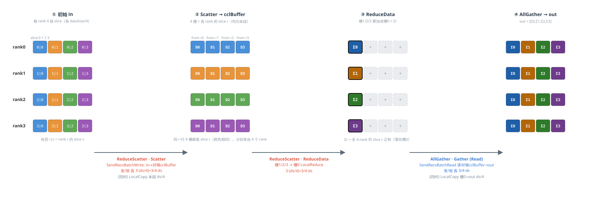
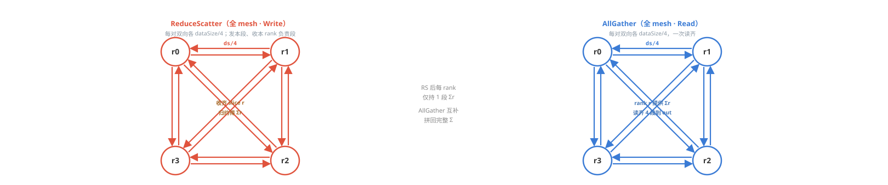

# HCCL AllReduce Mesh1D Two-Shot 数据传输示意图（4 Rank）

*模板：`InsTempAllReduceMesh1DTwoShot`
每 rank 输入数据量记为 **dataSize**（count 可被 4 整除，均衡切分）。in / cclBuffer / out 三块 buffer 间的数据流与数据量均已标注；不同数据块以不同颜色标识。*

## 模板二：Mesh1D Two-Shot  ——  ReduceScatter + AllGather（双通信阶段）

**数据切分**：按数据维均分为 **4 段 slice**（各 dataSize/4），rank r 负责 slice r 的归约。cclBuffer 倍数 = 2。

**核心流程**：① **Scatter**：`SendRecvBatchWrite` 把本地各 slice 发给对应 owner，收齐“所有 rank 的 slice r”到本地 4 个槽位；② **ReduceData**：把槽 1/2/3 累加进槽 0，得 slice r 的全局归约 Σr；③ **AllGather(Read)**：`SendRecvBatchRead` 从各 rank 读回其 Σs，拼满 out。

**颜色规则**：按 **slice 编号** —— slice0=蓝，slice1=橙，slice2=绿，slice3=紫；带 “Σ” 且深色的块表示该 slice 完成 4-rank 归约。

**阶段总览（in / cclBuffer / out 数据流，rank 视角）**



**各 rank 间通信拓扑（ReduceScatter mesh & AllGather mesh）**



*说明：本图为静态数据流示意，箭头旁标注为对应阶段的传输数据量（每 rank 视角）。
Two-Shot 的 Scatter 以 **in** write 写对端 **cclBuffer**，AllGather 以 Read 从对端 **cclBuffer** 读入本地 **out**。*

## 数据切分与性能对比分析

> **假设场景**：rankSize = **5**（非 2^i），dataType = **u64**（8 字节），dataSize = **34.125 MB**（dataCount = 4,472,832），hcclBuff.size = **4 MB**，HCCL_MIN_SLICE_ALIGN = 128 字节。
> 
> **关键公式**：`maxDataSizePerLoop = min(hcclBuff.size, hcclBuff.size / mult / 128 × 128)`，`loopTimes = ⌈dataCount / maxDataCountPerLoop⌉`。

### 1. 循环次数与末轮数据


> mult = **2**  |
> scratchBoundDataSize = 4194304 / 2 / 128 × 128 = **2,097,152** 字节  |
> maxDataCountPerLoop = **262,144**
>
> loopTimes = ⌈4472832 / 262,144⌉ = **18**  |
> 末轮 currDataCount = 4472832 - 17 × 262,144 = **16,384**  |
> currDataSize = **131,072** 字节


### 2. 末轮数据切分（按数据维 1 级切分）

按数据维均分为 N=5 段 slice（RoundUp 取整，末段为余量）。sliceCount = RoundUp(16384, 5) = 3277。

```
sliceCount = ⌈16384 / 5⌉ = 3,277    sliceSize = 3277 × 8 = 26,216 字节
```

| slice | offset (字节) | count (元素) | size (字节) | 说明 |
| --- | --- | --- | --- | --- |
| slice 0-3 | 0 / 26216 / 52432 / 78648 | 3,277 (各) | 26,216 (各) | 前 4 段等大 |
| slice 4 | 104,864 | **3,276** | **26,208** | 末段余量 (16384 - 4×3277 = 3276) |
| **合计** | — | **16,384** | **131,072** | 5 段**非均衡**切分 |

> **分析**：非均衡切分：末段比其余段少 1 元素（8 字节）。cclBuff 按标称槽位规划时 N×ceil(count/N) > dataSize，因此 multiple=2。

### 3. 性能对比（rank=4 与 rank=2^i 合并）

| 维度 | rank = 4 | rank = 2^i（N ≥ 2） |
| --- | --- | --- |
| 算法结构 | RS + AG | RS + AG |
| 数据切分 | 1级（4段） | 1级（N段） |
| 线程数 | 4 | N |
| 同步次数 | 4 | 4 |
| cclBuff 倍率 | 2× | 2× |
| 单 rank 发送量 | 1.5 × ds | 2(N-1)/N·ds |
| 单 rank 接收量 | 1.5 × ds | 2(N-1)/N·ds |
| 单 rank 通信总量 | 3 × ds | 4(N-1)/N·ds |
| LocalCopy 数据量 | 0.5 × ds | 2/N·ds |
| Reduce 方式 | Scatter后 LocalReduce | Scatter后 LocalReduce |
| Reduce 数据量 | 0.75 × ds | (N-1)/N·ds |
| 通信步数 | 2 (各3路并行) | 2 (各N-1路并行) |
| 通信并行度 | N-1=3路 | N-1路 |

### 4. 关键结论

- **cclBuff 倍率 = 2×**：兼容非均衡切分溢出（标称槽位 N×ceil > dataSize）

- **loop 次数 = 18**：倍率越大，单轮处理数据越小，循环次数越多

- **五模板横向对比**：详见独立文档 `A00-模板综合对比.md`

- **适用场景**：RS+AG 架构，通信量收敛于 4ds（N→∞）；multiple=2 兼容非均衡切分溢出。适合单级Mesh、大数据、省带宽并行散播场景。
