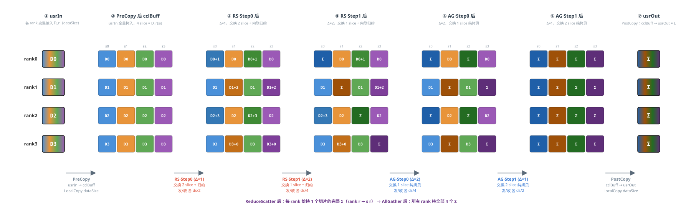
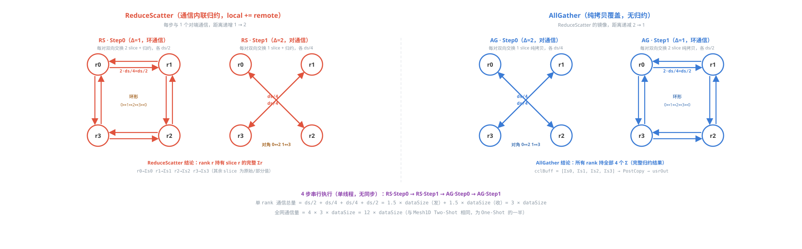
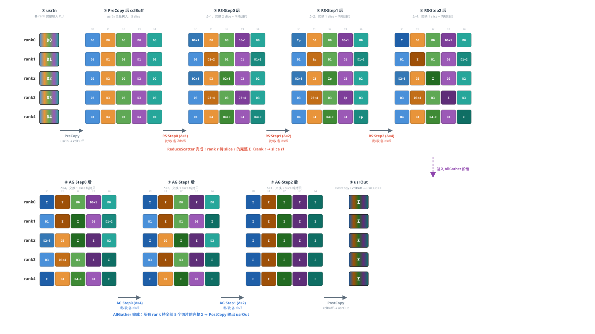
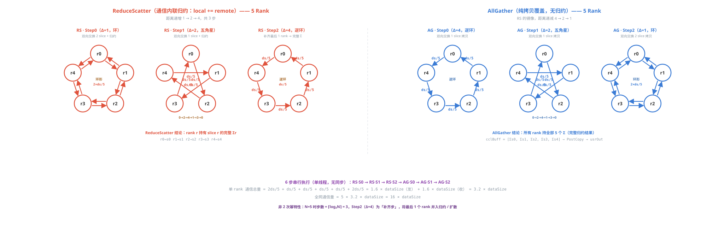

# HCCL AllReduce NHR 数据传输示意图（4 Rank）

模板：`InsTempAllReduceNHR`  ——  递归减半/倍增（Recursive Halving & Doubling）

每 rank 输入数据量记为 **dataSize**（count 可被 4 整除，均衡切分为 4 段，各 dataSize/4）。

单线程、零同步、cclBuff = 1× dataSize；ReduceScatter（2 步，通信内联归约）+ AllGather（2 步，纯拷贝）。

## NHR 主流程数据流  ——  PreCopy → ReduceScatter(2步) → AllGather(2步) → PostCopy

**数据切分**：按数据维均分为 **4 段 slice**（各 dataSize/4），cclBuff 为连续分区布局，总占 1× dataSize。

**核心流程**：① `PreCopy` usrIn → cclBuff（全量）；② `RunReduceScatter` 2 步递归减半，每步与 1 个对端通信并 **内联归约**（`SendRecvBatchWriteReduce`），最终每 rank 持有 1 个切片的完整 Σ；③ `RunAllGather` 2 步递归倍增，每步与 1 个对端通信（纯拷贝覆盖），拼回完整 Σ；④ `PostCopy` cclBuff → usrOut。

**颜色规则**：颜色 = **slice 位置**（slice0=蓝，slice1=橙，slice2=绿，slice3=紫）；**深浅** = 归约程度：浅=单 rank 原始，中=部分归约（2 rank），深=完整 Σ（4 rank）。标签 Dk=rank k 原始数据，Da+b=两 rank 之和，Σ=全 4-rank 归约。

**阶段总览（usrIn / cclBuff / usrOut 数据流，4 rank 视角）**



**通信步详情（每步 toRank / fromRank / 收发切片 / 通信原语 / 效果）**

| 阶段 / 步骤 | rank | → toRank | tx slices | ← fromRank | rx slices | 通信原语 | 通信量 | 本步后 cclBuff 变化 |
| --- | --- | --- | --- | --- | --- | --- | --- | --- |
| ReduceScatter · Step0（Δ=1，环通信：rank0↔rank1↔rank2↔rank3↔rank0，每 rank 交换 2 slice + 内联归约） |  |  |  |  |  |  |  |  |
| RS·Step0 | rank0 | → rank3 | [3, 1] | ← rank1 | [0, 2] | SendRecvBatchWriteReduce | ds/2 | s0=D0+D1, s2=D0+D1 |
| RS·Step0 | rank1 | → rank0 | [0, 2] | ← rank2 | [1, 3] | SendRecvBatchWriteReduce | ds/2 | s1=D1+D2, s3=D1+D2 |
| RS·Step0 | rank2 | → rank1 | [1, 3] | ← rank3 | [2, 0] | SendRecvBatchWriteReduce | ds/2 | s0=D2+D3, s2=D2+D3 |
| RS·Step0 | rank3 | → rank2 | [2, 0] | ← rank0 | [3, 1] | SendRecvBatchWriteReduce | ds/2 | s1=D3+D0, s3=D3+D0 |
| ReduceScatter · Step1（Δ=2，对通信：rank0↔rank2, rank1↔rank3，每 rank 交换 1 slice + 内联归约） |  |  |  |  |  |  |  |  |
| RS·Step1 | rank0 | → rank2 | [2] | ← rank2 | [0] | SendRecvBatchWriteReduce | ds/4 | s0=Σs0（完整归约） |
| RS·Step1 | rank1 | → rank3 | [3] | ← rank3 | [1] | SendRecvBatchWriteReduce | ds/4 | s1=Σs1（完整归约） |
| RS·Step1 | rank2 | → rank0 | [0] | ← rank0 | [2] | SendRecvBatchWriteReduce | ds/4 | s2=Σs2（完整归约） |
| RS·Step1 | rank3 | → rank1 | [1] | ← rank1 | [3] | SendRecvBatchWriteReduce | ds/4 | s3=Σs3（完整归约） |
| AllGather · Step0（Δ=2，对通信：rank0↔rank2, rank1↔rank3，每 rank 交换 1 slice 纯拷贝覆盖） |  |  |  |  |  |  |  |  |
| AG·Step0 | rank0 | → rank2 | [0] | ← rank2 | [2] | SendRecvWrite | ds/4 | s2=Σs2（拷贝覆盖） |
| AG·Step0 | rank1 | → rank3 | [1] | ← rank3 | [3] | SendRecvWrite | ds/4 | s3=Σs3（拷贝覆盖） |
| AG·Step0 | rank2 | → rank0 | [2] | ← rank0 | [0] | SendRecvWrite | ds/4 | s0=Σs0（拷贝覆盖） |
| AG·Step0 | rank3 | → rank1 | [3] | ← rank1 | [1] | SendRecvWrite | ds/4 | s1=Σs1（拷贝覆盖） |
| AllGather · Step1（Δ=1，环通信：rank0↔rank1↔rank2↔rank3↔rank0，每 rank 交换 2 slice 纯拷贝覆盖） |  |  |  |  |  |  |  |  |
| AG·Step1 | rank0 | → rank1 | [0, 2] | ← rank3 | [3, 1] | SendRecvWrite | ds/2 | s1=Σs1, s3=Σs3 |
| AG·Step1 | rank1 | → rank2 | [1, 3] | ← rank0 | [0, 2] | SendRecvWrite | ds/2 | s0=Σs0, s2=Σs2 |
| AG·Step1 | rank2 | → rank3 | [2, 0] | ← rank1 | [1, 3] | SendRecvWrite | ds/2 | s1=Σs1, s3=Σs3 |
| AG·Step1 | rank3 | → rank0 | [3, 1] | ← rank2 | [2, 0] | SendRecvWrite | ds/2 | s0=Σs0, s2=Σs2 |

## 通信拓扑  ——  ReduceScatter（内联归约）& AllGather（纯拷贝）

NHR 每步仅与 **1 个对端** 通信（非全 mesh）。ReduceScatter 距离递增（1→2），AllGather 距离递减（2→1），二者互为镜像。单线程串行执行 4 步，无主从同步。



| 维度 | NHR | 说明 |
| --- | --- | --- |
| 算法结构 | ReduceScatter + AllGather | 各 log₂N 步，4 rank 共 4 步 |
| 线程 / 同步 | 1 线程 / 0 同步 | 单线程串行，无从线程、无 Notify |
| cclBuff 倍率 | 1 × dataSize | 连续分区布局，通信内联归约无需 N 份副本 |
| Reduce 方式 | 通信内联归约 | `SendRecvBatchWriteReduce`，收发即归约 |
| 单 rank 发送量 | 1.5 × dataSize | RS: ds/2 + ds/4；AG: ds/4 + ds/2 |
| 单 rank 通信总量 | **3 × dataSize** | 发 1.5ds + 收 1.5ds |
| 额外 LocalCopy | 2 次（PreCopy + PostCopy） | 各 dataSize，共 2× dataSize |
| DMA 模式 | 自适应 | PCIe 链路用 Read，其余用 Write |
| 定位 | 通用兜底算法 | 多级拓扑 / 非标准 Mesh / 内存受限场景 |

> 说明：本图为静态数据流示意。颜色恒定代表 slice 位置（0/1/2/3），深浅代表归约程度（原始→部分→完整）。
>
> ReduceScatter 使用 `SendRecvBatchWriteReduce`（收发同时归约，local += remote）；AllGather 使用 `SendRecvWrite`（纯拷贝覆盖，无归约）。
>

# HCCL AllReduce NHR 数据传输示意图（5 Rank）

非 2 次幂场景：N=5，步数 = ⌈log₂5⌉ = 3 步；Step2（Δ=4）为「补齐步」，将最后 1 个 rank 并入归约 / 扩散

单 rank 通信总量：**3.2 × dataSize**（发 1.6ds + 收 1.6ds），全网通信量 16 × dataSize*

## NHR 主流程数据流  ——  PreCopy → ReduceScatter(3步) → AllGather(3步) → PostCopy

**数据切分**：均分为 **5 段 slice**（各 dataSize/5），cclBuff 总占 1× dataSize。

**核心流程**：① PreCopy 全量拷入；② ReduceScatter 3 步递归减半（Δ=1→2→4），每步内联归约，最终每 rank 持 1 个完整 Σ；③ AllGather 3 步递归倍增（Δ=4→2→1），纯拷贝覆盖拼回完整 Σ；④ PostCopy 输出。

**颜色规则**：颜色 = slice 位置（s0蓝 s1橙 s2绿 s3紫 s4青）；深浅 = 归约程度（浅=原始 中=部分 深=完整Σ）。

**阶段总览（usrIn / cclBuff / usrOut 数据流，5 rank 视角，分两行：RS 阶段 / AG 阶段）**



**通信步详情（每步 toRank / fromRank / 收发切片 / 本步后 cclBuff 变化）**

| 阶段 / 步骤 | rank | → toRank | tx slices | ← fromRank | rx slices | 通信原语 | 通信量 | 本步后 cclBuff 变化 |
| --- | --- | --- | --- | --- | --- | --- | --- | --- |
| ReduceScatter · Step0（Δ=1，环通信，每 rank 交换 2 slice + 内联归约） |  |  |  |  |  |  |  |  |
| RS·Step0 | rank0 | → rank4 | [4, 2] | ← rank1 | [0, 3] | SendRecvBatchWriteReduce | 2ds/5 | s0=D0+D1, s3=D0+D1 |
| RS·Step0 | rank1 | → rank0 | [0, 3] | ← rank2 | [1, 4] | SendRecvBatchWriteReduce | 2ds/5 | s1=D1+D2, s4=D1+D2 |
| RS·Step0 | rank2 | → rank1 | [1, 4] | ← rank3 | [2, 0] | SendRecvBatchWriteReduce | 2ds/5 | s2=D2+D3, s0=D2+D3 |
| RS·Step0 | rank3 | → rank2 | [2, 0] | ← rank4 | [3, 1] | SendRecvBatchWriteReduce | 2ds/5 | s3=D3+D4, s1=D3+D4 |
| RS·Step0 | rank4 | → rank3 | [3, 1] | ← rank0 | [4, 2] | SendRecvBatchWriteReduce | 2ds/5 | s4=D4+D0, s2=D4+D0 |
| ReduceScatter · Step1（Δ=2，五角星通信，每 rank 交换 1 slice + 内联归约） |  |  |  |  |  |  |  |  |
| RS·Step1 | rank0 | → rank3 | [3] | ← rank2 | [0] | SendRecvBatchWriteReduce | ds/5 | s0 = D0+D1+D2+D3（4-rank 部分 Σ） |
| RS·Step1 | rank1 | → rank4 | [4] | ← rank3 | [1] | SendRecvBatchWriteReduce | ds/5 | s1 = D1+D2+D3+D4（4-rank 部分 Σ） |
| RS·Step1 | rank2 | → rank0 | [0] | ← rank4 | [2] | SendRecvBatchWriteReduce | ds/5 | s2 = D0+D2+D3+D4（4-rank 部分 Σ） |
| RS·Step1 | rank3 | → rank1 | [1] | ← rank0 | [3] | SendRecvBatchWriteReduce | ds/5 | s3 = D0+D1+D3+D4（4-rank 部分 Σ） |
| RS·Step1 | rank4 | → rank2 | [2] | ← rank1 | [4] | SendRecvBatchWriteReduce | ds/5 | s4 = D0+D1+D2+D4（4-rank 部分 Σ） |
| ReduceScatter · Step2（Δ=4，逆环「补齐步」，将最后 1 rank 并入 → 完整 5-rank Σ） |  |  |  |  |  |  |  |  |
| RS·Step2 | rank0 | → rank1 | [1] | ← rank4 | [0] | SendRecvBatchWriteReduce | ds/5 | s0 = Σs0（完整 5-rank 归约） |
| RS·Step2 | rank1 | → rank2 | [2] | ← rank0 | [1] | SendRecvBatchWriteReduce | ds/5 | s1 = Σs1（完整 5-rank 归约） |
| RS·Step2 | rank2 | → rank3 | [3] | ← rank1 | [2] | SendRecvBatchWriteReduce | ds/5 | s2 = Σs2（完整 5-rank 归约） |
| RS·Step2 | rank3 | → rank4 | [4] | ← rank2 | [3] | SendRecvBatchWriteReduce | ds/5 | s3 = Σs3（完整 5-rank 归约） |
| RS·Step2 | rank4 | → rank0 | [0] | ← rank3 | [4] | SendRecvBatchWriteReduce | ds/5 | s4 = Σs4（完整 5-rank 归约） |
| AllGather · Step0（Δ=4，逆环，RS Step2 的镜像，纯拷贝覆盖） |  |  |  |  |  |  |  |  |
| AG·Step0 | rank0 | → rank4 | [0] | ← rank1 | [1] | SendRecvWrite | ds/5 | s1 = Σs1（拷贝覆盖） |
| AG·Step0 | rank1 | → rank0 | [1] | ← rank2 | [2] | SendRecvWrite | ds/5 | s2 = Σs2（拷贝覆盖） |
| AG·Step0 | rank2 | → rank1 | [2] | ← rank3 | [3] | SendRecvWrite | ds/5 | s3 = Σs3（拷贝覆盖） |
| AG·Step0 | rank3 | → rank2 | [3] | ← rank4 | [4] | SendRecvWrite | ds/5 | s4 = Σs4（拷贝覆盖） |
| AG·Step0 | rank4 | → rank3 | [4] | ← rank0 | [0] | SendRecvWrite | ds/5 | s0 = Σs0（拷贝覆盖） |
| AllGather · Step1（Δ=2，五角星，纯拷贝覆盖） |  |  |  |  |  |  |  |  |
| AG·Step1 | rank0 | → rank2 | [0] | ← rank3 | [3] | SendRecvWrite | ds/5 | s3 = Σs3（拷贝覆盖） |
| AG·Step1 | rank1 | → rank3 | [1] | ← rank4 | [4] | SendRecvWrite | ds/5 | s4 = Σs4（拷贝覆盖） |
| AG·Step1 | rank2 | → rank4 | [2] | ← rank0 | [0] | SendRecvWrite | ds/5 | s0 = Σs0（拷贝覆盖） |
| AG·Step1 | rank3 | → rank0 | [3] | ← rank1 | [1] | SendRecvWrite | ds/5 | s1 = Σs1（拷贝覆盖） |
| AG·Step1 | rank4 | → rank1 | [4] | ← rank2 | [2] | SendRecvWrite | ds/5 | s2 = Σs2（拷贝覆盖） |
| AllGather · Step2（Δ=1，环通信，每 rank 交换 2 slice 纯拷贝覆盖） |  |  |  |  |  |  |  |  |
| AG·Step2 | rank0 | → rank1 | [0, 3] | ← rank4 | [4, 2] | SendRecvWrite | 2ds/5 | s2=Σs2, s4=Σs4 |
| AG·Step2 | rank1 | → rank2 | [1, 4] | ← rank0 | [0, 3] | SendRecvWrite | 2ds/5 | s0=Σs0, s3=Σs3 |
| AG·Step2 | rank2 | → rank3 | [2, 0] | ← rank1 | [1, 4] | SendRecvWrite | 2ds/5 | s1=Σs1, s4=Σs4 |
| AG·Step2 | rank3 | → rank4 | [3, 1] | ← rank2 | [2, 0] | SendRecvWrite | 2ds/5 | s2=Σs2, s0=Σs0 |
| AG·Step2 | rank4 | → rank0 | [4, 2] | ← rank3 | [3, 1] | SendRecvWrite | 2ds/5 | s3=Σs3, s1=Σs1 |

## 通信拓扑  ——  5 Rank（ReduceScatter 3 步 + AllGather 3 步，互为镜像）

N=5 非 2 次幂场景：前 2 步完成 4-rank 子环归约，第 3 步（Δ=4）将最后 1 个 rank 并入，形成「补齐步」。



| 维度 | NHR (N=5) | 说明 |
| --- | --- | --- |
| 算法结构 | ReduceScatter + AllGather | 各 ⌈log₂N⌉ = 3 步，共 6 步串行 |
| 线程 / 同步 | 1 线程 / 0 同步 | 单线程串行，无从线程、无 Notify |
| cclBuff 倍率 | 1 × dataSize | 连续分区布局，通信内联归约 |
| Reduce 方式 | 通信内联归约 | SendRecvBatchWriteReduce，收发即归约 |
| 单 rank 发送量 | 1.6 × dataSize | RS: 2ds/5 + ds/5 + ds/5；AG: ds/5 + ds/5 + 2ds/5 |
| 单 rank 通信总量 | **3.2 × dataSize** | 发 1.6ds + 收 1.6ds |
| 全网通信量 | 16 × dataSize | 5 × 3.2 × dataSize |
| 额外 LocalCopy | 2 次（PreCopy + PostCopy） | 各 dataSize，共 2× dataSize |
| 非 2 次幂特性 | Step2 为「补齐步」 | Δ=4，将最后 1 个 rank 并入归约 / 扩散 |
| 定位 | 通用兜底算法 | 支持任意 rank 数，多级拓扑 / 内存受限场景 |

> 5 Rank 特性：N 非 2 次幂时，步数 = ⌈log₂N⌉，最后一步为「补齐步」，通信模式由环变为逆环，将剩余 rank 数据并入。
>
> 与 4 Rank 对比：步数从 4 → 6（+2 步），单 rank 通信量从 3ds → 3.2ds（仅增加约 6.7%），扩展性良好。
>

## 数据切分与性能对比分析

> **假设场景**：rankSize = **5**（非 2^i），dataType = **u64**（8 字节），dataSize = **34.125 MB**（dataCount = 4,472,832），hcclBuff.size = **4 MB**，HCCL_MIN_SLICE_ALIGN = 128 字节。
> 
> **关键公式**：`maxDataSizePerLoop = min(hcclBuff.size, hcclBuff.size / mult / 128 × 128)`，`loopTimes = ⌈dataCount / maxDataCountPerLoop⌉`。

### 1. 循环次数与末轮数据


> mult = **1**  |
> scratchBoundDataSize = 4194304 / 1 / 128 × 128 = **4,194,304** 字节  |
> maxDataCountPerLoop = **524,288**
>
> loopTimes = ⌈4472832 / 524,288⌉ = **9**  |
> 末轮 currDataCount = 4472832 - 8 × 524,288 = **278,528**  |
> currDataSize = **2,228,224** 字节


### 2. 末轮数据切分（按数据维 1 级切分）

按数据维均分为 N=5 段 slice（RoundUp 取整）。sliceCount = RoundUp(278528, 5) = 55706。N=5 时 NHR 步数 = bit_width(4) = 3，RS 3步 + AG 3步 = 6步。

```
sliceCount = ⌈278528 / 5⌉ = 55,706    sliceSize = 55706 × 8 = 445,648 字节
```

| slice | offset (字节) | count (元素) | size (字节) | 说明 |
| --- | --- | --- | --- | --- |
| slice 0-3 | 0 / 445648 / 891296 / 1336944 | 55,706 (各) | 445,648 (各) | 前 4 段等大 |
| slice 4 | 1,782,592 | **55,704** | **445,632** | 末段余量 (278528 - 4×55706 = 55704) |
| **合计** | — | **278,528** | **2,228,224** | 5 段**非均衡**切分 |

### RS 通信表（myRankIdx=1，N=5，3 步）

| RS 步骤 | Δ | toRank | fromRank | nSlices | txSliceIdxs | rxSliceIdxs | tx 通信量 | rx 通信量 |
| --- | --- | --- | --- | --- | --- | --- | --- | --- |
| step 0 | 1 | 0 | 2 | 2 | [0, 3] | [1, 4] | 445648+445648 = 891,296 | 445648+445632 = 891,280 |
| step 1 | 2 | 4 | 3 | 1 | [4] | [1] | 445,632 | 445,648 |
| step 2 | 4 | 2 | 0 | 1 | [2] | [1] | 445,648 | 445,648 |
| **合计** | — | — | — | **4** | — | — | **1,782,576** | **1,782,576** |

> **分析**：因 slice 4（445632 B）比其余（445648 B）少 16 字节，step 0/1 的 tx/rx 通信量略有差异（差 16 B），但总收发量相等。u64 为特殊数据类型，DMA 内联归约不支持，实际选择器不会为 u64 选 NHR。

### 3. 性能对比（rank=4 与 rank=2^i 合并）

| 维度 | rank = 4 | rank = 2^i（N ≥ 2） |
| --- | --- | --- |
| 算法结构 | RS + AG | RS + AG |
| 数据切分 | 1级（4段） | 1级（N段） |
| 线程数 | 1 | 1 |
| 同步次数 | 0 | 0 |
| cclBuff 倍率 | 1× | 1× |
| 单 rank 发送量 | 1.5 × ds | 2(N-1)/N·ds |
| 单 rank 接收量 | 1.5 × ds | 2(N-1)/N·ds |
| 单 rank 通信总量 | 3 × ds | 4(N-1)/N·ds |
| LocalCopy 数据量 | 2 × ds | 2·ds |
| Reduce 方式 | 通信内联归约 | 通信内联归约 |
| Reduce 数据量 | 重叠(0.75ds) | 重叠((N-1)/N·ds) |
| 通信步数 | 4 (串行) | 2log₂N (串行) |
| 通信并行度 | 1路 | 1路 |

### 4. 关键结论

- **cclBuff 倍率 = 1×**：连续分区+内联归约，最省内存

- **loop 次数 = 9**：倍率越大，单轮处理数据越小，循环次数越多

- **五模板横向对比**：详见独立文档 `A00-模板综合对比.md`

- **适用场景**：连续分区+内联归约，cclBuff 最省（1×）；单线程零同步，但串行执行无并行度。适合任意拓扑、非特殊数据类型，通用兜底。
