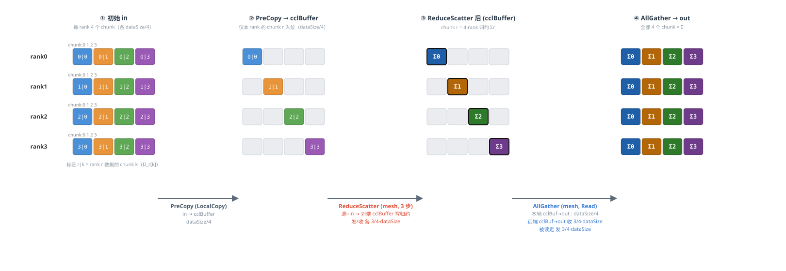
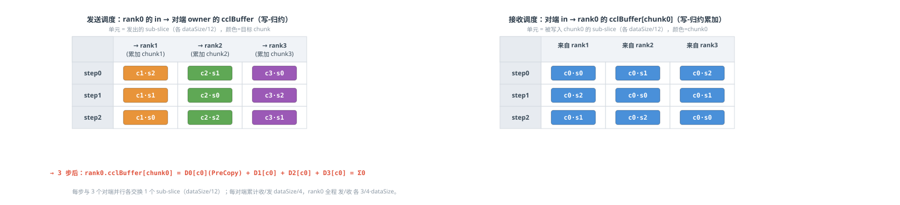

# HCCL AllReduce Mesh1D TwoShot MeshChunk 数据传输示意图（4 Rank）

*模板：`InsTempAllReduceMesh1DTwoShotMeshChunk`
每 rank 输入数据量记为 dataSize，count 可被 4 整除。不同数据块 / chunk 以不同颜色标识。*

## 模板一：Mesh1D TwoShot MeshChunk  ——  ReduceScatter(mesh, 分布式Reduce) + AllGather(mesh)

**数据切分（两级）**：一级把每 rank 数据切成 4 个 **chunk**（各 dataSize/4），chunk k 记为 D_r[k]；
二级把每个 chunk 再切成 rankSize−1=3 个 **sub-slice**（各 dataSize/12），用于 ReduceScatter 的 3 步流水。cclBuffer 倍数 = 2。

**颜色规则**：按 chunk 编号 —— chunk0=蓝，chunk1=橙，chunk2=绿，chunk3=紫；带 “Σ” 且深色描边的块表示该 chunk 已完成 4-rank 归约。

**阶段总览（in / cclBuffer / out 数据流）**



**ReduceScatter 细化：3 步全-mesh 流水（rank0 视角）**

**目标**：每个 rank r 是 chunk r 的“归主”，需把所有 rank 的 chunk-r 分量累加进自己的 `cclBuffer[chunk r]`（PreCopy 已放入自己那份）。

**写-归约语义（two-shot 关键）**：发送源恒为本地用户 `in`；数据被写入 **对端(owner)** 的 `cclBuffer` 对应 chunk，并在写入的同时执行 reduce 累加（不经本地 cclBuffer 中转）。

**流水调度**：共 3 步（step0/1/2）。每一步里，本 rank 与其余 3 个 rank **同时**各交换 1 个 sub-slice（dataSize/12）——既发出 3 个 sub-slice、又收进 3 个 sub-slice，充分利用全 mesh 带宽。3 步累计：发 3×(dataSize/12)=**3/4·dataSize**，收 **3/4·dataSize**。



**各 rank 间通信拓扑（ReduceScatter mesh & AllGather mesh）**


*说明：本图为静态数据流示意，箭头旁标注为对应阶段/步的传输数据量（每 rank 视角）。
MeshChunk 的 ReduceScatter 直接以用户 **in** 为源、以 write-reduce 写对端 **cclBuffer**；AllGather 以 Read 模式将结果写入 **out**。*

## 数据切分与性能对比分析

> **假设场景**：rankSize = **5**（非 2^i），dataType = **u64**（8 字节），dataSize = **34.125 MB**（dataCount = 4,472,832），hcclBuff.size = **4 MB**，HCCL_MIN_SLICE_ALIGN = 128 字节。
> 
> **关键公式**：`maxDataSizePerLoop = min(hcclBuff.size, hcclBuff.size / mult / 128 × 128)`，`loopTimes = ⌈dataCount / maxDataCountPerLoop⌉`。

### 1. 循环次数与末轮数据


> mult = **2**  |
> scratchBoundDataSize = 4194304 / 2 / 128 × 128 = **2,097,152** 字节  |
> maxDataCountPerLoop = **262,144**
>
> loopTimes = ⌈4472832 / 262,144⌉ = **18**  |
> 末轮 currDataCount = 4472832 - 17 × 262,144 = **16,384**  |
> currDataSize = **131,072** 字节


### 2. 末轮数据切分（按数据维 2 级切分）

二级切片：一级切分为 5 个 chunk（同 TwoShot），每个 chunk 再切为 N-1=4 个 subSlice。count=3277 时 3277%4=1≠0，出现大块/小块混合！

### 一级切分（CalcSliceInfoVec）

```
chunkCount = ⌈16384 / 5⌉ = 3,277    chunkSize = 3277 × 8 = 26,216 字节
```

| chunk | offset (字节) | count | size (字节) | 说明 |
| --- | --- | --- | --- | --- |
| chunk 0-3 | 0 / 26216 / 52432 / 78648 | 3,277 (各) | 26,216 (各) | 前 4 块等大 |
| chunk 4 | 104,864 | **3,276** | **26,208** | 末块余量 |

### 二级切分（RunReduceScatter，每 chunk 切 4 subSlice）

```
bigDataSliceNum = count % 4    bigSize = (count/4+1)×8    smallSize = (count/4)×8
```

| 一级 chunk | count | count%4 | 大块数 | 大块 size | 小块数 | 小块 size | 子块合计 |
| --- | --- | --- | --- | --- | --- | --- | --- |
| chunk 0-3 | 3,277 | **1** | **1** | **6,560** (820元素) | **3** | **6,552** (819元素) | 1×6560+3×6552=26216 ✓ |
| chunk 4 | 3,276 | 0 | 0 | — | 4 | 6,552 | 4×6552=26208 ✓ |

> **分析**：本章 count=3277 % 4 = 1（1 大块 + 3 小块），子块大小不均。ReduceScatter 循环 N-1=4 步，每步与 N-1=4 个对端各交换 1 个子块。multiple=2 原因同 TwoShot：非均衡切分时标称槽位膨胀。

### 3. 性能对比（rank=4 与 rank=2^i 合并）

| 维度 | rank = 4 | rank = 2^i（N ≥ 2） |
| --- | --- | --- |
| 算法结构 | 流水RS + AG | 流水RS + AG |
| 数据切分 | 2级（chunk+sub） | 2级 |
| 线程数 | 4 | N |
| 同步次数 | 8 | 2N |
| cclBuff 倍率 | 2× | 2× |
| 单 rank 发送量 | 1.5 × ds | 2(N-1)/N·ds |
| 单 rank 接收量 | 1.5 × ds | 2(N-1)/N·ds |
| 单 rank 通信总量 | 3 × ds | 4(N-1)/N·ds |
| LocalCopy 数据量 | 0.5 × ds | 2/N·ds |
| Reduce 方式 | 通信内联归约 | 通信内联归约 |
| Reduce 数据量 | 重叠(0.75ds) | 重叠((N-1)/N·ds) |
| 通信步数 | 3+1 (流水) | (N-1)+1 (流水) |
| 通信并行度 | N-1=3路 | N-1路 |

### 4. 关键结论

- **cclBuff 倍率 = 2×**：兼容非均衡切分溢出（标称槽位 N×ceil > dataSize）

- **loop 次数 = 18**：倍率越大，单轮处理数据越小，循环次数越多

- **五模板横向对比**：详见独立文档 `A00-模板综合对比.md`

- **适用场景**：流水线 RS 可掩盖延迟，但同步次数最多（2N）；内联归约不支持特殊数据类型。适合单级Mesh(UBX)、大数据、流水线掩盖延迟场景。

## 主从线程同步与 Notify 机制（4 rank 场景）

> **源码位置**：`ins_temp_all_reduce_mesh_1D_two_shot_mesh_chunk.cc`
> 
> **线程模型**：1 主线程 + 3 从线程（threadNum = templateRankSize_ = 4）
> 
> **Notify 资源**：每从线程 3 个 Notify（索引 0/1/2），主线程 9 个 Notify（索引 0-8）

### 1. 资源配置（CalcRes，line 31-51）

```
threadNum = templateRankSize_ = 4

      slaveThreadNum = threadNum - 1 = 3

      NOTIFY_NUM_PER_SLAVE_THREAD = 3

      notifyNumPerThread = [3, 3, 3]  // 每从线程 3 个

      notifyNumOnMainThread = (threadNum - 1) × 3 = 9
```

### 2. Notify 索引分配（3 组）

| Notify 组 | 用途 | 从线程索引 | 主线程索引（slave 0/1/2） | 源码函数 |
| --- | --- | --- | --- | --- |
| 第 0 组 | RS 启动 / RS 结束 | 0 | [0, 1, 2] | GetNotifyIdxMainToSub / GetNotifyIdxSubToMain |
| 第 1 组 | RS 步间同步 | 1 | [3, 4, 5] | NotifyIdxMainToSubInRSMeshChunk / NotifyIdxSubToMainInRSMeshChunk |
| 第 2 组 | AG 启动 / AG 结束 | 2 | AG启动:写从线程[2] / AG结束:[8, 7, 6] | NotifyIdxMainToSubInAG / NotifyIdxSubToMainInAG |

> **索引设计要点**：AG 结束的主线程索引采用倒序分配 `8 - slaveIdx`（slave0→8, slave1→7, slave2→6），与 RS 结束的正序 `slaveIdx`（0,1,2）区分，避免 Notify 复用冲突。

### 3. 完整调用时序（8 次同步）

#### ReduceScatter 阶段（6 次同步）

- Main→Sub
**RS 启动**：GetNotifyIdxMainToSub（从线程索引 0）+ PreSyncInterThreads

主线程写各从线程的 notify[0]，唤醒从线程开始 RS

执行
**step 0**：ReduceScatterMeshChunk(stepIndex=0)，与 3 个对端各交换 1 子块

Sub→Main
**步间同步**：NotifyIdxSubToMainInRSMeshChunk（主线程索引 [3,4,5]）+ PostSyncInterThreads

从线程写主线程 notify[3,4,5]，回报 step0 完成

Main→Sub
**步间同步**：NotifyIdxMainToSubInRSMeshChunk（从线程索引 1）+ PreSyncInterThreads

主线程写各从线程的 notify[1]，唤醒 step1
- 执行
**step 1**：ReduceScatterMeshChunk(stepIndex=1)
- Sub→Main
**步间同步**：NotifyIdxSubToMainInRSMeshChunk（主线程索引 [3,4,5]）+ PostSyncInterThreads
- Main→Sub
**步间同步**：NotifyIdxMainToSubInRSMeshChunk（从线程索引 1）+ PreSyncInterThreads
- 执行
**step 2**：ReduceScatterMeshChunk(stepIndex=2)，最后一步，无需步间同步

（条件 stepIndex

#### AllGather 阶段（2 次同步）

- Main→Sub
**AG 启动**：NotifyIdxMainToSubInAG（从线程索引 2，AGThreadIndex=2）+ PreSyncInterThreads

主线程写各从线程的 notify[2]，唤醒从线程开始 AG

执行
**AllGather**：遍历 N=4 个 rank，own 用 LocalCopy，对端用 SendRecvRead

Sub→Main
**AG 结束**：NotifyIdxSubToMainInAG（主线程索引 [8,7,6]，AGThreadNum=3）+ PostSyncInterThreads

公式：`3×(threadNum-1) - notifyIdx - 1 = 9 - notifyIdx - 1 = 8 - notifyIdx`

### 4. 同步次数统计

| 阶段 | PreSync | 步间 Post+Pre | PostSync | 小计 |
| --- | --- | --- | --- | --- |
| ReduceScatter | 1 | 2 × 2 = 4（step0、step1 各 1 对） | 1 | **6** |
| AllGather | 1 | 0（AG 无步间同步） | 1 | **2** |
| **总计** | **2** | **4** | **2** | **8** |

> **N 秩通式**：RS 步间同步对数 = N-2（step 0 到 N-3），每对 2 次同步。
> 
> 总同步次数 = 1(RS Pre) + 2(N-2)(步间) + 1(RS Post) + 1(AG Pre) + 1(AG Post) = **2N**

### 5. 线程与 Notify 资源总览

| 线程 | 角色 | Notify 索引 | 用途 |
| --- | --- | --- | --- |
| 主线程 Thread[0] | 调度 + own 数据 | 0-8（共 9 个） | 0-2: RS启动/结束; 3-5: RS步间; 6-8: AG结束（倒序） |
| 从线程 Thread[1] | slave 0 | 0, 1, 2 | 0: RS启动/结束; 1: RS步间; 2: AG启动/结束 |
| 从线程 Thread[2] | slave 1 | 0, 1, 2 | 同上 |
| 从线程 Thread[3] | slave 2 | 0, 1, 2 | 同上 |
