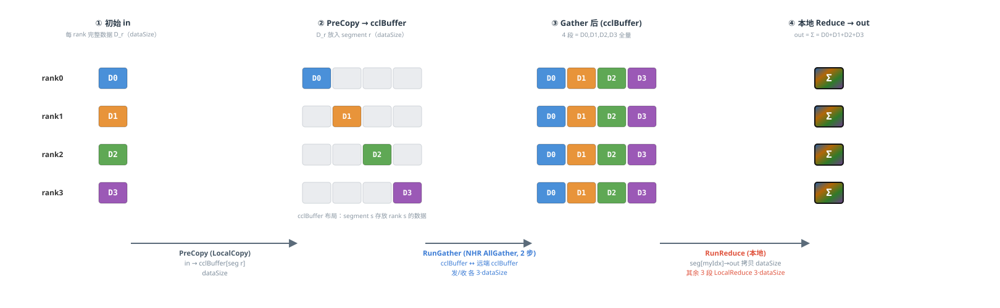
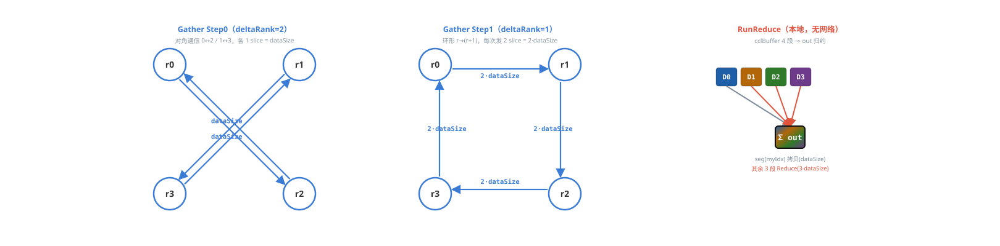

# HCCL AllReduce Aicpu Reduce NHR 数据传输示意图（4 Rank）

*模板：`InsTempAllReduceAicpuReduceNHR`
每 rank 输入数据量记为 dataSize，count 可被 4 整除。不同数据块以不同颜色标识。*

## 模板二：Aicpu Reduce NHR  ——  AllGather(NHR, 无Reduce) + 本地 Reduce

数据切分：cclBuffer 视为 4 个等大 segment（各 dataSize，即完整的 per-rank 数据），cclBuffer 倍数 = 4。
先用 NHR AllGather（2 步）把 4 个 rank 的完整数据聚齐到本地 cclBuffer，再在本地对 4 个 segment 做 Reduce 写入 output。

颜色按 **数据来源 rank**：rank0=蓝，rank1=橙，rank2=绿，rank3=紫；output 的 “Σ” 块表示 4-rank 归约结果。

**阶段总览（in / cclBuffer / out 数据流）**

**各 rank 间通信拓扑（RunGather / 本地 Reduce）**

*说明：本图为静态数据流示意，箭头旁标注为对应阶段的传输数据量（每 rank 视角）。
AicpuReduceNHR 全程在 **cclBuffer** 中 Gather，最后本地 Reduce 写 **out**。*

## 数据切分与性能对比分析

> **假设场景**：rankSize = **5**（非 2^i），dataType = **u64**（8 字节），dataSize = **34.125 MB**（dataCount = 4,472,832），hcclBuff.size = **4 MB**，HCCL_MIN_SLICE_ALIGN = 128 字节。
> 
> **关键公式**：`maxDataSizePerLoop = min(hcclBuff.size, hcclBuff.size / mult / 128 × 128)`，`loopTimes = ⌈dataCount / maxDataCountPerLoop⌉`。

### 1. 循环次数与末轮数据

> mult = **5**  |
> scratchBoundDataSize = 4194304 / 5 / 128 × 128 = **838,784** 字节  |
> maxDataCountPerLoop = **104,848**
>
> loopTimes = ⌈4472832 / 104,848⌉ = **43**  |
> 末轮 currDataCount = 4472832 - 42 × 104,848 = **69,216**  |
> currDataSize = **553,728** 字节

### 2. 末轮数据切分（按 rank 切分（不切数据维））

cclBuffer 划分为 N=5 个等大槽位，每槽存储完整 currDataSize。与 OneShot 完全相同的 rank-slot 布局。CalcScratchMultiple = N = 5。

| 槽位 | offset (字节) | size (字节) | count (元素) | 存储内容 |
| --- | --- | --- | --- | --- |
| slot 0 | 0 | 553,728 | 69,216 | rank0 完整数据副本 |
| slot 1 | 553,728 | 553,728 | 69,216 | rank1 完整数据副本（own） |
| slot 2 | 1,107,456 | 553,728 | 69,216 | rank2 完整数据副本 |
| slot 3 | 1,661,184 | 553,728 | 69,216 | rank3 完整数据副本 |
| slot 4 | 2,214,912 | 553,728 | 69,216 | rank4 完整数据副本 |
| **合计** | — | **2,768,640** | **346,080** | cclBuff 占用 2.64 MB (< 4 MB) |

> **分析**：切分特点：与 OneShot 完全相同。N=5 的 AllGather 步数 = 3（bit_width(4)=3）。专为支持 u64/int64/fp64/PROD 等特殊数据类型设计，AG 后由 AICPU 执行 LocalReduce。

### 3. 性能对比（rank=4 与 rank=2^i 合并）

| 维度 | rank = 4 | rank = 2^i（N ≥ 2） |
| --- | --- | --- |
| 算法结构 | AG + Reduce | AG + Reduce |
| 数据切分 | 无切分 | 无切分 |
| 线程数 | 1 | 1 |
| 同步次数 | 0 | 0 |
| cclBuff 倍率 | 4× | N× |
| 单 rank 发送量 | 3 × ds | (N-1)·ds |
| 单 rank 接收量 | 3 × ds | (N-1)·ds |
| 单 rank 通信总量 | 6 × ds | 2(N-1)·ds |
| LocalCopy 数据量 | 2 × ds | 2·ds |
| Reduce 方式 | AG后 LocalReduce | AG后 LocalReduce |
| Reduce 数据量 | 3 × ds | (N-1)·ds |
| 通信步数 | 2 (串行) | log₂N (串行) |
| 通信并行度 | 1路 | 1路 |

### 4. 关键结论

- **cclBuff 倍率 = 5×**：需存储 N 份完整副本，内存随 N 线性增长

- **loop 次数 = 43**：倍率越大，单轮处理数据越小，循环次数越多

- **五模板横向对比**：详见独立文档 `A00-模板综合对比.md`

- **适用场景**：NHR AllGather + AICPU LocalReduce，专为特殊数据类型设计；单线程零同步，内存和通信量与 OneShot 相当。适合任意拓扑、特殊数据类型(u64/int64/fp64/PROD)兜底。
